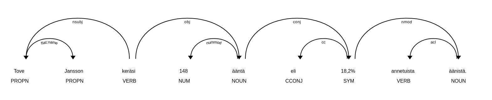

# Processando Diversos Idiomas

## Objetivos de Aprendizagem

Neste módulo, você será capaz de:

*   **Compreender a necessidade da diversidade linguística:** Entender os desafios e a importância de aplicar técnicas de Processamento de Linguagem Natural (PNL) em múltiplos idiomas, expandindo além das ferramentas tradicionais focadas exclusivamente no inglês.
*   **Conhecer a biblioteca Stanza:** Explorar a ferramenta de PNL desenvolvida pelo Stanford NLP Group, compreendendo como ela utiliza modelos de redes neurais para oferecer suporte nativo a dezenas de línguas.
*   **Integrar ecossistemas (Stanza + spaCy):** Aprender a utilizar o pacote `spacy-stanza` para carregar e executar os modelos pesados do Stanza sem precisar abandonar a sintaxe, os objetos e o fluxo de trabalho já familiares do spaCy.

---

## 1. Introdução

Historicamente, a maior parte da pesquisa, do desenvolvimento de ferramentas e da criação de conjuntos de dados em Processamento de Linguagem Natural (PNL) concentrou-se fortemente no idioma inglês. 

No entanto, o inglês representa apenas uma pequena fração da diversidade linguística mundial. Quando tentamos aplicar as mesmas abordagens do inglês para outros idiomas, encontramos desafios estruturais significativos:

*   **Morfologia complexa:** Idiomas como o finlandês ou o turco são aglutinativos, o que significa que uma única palavra pode conter a raiz, o tempo verbal, marcadores de caso e pronomes, todos combinados.
*   **Ordem das palavras (Sintaxe):** Enquanto o inglês segue uma ordem razoavelmente rigorosa de Sujeito-Verbo-Objeto (SVO), muitos outros idiomas possuem ordens muito mais flexíveis ou adotam estruturas diferentes, como Sujeito-Objeto-Verbo (SOV), comum no japonês.

Para que possamos construir aplicações globais e analisar textos de diferentes culturas de forma precisa, precisamos de ecossistemas de PNL que sejam nativamente projetados para lidar com essa vasta variedade de estruturas gramaticais. É nesse contexto que surgem ferramentas modernas de anotação multilíngue.

## 2. Stanza: Uma biblioteca Python para processar muitos idiomas

Para começar a trabalhar com outros idiomas além do inglês, podemos usar uma biblioteca chamada Stanza.

[Stanza](https://stanfordnlp.github.io/stanza/) é uma biblioteca Python para processamento de linguagem natural que fornece modelos de linguagem pré-treinados para muitos idiomas (Qi et al. [2020](https://www.aclweb.org/anthology/2020.acl-demos.14/)).

Os modelos de linguagem do Stanza são treinados em corpora anotados usando o formalismo de [Dependências Universais](https://universaldependencies.org/), o que significa que esses modelos podem executar tarefas como tokenização, etiquetagem de classes gramaticais, etiquetagem morfológica e análise de dependências.

Estas são essencialmente as mesmas tarefas que exploramos usando a biblioteca de processamento de linguagem natural spaCy na Parte II.

Vamos começar a explorar o Stanza importando a biblioteca.

````python
# Importa a biblioteca Stanza
import stanza
````

Para processar um determinado idioma, devemos primeiro baixar um modelo de linguagem do Stanza usando a função `download()`.

A função `download()` requer um único argumento, `lang`, que define o modelo de linguagem a ser baixado.

Para baixar um modelo de linguagem para um determinado idioma, recupere o código de idioma de duas letras (por exemplo, `wo`) para o idioma da lista de modelos de linguagem disponíveis e passe o código do idioma como um objeto de string para o argumento `lang`.

Por exemplo, o código a seguir baixaria um modelo para o Wolof, um idioma falado na África Ocidental que pertence à família de línguas nigero-congolesas. Este modelo foi treinado usando o treebank Wolof (Dione [2019](https://www.aclweb.org/anthology/W19-8003/)).

````python
# Baixa o modelo de linguagem do Stanza para o Wolof
stanza.download(lang='wo')
````

Para alguns idiomas, o Stanza fornece modelos que foram treinados em diferentes conjuntos de dados. O Stanza se refere a modelos treinados em diferentes conjuntos de dados como *packages* (pacotes). Por padrão, o Stanza baixa automaticamente o pacote com o modelo treinado no maior conjunto de dados disponível para o idioma em questão.

Para selecionar um modelo treinado em um conjunto de dados específico, passe o nome do seu pacote como um objeto de string para o argumento `package`.

Para exemplificar, o comando a seguir baixaria um modelo para o finlandês treinado no conjunto de dados *FinnTreeBank* (pacote: `ftb`) em vez do modelo padrão, que é treinado no conjunto de dados *Turku Dependency Treebank* (pacote: `tbt`).

````python
# Baixa um modelo de linguagem do Stanza para o finlandês treinado usando o FinnTreeBank (pacote 'ftb')
stanza.download(lang='fi', package='ftb')
````

Os nomes dos pacotes são fornecidos na lista de modelos de linguagem disponíveis para o Stanza.
### 2.1. Carregando um modelo de linguagem no Stanza

Para carregar um modelo de linguagem do Stanza no Python, devemos primeiro criar um objeto *Pipeline* inicializando uma instância da classe `Pipeline()` do módulo `stanza`.

Para exemplificar este procedimento, vamos inicializar um pipeline com um modelo de linguagem para o Wolof.

Para carregar um modelo de linguagem para o Wolof no pipeline, devemos fornecer a string `'wo'` para o argumento `lang` da função `Pipeline()`.

````python
# Inicializa um pipeline do Stanza com um modelo de linguagem para o Wolof;
# atribui o modelo à variável 'nlp_wo'.
nlp_wo = stanza.Pipeline(lang='wo')
````

````python
# Chama a variável para examinar a saída
nlp_wo
````

````text
<stanza.pipeline.core.Pipeline at 0x127f94eb0>
````

Carregar um modelo de linguagem no Stanza retorna um objeto *Pipeline*, que consiste em uma série de *processadores* que executam várias tarefas de processamento de linguagem natural.

A saída acima lista os processadores sob o cabeçalho de mesmo nome, juntamente com os nomes dos pacotes usados para treinar esses processadores.

Como aprendemos na Parte II, nem sempre é necessário ter todas as anotações linguísticas criadas por um modelo, pois elas sempre têm um custo computacional.

Para acelerar o processamento, você pode definir os processadores a serem incluídos no objeto *Pipeline* fornecendo ao argumento `processors` um objeto de string contendo os [nomes dos processadores](https://stanfordnlp.github.io/stanza/pipeline.html#processors) a serem incluídos no pipeline, que devem ser separados por vírgulas.

Por exemplo, criar um *Pipeline* usando o comando abaixo incluiria apenas os processadores para tokenização e etiquetagem de classes gramaticais (part-of-speech tagging) no pipeline.

````python
# Inicializa um pipeline do Stanza com um modelo de linguagem para o Wolof;
# atribui o modelo à variável 'nlp_wo'. Inclui apenas o tokenizador 
# e o etiquetador de classes gramaticais.
nlp_wo = stanza.Pipeline(lang='wo', processors='tokenize, pos')
````

### 2.2. Processando texto usando o Stanza

Agora que inicializamos um *Pipeline* do Stanza com um modelo de linguagem, podemos fornecer um texto em Wolof para o modelo sob a variável `nlp_wo` como um objeto de string.

Armazenamos o resultado na variável `doc_wo`.

````
python
# Fornece o texto para o modelo sob 'nlp_wo'; armazena o resultado na variável 'doc'
doc_wo = nlp_wo("Réew maa ngi lebe turam wi ci dex gi ko peek ci penku ak bëj-gànnaar, te ab balluwaayam bawoo ca Fuuta Jallon ca Ginne, di Dexug Senegaal. Ab kilimaam bu gëwéel la te di bu fendi te yor ñaari jamono: jamonoy nawet (jamonoy taw) ak ju noor (jamonoy fendi).")

# Verifica o tipo da saída
type(doc_wo)
````


````
text
stanza.models.common.doc.Document
````


Isso retorna um objeto [*Document*](https://stanfordnlp.github.io/stanza/data_objects.html#document) do Stanza, que contém as anotações linguísticas criadas ao passar o texto pelo pipeline.

O atributo `sentences` de um objeto *Document* do Stanza contém uma lista onde cada item representa uma única sentença.

Portanto, podemos usar colchetes para acessar o primeiro item `[0]` da lista.

````
python
# Obtém o primeiro item da lista de sentenças
doc_wo.sentences[0]
````


````
text
[
  {
    "id": 1,
    "text": "Réew",
    "lemma": "réew",
    "upos": "NOUN",
    "xpos": "NOUN",
    "head": 4,
    "deprel": "nsubj",
    "start_char": 0,
    "end_char": 4
  },
  {
    "id": 2,
    "text": "maa",
    "lemma": "a",
    "upos": "AUX",
    "xpos": "AUX",
    "feats": "PronType=Prs",
    "head": 4,
    "deprel": "aux",
    "start_char": 5,
    "end_char": 8
  },
  {
    "id": 3,
    "text": "ngi",
    "lemma": "ngi",
    "upos": "AUX",
    "xpos": "AUX",
    "feats": "Aspect=Prog",
    "head": 4,
    "deprel": "aux",
    "start_char": 9,
    "end_char": 12
  },
  {
    "id": 4,
    "text": "lebe",
    "lemma": "lebe",
    "upos": "VERB",
    "xpos": "VERB",
    "feats": "Mood=Ind|VerbForm=Fin",
    "head": 0,
    "deprel": "root",
    "start_char": 13,
    "end_char": 17
  },
  {
    "id": 5,
    "text": "turam",
    "lemma": "tur",
    "upos": "NOUN",
    "xpos": "NOUN",
    "feats": "Number=Sing|Poss=Yes",
    "head": 4,
    "deprel": "obj",
    "start_char": 18,
    "end_char": 23
  },
  {
    "id": 6,
    "text": "wi",
    "lemma": "bi",
    "upos": "DET",
    "xpos": "DET",
    "feats": "Definite=Def|Deixis=Prox|NounClass=Wol10|Number=Sing|PronType=Art",
    "head": 5,
    "deprel": "det",
    "start_char": 24,
    "end_char": 26
  },
  {
    "id": 7,
    "text": "ci",
    "lemma": "ci",
    "upos": "ADP",
    "xpos": "PREP",
    "head": 8,
    "deprel": "case",
    "start_char": 27,
    "end_char": 29
  },
  {
    "id": 8,
    "text": "dex",
    "lemma": "dex",
    "upos": "NOUN",
    "xpos": "NOUN",
    "head": 4,
    "deprel": "obl",
    "start_char": 30,
    "end_char": 33
  },
  {
    "id": 9,
    "text": "gi",
    "lemma": "bi",
    "upos": "PRON",
    "xpos": "PRON",
    "feats": "Definite=Def|Deixis=Prox|NounClass=Wol3|Number=Sing|Person=3|PronType=Rel",
    "head": 11,
    "deprel": "nsubj",
    "start_char": 34,
    "end_char": 36
  },
  {
    "id": 10,
    "text": "ko",
    "lemma": "ko",
    "upos": "PRON",
    "xpos": "CL",
    "feats": "Case=Acc|Number=Sing|Person=3|PronType=Prs",
    "head": 11,
    "deprel": "obj",
    "start_char": 37,
    "end_char": 39
  },
  {
    "id": 11,
    "text": "peek",
    "lemma": "peek",
    "upos": "VERB",
    "xpos": "VERB",
    "feats": "Mood=Ind|VerbForm=Fin",
    "head": 8,
    "deprel": "acl:relcl",
    "start_char": 40,
    "end_char": 44
  },
  {
    "id": 12,
    "text": "ci",
    "lemma": "ci",
    "upos": "ADP",
    "xpos": "PREP",
    "head": 13,
    "deprel": "case",
    "start_char": 45,
    "end_char": 47
  },
  {
    "id": 13,
    "text": "penku",
    "lemma": "penku",
    "upos": "NOUN",
    "xpos": "NOUN",
    "head": 11,
    "deprel": "obl",
    "start_char": 48,
    "end_char": 53
  },
  {
    "id": 14,
    "text": "ak",
    "lemma": "ak",
    "upos": "CCONJ",
    "xpos": "CONJ",
    "head": 15,
    "deprel": "cc",
    "start_char": 54,
    "end_char": 56
  },
  {
    "id": 15,
    "text": "bëj-gànnaar",
    "lemma": "bëj-gànnaar",
    "upos": "NOUN",
    "xpos": "NOUN",
    "head": 13,
    "deprel": "conj",
    "start_char": 57,
    "end_char": 68
  },
  {
    "id": 16,
    "text": ",",
    "lemma": ",",
    "upos": "PUNCT",
    "xpos": "COMMA",
    "head": 20,
    "deprel": "punct",
    "start_char": 68,
    "end_char": 69
  },
  {
    "id": 17,
    "text": "te",
    "lemma": "te",
    "upos": "CCONJ",
    "xpos": "CONJ",
    "head": 20,
    "deprel": "cc",
    "start_char": 70,
    "end_char": 72
  },
  {
    "id": 18,
    "text": "ab",
    "lemma": "ab",
    "upos": "DET",
    "xpos": "DET",
    "feats": "Definite=Ind|NounClass=Wol5|Number=Sing|PronType=Art",
    "head": 19,
    "deprel": "det",
    "start_char": 73,
    "end_char": 75
  },
  {
    "id": 19,
    "text": "balluwaayam",
    "lemma": "balluwaay",
    "upos": "NOUN",
    "xpos": "NOUN",
    "feats": "Number=Sing|Poss=Yes",
    "head": 20,
    "deprel": "nsubj",
    "start_char": 76,
    "end_char": 87
  },
  {
    "id": 20,
    "text": "bawoo",
    "lemma": "bawoo",
    "upos": "VERB",
    "xpos": "VERB",
    "feats": "Mood=Ind|VerbForm=Fin",
    "head": 4,
    "deprel": "conj",
    "start_char": 88,
    "end_char": 93
  },
  {
    "id": 21,
    "text": "ca",
    "lemma": "ca",
    "upos": "ADP",
    "xpos": "PREP",
    "head": 22,
    "deprel": "case",
    "start_char": 94,
    "end_char": 96
  },
  {
    "id": 22,
    "text": "Fuuta",
    "lemma": "Fuuta",
    "upos": "PROPN",
    "xpos": "NAME",
    "head": 20,
    "deprel": "obl",
    "start_char": 97,
    "end_char": 102
  },
  {
    "id": 23,
    "text": "Jallon",
    "lemma": "Jallon",
    "upos": "PROPN",
    "xpos": "NAME",
    "head": 22,
    "deprel": "flat",
    "start_char": 103,
    "end_char": 109
  },
  {
    "id": 24,
    "text": "ca",
    "lemma": "ca",
    "upos": "ADP",
    "xpos": "PREP",
    "head": 25,
    "deprel": "case",
    "start_char": 110,
    "end_char": 112
  },
  {
    "id": 25,
    "text": "Ginne",
    "lemma": "Ginne",
    "upos": "PROPN",
    "xpos": "NAME",
    "head": 20,
    "deprel": "obl",
    "start_char": 113,
    "end_char": 118
  },
  {
    "id": 26,
    "text": ",",
    "lemma": ",",
    "upos": "PUNCT",
    "xpos": "COMMA",
    "head": 28,
    "deprel": "punct",
    "start_char": 118,
    "end_char": 119
  },
  {
    "id": 27,
    "text": "di",
    "lemma": "di",
    "upos": "AUX",
    "xpos": "COP",
    "feats": "Aspect=Imp|Mood=Ind|Tense=Pres|VerbForm=Fin",
    "head": 28,
    "deprel": "cop",
    "start_char": 120,
    "end_char": 122
  },
  {
    "id": 28,
    "text": "Dexug",
    "lemma": "dex",
    "upos": "NOUN",
    "xpos": "NOUN",
    "feats": "Case=Gen|Number=Sing",
    "head": 22,
    "deprel": "appos",
    "start_char": 123,
    "end_char": 128
  },
  {
    "id": 29,
    "text": "Senegaal",
    "lemma": "Senegaal",
    "upos": "PROPN",
    "xpos": "NAME",
    "head": 28,
    "deprel": "nmod",
    "start_char": 129,
    "end_char": 137
  },
  {
    "id": 30,
    "text": ".",
    "lemma": ".",
    "upos": "PUNCT",
    "xpos": "PERIOD",
    "head": 4,
    "deprel": "punct",
    "start_char": 137,
    "end_char": 138
  }
]
````


Embora a saída contenha colchetes `[]` e chaves `{}`, que o Python normalmente usa para marcar listas e dicionários, respectivamente, a saída não é uma lista com dicionários aninhados, mas um objeto [*Sentence*](https://stanfordnlp.github.io/stanza/data_objects.html#sentence) do Stanza.

````
python
# Verifica o tipo do primeiro item no objeto Document
type(doc_wo.sentences[0])
````


````
text
stanza.models.common.doc.Sentence
````


O objeto *Sentence* contém [vários atributos e métodos](https://stanfordnlp.github.io/stanza/data_objects.html#sentence) para acessar as anotações linguísticas criadas pelo modelo de linguagem.

Se quisermos interagir com as anotações usando estruturas de dados nativas do Python, podemos usar o método `to_dict()` para converter as anotações em uma lista de dicionários, na qual cada dicionário representa um único objeto [*Token*](https://stanfordnlp.github.io/stanza/data_objects.html#token) do Stanza.

Os pares de *chave* e *valor* nesses dicionários contêm as anotações linguísticas para cada *Token*.

````
python
# Converte o primeiro objeto Sentence em um dicionário Python; armazena na variável 'doc_dict'
doc_dict = doc_wo.sentences[0].to_dict()

# Obtém o dicionário para o primeiro Token
doc_dict[0]
````


````
text
{'id': 1,
 'text': 'Réew',
 'lemma': 'réew',
 'upos': 'NOUN',
 'xpos': 'NOUN',
 'head': 4,
 'deprel': 'nsubj',
 'start_char': 0,
 'end_char': 4}
````


Como você pode ver, o dicionário consiste em pares de chave e valor, que mantêm as anotações linguísticas.

Podemos recuperar uma lista de chaves disponíveis para um dicionário Python usando o método `keys()`.

````
python
# Obtém uma lista de chaves para o primeiro Token no dicionário 'doc_dict'
doc_dict[0].keys()
````


````
text
dict_keys(['id', 'text', 'lemma', 'upos', 'xpos', 'head', 'deprel', 'start_char', 'end_char'])
````


Agora que listamos as chaves, vamos recuperar o valor sob a chave `lemma`.

````
python
# Obtém o valor sob a chave 'lemma' para o primeiro item [0] no dicionário 'doc_dict'
doc_dict[0]['lemma']
````


````
text
'réew'
````


Isso retorna o lema da palavra “réew”, que significa “país”.

### 2.3. Processando múltiplos textos usando o Stanza

Para processar múltiplos documentos com o Stanza, a maneira mais eficiente é primeiro coletar os documentos como objetos de string em uma lista Python.

Vamos definir um pequeno exemplo com alguns documentos de exemplo em Wolof e armazená-los como objetos de string em uma lista sob a variável `str_docs`.

````python
# Define uma lista Python consistindo em duas strings
str_docs = ['Lislaam a ngi njëkk a tàbbi ci Senegaal ci diggante VIIIeelu xarnu ak IXeelu xarnu, ña ko fa dugal di ay yaxantukat yu araab-yu-berber.',
            'Li ëpp ci gëstu yi ñu def ci wàllug Gëstu-askan (walla demogaraafi) ci Senegaal dafa sukkandiku ci Waññ (recensement) yi ñu jotoon a def ci 1976, 1988 rawati na 2002.']
````

Em seguida, criamos uma lista de objetos *Document* do Stanza usando uma compreensão de lista (*list comprehension*) do Python. Esses objetos *Document* são anotados para seus recursos linguísticos quando são passados por um objeto *Pipeline*.

Nesta fase, nós simplesmente convertemos cada string na lista `str_docs` em um objeto *Document* do Stanza. Armazenamos o resultado em uma lista chamada `docs_wo_in`.

Antes de prosseguir com a criação dos objetos *Document*, vamos examinar como a compreensão de lista é estruturada, desmontando sua sintaxe passo a passo.

A compreensão de lista é como um loop `for`, que foi introduzido na Parte II, que usa o conteúdo de uma lista existente para criar uma nova lista.

Para começar, assim como as listas, as compreensões de lista são marcadas usando colchetes `[]`.

````python
docs_wo_in = []
````

Em seguida, no lado direito da declaração `for`, usamos a variável `doc` para nos referir aos itens da lista `str_docs` sobre a qual estamos iterando.

````python
docs_wo_in = [... for doc in str_docs]
````

Agora que podemos nos referir aos itens da lista usando a variável `doc`, podemos definir o que fazemos com cada item no lado esquerdo da declaração `for`.

````python
docs_wo_in = [stanza.Document([], text=doc) for doc in str_docs]
````

Para cada item na lista `str_docs`, inicializamos um objeto `Document` vazio e passamos duas entradas para este objeto:

1. uma lista vazia `[]` que será preenchida com anotações linguísticas,
2. o conteúdo da variável de string sob `doc` para o argumento `text`.

````python
# Usa uma compreensão de lista para criar uma lista Python com objetos Document do Stanza.
docs_wo_in = [stanza.Document([], text=doc) for doc in str_docs]

# Chama a variável para verificar a saída
docs_wo_in
````

````text
[[], []]
````

Não deixe a saída te enganar aqui: o que parecem ser duas listas Python vazias aninhadas dentro de uma lista são, na verdade, objetos *Document* do Stanza.

Vamos usar os colchetes para acessar e examinar o primeiro objeto *Document* na lista `docs_wo_in`.

````python
# Verifica o tipo do primeiro item na lista 'docs_wo_in'
type(docs_wo_in[0])
````

````text
stanza.models.common.doc.Document
````

Como você pode ver, o objeto é de fato um objeto *Document* do Stanza.

Podemos verificar se nossos textos de entrada chegaram a este documento examinando o atributo `text`.

````python
# Verifica o conteúdo do atributo 'text' sob a
# primeira Sentença na lista 'docs_wo_in'
docs_wo_in[0].text
````

````text
'Lislaam a ngi njëkk a tàbbi ci Senegaal ci diggante VIIIeelu xarnu ak IXeelu xarnu, ña ko fa dugal di ay yaxantukat yu araab-yu-berber.'
````

Agora que temos uma lista de objetos *Document* do Stanza, podemos passá-los todos de uma vez para o modelo de linguagem para anotação.

Isso pode ser alcançado simplesmente fornecendo a lista como entrada para o modelo de linguagem Wolof armazenado em `nlp_wo`.

Em seguida, armazenamos os objetos *Document* do Stanza anotados na variável `docs_wo_out`.

````python
# Passa a lista de objetos Document para o modelo de linguagem 'nlp_wo'
# para anotação.
docs_wo_out = nlp_wo(docs_wo_in)

# Chama a variável para verificar a saída
docs_wo_out
````

````text
[[
   [
     {
       "id": 1,
       "text": "Lislaam",
       "lemma": "Lislaam",
       "upos": "PROPN",
       "xpos": "NAME",
       "head": 4,
       "deprel": "nsubj",
       "start_char": 0,
       "end_char": 7
     },
     {
       "id": 2,
       "text": "a",
       "lemma": "a",
       "upos": "AUX",
       "xpos": "AUX",
       "feats": "PronType=Prs",
       "head": 4,
       "deprel": "aux",
       "start_char": 8,
       "end_char": 9
     },
     {
       "id": 3,
       "text": "ngi",
       "lemma": "ngi",
       "upos": "AUX",
       "xpos": "AUX",
       "feats": "Aspect=Prog",
       "head": 4,
       "deprel": "aux",
       "start_char": 10,
       "end_char": 13
     },
     {
       "id": 4,
       "text": "njëkk",
       "lemma": "njëkk",
       "upos": "VERB",
       "xpos": "VERB",
       "feats": "Mood=Ind|VerbForm=Fin",
       "head": 0,
       "deprel": "root",
       "start_char": 14,
       "end_char": 19
     },
     {
       "id": 5,
       "text": "a",
       "lemma": "a",
       "upos": "PART",
       "xpos": "PART",
       "head": 6,
       "deprel": "mark",
       "start_char": 20,
       "end_char": 21
     },
     {
       "id": 6,
       "text": "tàbbi",
       "lemma": "tàbbi",
       "upos": "VERB",
       "xpos": "VERB",
       "feats": "VerbForm=Inf",
       "head": 4,
       "deprel": "xcomp",
       "start_char": 22,
       "end_char": 27
     },
     {
       "id": 7,
       "text": "ci",
       "lemma": "ci",
       "upos": "ADP",
       "xpos": "PREP",
       "head": 8,
       "deprel": "case",
       "start_char": 28,
       "end_char": 30
     },
     {
       "id": 8,
       "text": "Senegaal",
       "lemma": "Senegaal",
       "upos": "PROPN",
       "xpos": "NAME",
       "head": 6,
       "deprel": "obl",
       "start_char": 31,
       "end_char": 39
     },
     {
       "id": 9,
       "text": "ci",
       "lemma": "ci",
       "upos": "ADP",
       "xpos": "PREP",
       "head": 12,
       "deprel": "case",
       "start_char": 40,
       "end_char": 42
     },
     {
       "id": 10,
       "text": "diggante",
       "lemma": "diggante",
       "upos": "NOUN",
       "xpos": "NOUN",
       "head": 9,
       "deprel": "fixed",
       "start_char": 43,
       "end_char": 51
     },
     {
       "id": 11,
       "text": "VIIIeelu",
       "lemma": "VIII",
       "upos": "NUM",
       "xpos": "NUMBER",
       "feats": "NumType=Ord",
       "head": 12,
       "deprel": "nummod",
       "start_char": 52,
       "end_char": 60
     },
     {
       "id": 12,
       "text": "xarnu",
       "lemma": "xarnu",
       "upos": "NOUN",
       "xpos": "NOUN",
       "head": 6,
       "deprel": "obl",
       "start_char": 61,
       "end_char": 66
     },
     {
       "id": 13,
       "text": "ak",
       "lemma": "ak",
       "upos": "CCONJ",
       "xpos": "CONJ",
       "head": 14,
       "deprel": "cc",
       "start_char": 67,
       "end_char": 69
     },
     {
       "id": 14,
       "text": "IXeelu",
       "lemma": "IX",
       "upos": "NUM",
       "xpos": "NUMBER",
       "feats": "NumType=Ord",
       "head": 15,
       "deprel": "nummod",
       "start_char": 70,
       "end_char": 76
     },
     {
       "id": 15,
       "text": "xarnu",
       "lemma": "xarnu",
       "upos": "NOUN",
       "xpos": "NOUN",
       "head": 12,
       "deprel": "conj",
       "start_char": 77,
       "end_char": 82
     },
     {
       "id": 16,
       "text": ",",
       "lemma": ",",
       "upos": "PUNCT",
       "xpos": "COMMA",
       "head": 23,
       "deprel": "punct",
       "start_char": 82,
       "end_char": 83
     },
     {
       "id": 17,
       "text": "ña",
       "lemma": "ba",
       "upos": "PRON",
       "xpos": "PRON",
       "feats": "Definite=Def|Deixis=Remt|NounClass=Wol2|Number=Plur|Person=3|PronType=Rel",
       "head": 23,
       "deprel": "nsubj",
       "start_char": 84,
       "end_char": 86
     },
     {
       "id": 18,
       "text": "ko",
       "lemma": "ko",
       "upos": "PRON",
       "xpos": "CL",
       "feats": "Case=Acc|Number=Sing|Person=3|PronType=Prs",
       "head": 20,
       "deprel": "obj",
       "start_char": 87,
       "end_char": 89
     },
     {
       "id": 19,
       "text": "fa",
       "lemma": "fa",
       "upos": "ADV",
       "xpos": "ADV",
       "feats": "Deixis=Remt|NounClass=Wol11|PronType=Dem",
       "head": 20,
       "deprel": "advmod",
       "start_char": 90,
       "end_char": 92
     },
     {
       "id": 20,
       "text": "dugal",
       "lemma": "dugal",
       "upos": "VERB",
       "xpos": "VERB",
       "feats": "Mood=Ind|VerbForm=Fin",
       "head": 17,
       "deprel": "acl:relcl",
       "start_char": 93,
       "end_char": 98
     },
     {
       "id": 21,
       "text": "di",
       "lemma": "di",
       "upos": "AUX",
       "xpos": "COP",
       "feats": "Aspect=Imp|Mood=Ind|Tense=Pres|VerbForm=Fin",
       "head": 23,
       "deprel": "cop",
       "start_char": 99,
       "end_char": 101
     },
     {
       "id": 22,
       "text": "ay",
       "lemma": "ab",
       "upos": "DET",
       "xpos": "DET",
       "feats": "Definite=Ind|NounClass=Wol8|Number=Plur|PronType=Art",
       "head": 23,
       "deprel": "det",
       "start_char": 102,
       "end_char": 104
     },
     {
       "id": 23,
       "text": "yaxantukat",
       "lemma": "yaxantukat",
       "upos": "NOUN",
       "xpos": "NOUN",
       "head": 4,
       "deprel": "conj",
       "start_char": 105,
       "end_char": 115
     },
     {
       "id": 24,
       "text": "yu",
       "lemma": "yu",
       "upos": "ADP",
       "xpos": "PREP",
       "head": 25,
       "deprel": "case",
       "start_char": 116,
       "end_char": 118
     },
     {
       "id": 25,
       "text": "araab-yu-berber",
       "lemma": "araab-yu-berber",
       "upos": "NOUN",
       "xpos": "NOUN",
       "head": 23,
       "deprel": "nmod",
       "start_char": 119,
       "end_char": 134
     },
     {
       "id": 26,
       "text": ".",
       "lemma": ".",
       "upos": "PUNCT",
       "xpos": "PERIOD",
       "head": 4,
       "deprel": "punct",
       "start_char": 134,
       "end_char": 135
     }
   ]
 ],
 [
   [
     {
       "id": 1,
       "text": "Li",
       "lemma": "bi",
       "upos": "PRON",
       "xpos": "PRON",
       "feats": "Definite=Def|Deixis=Prox|NounClass=Wol7|Number=Sing|Person=3|PronType=Rel",
       "head": 19,
       "deprel": "dislocated",
       "start_char": 0,
       "end_char": 2
     },
     {
       "id": 2,
       "text": "ëpp",
       "lemma": "ëpp",
       "upos": "VERB",
       "xpos": "VERB",
       "feats": "Mood=Ind|VerbForm=Fin",
       "head": 1,
       "deprel": "acl:relcl",
       "start_char": 3,
       "end_char": 6
     },
     {
       "id": 3,
       "text": "ci",
       "lemma": "ci",
       "upos": "ADP",
       "xpos": "PREP",
       "head": 4,
       "deprel": "case",
       "start_char": 7,
       "end_char": 9
     },
     {
       "id": 4,
       "text": "gëstu",
       "lemma": "gëstu",
       "upos": "NOUN",
       "xpos": "NOUN",
       "head": 2,
       "deprel": "obl",
       "start_char": 10,
       "end_char": 15
     },
     {
       "id": 5,
       "text": "yi",
       "lemma": "bi",
       "upos": "PRON",
       "xpos": "PRON",
       "feats": "Definite=Def|Deixis=Prox|NounClass=Wol8|Number=Plur|Person=3|PronType=Rel",
       "head": 7,
       "deprel": "obj",
       "start_char": 16,
       "end_char": 18
     },
     {
       "id": 6,
       "text": "ñu",
       "lemma": "mu",
       "upos": "PRON",
       "xpos": "PRON",
       "feats": "Case=Nom|Number=Plur|Person=3|PronType=Prs",
       "head": 7,
       "deprel": "nsubj",
       "start_char": 19,
       "end_char": 21
     },
     {
       "id": 7,
       "text": "def",
       "lemma": "def",
       "upos": "VERB",
       "xpos": "VERB",
       "feats": "Mood=Ind|VerbForm=Fin",
       "head": 4,
       "deprel": "acl:relcl",
       "start_char": 22,
       "end_char": 25
     },
     {
       "id": 8,
       "text": "ci",
       "lemma": "ci",
       "upos": "ADP",
       "xpos": "PREP",
       "head": 9,
       "deprel": "case",
       "start_char": 26,
       "end_char": 28
     },
     {
       "id": 9,
       "text": "wàllug",
       "lemma": "wàll",
       "upos": "NOUN",
       "xpos": "NOUN",
       "feats": "Case=Gen|Number=Sing",
       "head": 7,
       "deprel": "obl",
       "start_char": 29,
       "end_char": 35
     },
     {
       "id": 10,
       "text": "Gëstu-askan",
       "lemma": "Gëstu-askan",
       "upos": "PROPN",
       "xpos": "NAME",
       "head": 9,
       "deprel": "nmod",
       "start_char": 36,
       "end_char": 47
     },
     {
       "id": 11,
       "text": "(",
       "lemma": "(",
       "upos": "PUNCT",
       "xpos": "PAREN",
       "head": 13,
       "deprel": "punct",
       "start_char": 48,
       "end_char": 49
     },
     {
       "id": 12,
       "text": "walla",
       "lemma": "walla",
       "upos": "CCONJ",
       "xpos": "CONJ",
       "head": 13,
       "deprel": "cc",
       "start_char": 49,
       "end_char": 54
     },
     {
       "id": 13,
       "text": "demogaraafi",
       "lemma": "demogaraafi",
       "upos": "NOUN",
       "xpos": "NOUN",
       "feats": "Case=Gen|Number=Plur",
       "head": 9,
       "deprel": "conj",
       "start_char": 55,
       "end_char": 66
     },
     {
       "id": 14,
       "text": ")",
       "lemma": ")",
       "upos": "PUNCT",
       "xpos": "PAREN",
       "head": 13,
       "deprel": "punct",
       "start_char": 66,
       "end_char": 67
     },
     {
       "id": 15,
       "text": "ci",
       "lemma": "ci",
       "upos": "ADP",
       "xpos": "PREP",
       "head": 16,
       "deprel": "case",
       "start_char": 68,
       "end_char": 70
     },
     {
       "id": 16,
       "text": "Senegaal",
       "lemma": "Senegaal",
       "upos": "PROPN",
       "xpos": "NAME",
       "head": 13,
       "deprel": "nmod",
       "start_char": 71,
       "end_char": 79
     },
     {
       "id": [
         17,
         18
       ],
       "text": "dafa",
       "start_char": 80,
       "end_char": 84
     },
     {
       "id": 17,
       "text": "da",
       "lemma": "da",
       "upos": "AUX",
       "xpos": "INFL",
       "feats": "FocusType=Verb|Mood=Ind",
       "head": 19,
       "deprel": "aux"
     },
     {
       "id": 18,
       "text": "mu",
       "lemma": "mu",
       "upos": "PRON",
       "xpos": "PRON",
       "feats": "Case=Nom|Number=Sing|Person=3|PronType=Prs",
       "head": 19,
       "deprel": "nsubj"
     },
     {
       "id": 19,
       "text": "sukkandiku",
       "lemma": "sukkandiku",
       "upos": "VERB",
       "xpos": "VERB",
       "feats": "Mood=Ind|VerbForm=Fin",
       "head": 0,
       "deprel": "root",
       "start_char": 85,
       "end_char": 95
     },
     {
       "id": 20,
       "text": "ci",
       "lemma": "ci",
       "upos": "ADP",
       "xpos": "PREP",
       "head": 21,
       "deprel": "case",
       "start_char": 96,
       "end_char": 98
     },
     {
       "id": 21,
       "text": "Waññ",
       "lemma": "waññ",
       "upos": "NOUN",
       "xpos": "NOUN",
       "head": 19,
       "deprel": "obl:appl",
       "start_char": 99,
       "end_char": 103
     },
     {
       "id": 22,
       "text": "(",
       "lemma": "(",
       "upos": "PUNCT",
       "xpos": "PAREN",
       "head": 23,
       "deprel": "punct",
       "start_char": 104,
       "end_char": 105
     },
     {
       "id": 23,
       "text": "recensement",
       "lemma": "recensement",
       "upos": "NOUN",
       "xpos": "NOUN",
       "head": 21,
       "deprel": "appos",
       "start_char": 105,
       "end_char": 116
     },
     {
       "id": 24,
       "text": ")",
       "lemma": ")",
       "upos": "PUNCT",
       "xpos": "PAREN",
       "head": 23,
       "deprel": "punct",
       "start_char": 116,
       "end_char": 117
     },
     {
       "id": 25,
       "text": "yi",
       "lemma": "bi",
       "upos": "PRON",
       "xpos": "PRON",
       "feats": "Definite=Def|Deixis=Prox|NounClass=Wol8|Number=Plur|Person=3|PronType=Rel",
       "head": 27,
       "deprel": "obj",
       "start_char": 118,
       "end_char": 120
     },
     {
       "id": 26,
       "text": "ñu",
       "lemma": "mu",
       "upos": "PRON",
       "xpos": "PRON",
       "feats": "Case=Nom|Number=Plur|Person=3|PronType=Prs",
       "head": 27,
       "deprel": "nsubj",
       "start_char": 121,
       "end_char": 123
     },
     {
       "id": 27,
       "text": "jotoon",
       "lemma": "jot",
       "upos": "VERB",
       "xpos": "VERB",
       "feats": "Mood=Ind|Tense=Past|VerbForm=Fin",
       "head": 21,
       "deprel": "acl:relcl",
       "start_char": 124,
       "end_char": 130
     },
     {
       "id": 28,
       "text": "a",
       "lemma": "a",
       "upos": "PART",
       "xpos": "PART",
       "head": 29,
       "deprel": "mark",
       "start_char": 131,
       "end_char": 132
     },
     {
       "id": 29,
       "text": "def",
       "lemma": "def",
       "upos": "VERB",
       "xpos": "VERB",
       "feats": "VerbForm=Inf",
       "head": 27,
       "deprel": "xcomp",
       "start_char": 133,
       "end_char": 136
     },
     {
       "id": 30,
       "text": "ci",
       "lemma": "ci",
       "upos": "ADP",
       "xpos": "PREP",
       "head": 31,
       "deprel": "case",
       "start_char": 137,
       "end_char": 139
     },
     {
       "id": 31,
       "text": "1976",
       "lemma": "1976",
       "upos": "NUM",
       "xpos": "NUMBER",
       "feats": "NumType=Card",
       "head": 29,
       "deprel": "obl",
       "start_char": 140,
       "end_char": 144
     },
     {
       "id": 32,
       "text": ",",
       "lemma": ",",
       "upos": "PUNCT",
       "xpos": "COMMA",
       "head": 34,
       "deprel": "punct",
       "start_char": 144,
       "end_char": 145
     },
     {
       "id": 33,
       "text": "1988",
       "lemma": "1988",
       "upos": "NUM",
       "xpos": "NUMBER",
       "feats": "NumType=Card",
       "head": 34,
       "deprel": "discourse",
       "start_char": 146,
       "end_char": 150
     },
     {
       "id": 34,
       "text": "rawati",
       "lemma": "rawati",
       "upos": "VERB",
       "xpos": "VERB",
       "feats": "Mood=Ind|VerbForm=Fin",
       "head": 19,
       "deprel": "parataxis",
       "start_char": 151,
       "end_char": 157
     },
     {
       "id": 35,
       "text": "na",
       "lemma": "na",
       "upos": "AUX",
       "xpos": "INFL",
       "feats": "Aspect=Perf|Mood=Ind|Number=Sing|Person=3",
       "head": 34,
       "deprel": "aux",
       "start_char": 158,
       "end_char": 160
     },
     {
       "id": 36,
       "text": "2002",
       "lemma": "2002",
       "upos": "NUM",
       "xpos": "NUMBER",
       "feats": "NumType=Card",
       "head": 34,
       "deprel": "obj",
       "start_char": 161,
       "end_char": 165
     },
     {
       "id": 37,
       "text": ".",
       "lemma": ".",
       "upos": "PUNCT",
       "xpos": "PERIOD",
       "head": 19,
       "deprel": "punct",
       "start_char": 165,
       "end_char": 166
     }
   ]
 ]]
````

Como você pode ver, passar os objetos *Document* para o modelo de linguagem os preenche com anotações linguísticas, que podem ser exploradas conforme introduzido acima.

## 3. Integrando Stanza com o spaCy (`spacy-stanza`)

Se você estiver mais familiarizado com a biblioteca spaCy para processamento de linguagem natural, cujo uso foi coberto extensivamente na Parte II, ficará feliz em saber que também pode usar alguns dos modelos de linguagem do Stanza no spaCy!

Isso pode ser alcançado usando uma biblioteca Python chamada [spacy-stanza](https://spacy.io/universe/project/spacy-stanza), que interliga as duas bibliotecas.

Dado que o Stanza atualmente tem mais modelos de linguagem pré-treinados disponíveis do que o spaCy, a biblioteca spacy-stanza aumenta consideravelmente o número de modelos de linguagem disponíveis para o spaCy.

Existe, no entanto, **uma grande limitação**: o idioma em questão deve ser suportado tanto pelo Stanza quanto pelo [spaCy](https://spacy.io/usage/models#languages).

Por exemplo, não podemos usar o modelo de linguagem do Stanza para o Wolof no spaCy, porque o spaCy não suporta o idioma Wolof.

Para começar a usar modelos de linguagem do Stanza no spaCy, vamos começar importando a biblioteca spacy-stanza (nome do módulo: `spacy_stanza`).

```python
# Importa as bibliotecas spaCy e spacy-stanza
import spacy
import spacy_stanza
```

Isso importa as bibliotecas spaCy e spacy-stanza para o Python. Para continuar, devemos garantir que temos o modelo de linguagem do Stanza para o finlandês disponível também.

Como mostrado acima, este modelo pode ser baixado usando o seguinte comando:

```python
# Baixa um modelo de linguagem do Stanza para o finlandês
stanza.download(lang='fi')
```

Como o spaCy suporta [o idioma finlandês](https://spacy.io/usage/models#languages), podemos carregar modelos de linguagem do Stanza para o finlandês no spaCy usando a biblioteca spacy-stanza.

Isso pode ser alcançado usando a função `load_pipeline()` disponível no módulo `spacy_stanza`.

Para carregar o modelo de linguagem do Stanza para um determinado idioma, você deve fornecer o código de duas letras para o idioma em questão (por exemplo, `fi`) para o argumento `name`:

```python
# Carrega um modelo de linguagem do Stanza para o finlandês no spaCy
nlp_fi = spacy_stanza.load_pipeline(name='fi')
```

Se examinarmos o objeto resultante sob a variável `nlp_fi` usando a função `type()` do Python, veremos que o objeto é de fato um objeto *Language* do spaCy.

```python
# Verifica o tipo do objeto sob 'nlp_fi'
type(nlp_fi)
```

```text
spacy.lang.fi.Finnish
```

Geralmente, este objeto se comporta como qualquer outro objeto *Language* do spaCy que aprendemos a usar na Parte II.

Podemos explorar seu uso processando algumas sentenças de um [artigo de notícias](https://yle.fi/aihe/artikkeli/2021/03/08/yleiso-aanesti-tarja-halonen-on-inspiroivin-nainen-karkikolmikkoon-ylsivat-myos) recente em finlandês escrito.

Fornecemos o texto como um objeto de string para o objeto *Language* sob `nlp_fi` e armazenamos o resultado sob a variável `doc_fi`.

```python
# Fornece o texto para o modelo de linguagem sob 'nlp_fi', armazena o resultado sob 'doc_fi'
doc_fi = nlp_fi('Tove Jansson keräsi 148 ääntä eli 18,2% annetuista äänistä. Kirjailija, kuvataiteilija ja pilapiirtäjä tuli kansainvälisesti tunnetuksi satukirjoistaan ja sarjakuvistaan.')
```

Vamos continuar recuperando as sentenças do objeto *Doc*, que estão disponíveis sob o atributo `sents`, como aprendemos na Parte II.

O objeto disponível sob o atributo `sents` é um gerador Python que produz objetos *Doc*.

Para examiná-los, devemos capturar os objetos em uma estrutura de dados adequada. Neste caso, a estrutura de dados que melhor atende às nossas necessidades é uma lista Python.

Portanto, convertemos a saída do objeto gerador sob `sents` em uma lista usando a função `list()`.

```python
# Obtém as sentenças contidas no objeto Doc 'doc_fi'.
# Converte o resultado em lista.
sents_fi = list(doc_fi.sents)

# Chama a variável para verificar a saída
sents_fi
```

```text
[Tove Jansson keräsi 148 ääntä eli 18,2% annetuista äänistä.,
 Kirjailija, kuvataiteilija ja pilapiirtäjä tuli kansainvälisesti tunnetuksi satukirjoistaan ja sarjakuvistaan.]
```

Também podemos usar o submódulo `displacy` do spaCy para visualizar as dependências sintáticas.

Para fazer isso na primeira sentença sob `sents_fi`, devemos primeiro acessar o primeiro item da lista usando colchetes `[0]` como de costume.

Vamos começar verificando o tipo deste objeto.

```python
# Verifica o tipo do primeiro item na lista 'sents_fi'
type(sents_fi[0])
```

```text
spacy.tokens.span.Span
```

Como você pode ver, o resultado é um objeto *Span* do spaCy, que é uma sequência de objetos *Token* contidos dentro de um objeto *Doc*.

Podemos então chamar a função `render` do submódulo `displacy` para visualizar as dependências sintáticas para o objeto *Span* sob `sents_fi[0]`.

```python
# Importa o submódulo displacy
from spacy import displacy

# Usa a função render para renderizar o primeiro item [0] na lista 'sents_fi'.
# Passa o argumento 'style' com o valor 'dep' para visualizar dependências sintáticas.
displacy.render(sents_fi[0], style='dep')
```


Observe que o spaCy emitirá um aviso sobre o armazenamento de atributos personalizados ao gravar o objeto *Doc* no disco para visualização.

Também podemos examinar as anotações linguísticas criadas para objetos *Token* individuais dentro deste objeto *Span*.

```python
# Faz um loop sobre cada objeto Token no Span
for token in sents_fi[0]:
    
    # Imprime o token, seu lema, dependência e recursos morfológicos
    print(token, token.lemma_, token.dep_, token.morph)
```

```text
Tove Tove nsubj Case=Nom|Number=Sing
Jansson Jansson flat:name Case=Nom|Number=Sing
keräsi kerätä root Mood=Ind|Number=Sing|Person=3|Tense=Past|VerbForm=Fin|Voice=Act
148 148 nummod NumType=Card
ääntä ääni obj Case=Par|Number=Sing
eli eli cc 
18,2 18,2 nummod NumType=Card
% % conj 
annetuista antaa acl Case=Ela|Number=Plur|PartForm=Past|VerbForm=Part|Voice=Pass
äänistä ääni nmod Case=Ela|Number=Plur
. . punct 
```

Os exemplos acima mostram como podemos acessar as anotações linguísticas criadas por um modelo de linguagem do Stanza por meio de objetos *Doc*, *Span* e *Token* do spaCy.

Esta seção deve ter lhe dado uma ideia de como começar a processar diversos idiomas.

Na seção seguinte, vamos nos aprofundar na estrutura das Dependências Universais.