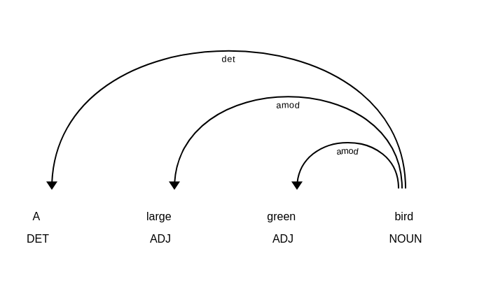
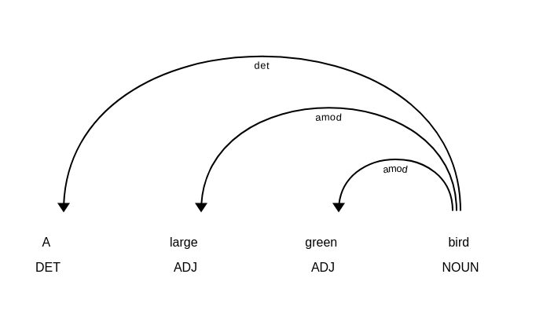
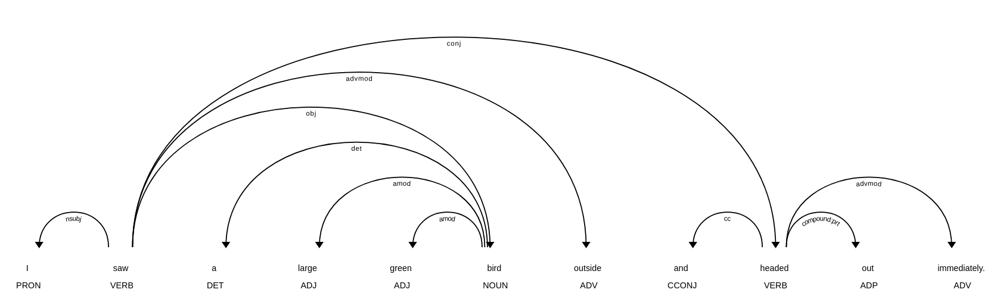
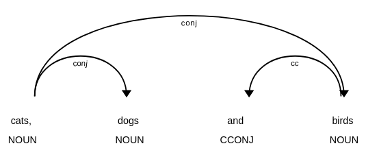
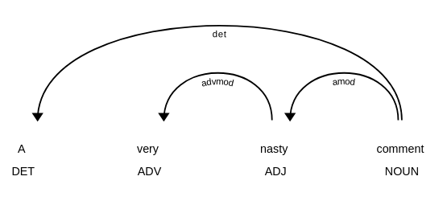
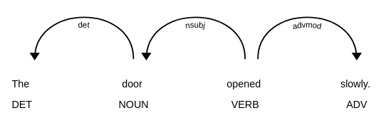
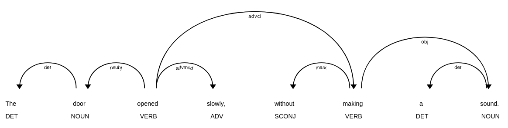
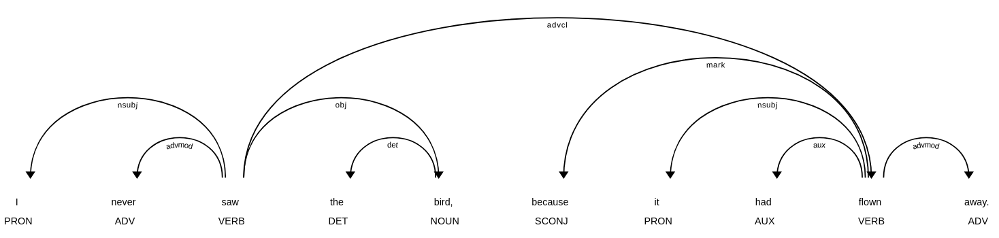
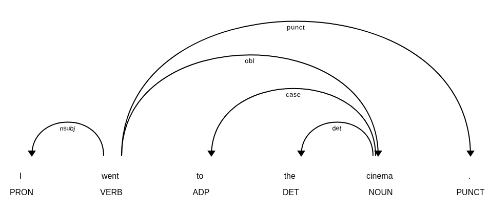

# Dependências Universais

Nesta seção, nos aprofundaremos nas Dependências Universais, um framework que já encontramos em conexão com a análise sintática e a análise morfológica na Parte II e na Parte III.

## Objetivos de Aprendizagem

Neste módulo, você será capaz de:

* **Compreender os objetivos do projeto:** Entender as metas e o propósito das Dependências Universais como um projeto colaborativo.
* **Entender o framework:** Compreender as Dependências Universais como uma estrutura padronizada para descrever a gramática e a estrutura da linguagem.
* **Conhecer o esquema de anotação:** Dominar os fundamentos de como as anotações das Dependências Universais são estruturadas e aplicadas.
* **Explorar anotações práticas:** Saber como acessar e manipular as anotações das Dependências Universais utilizando a biblioteca spaCy.

## 1. Uma breve introdução às Dependências Universais

Dependências Universais (ou UD, do inglês *Universal Dependencies*), é um projeto colaborativo que tem dois objetivos sobrepostos:

1. desenvolver um framework comum para descrever a estrutura gramatical de diversos idiomas (de Marneffe et al. [2021](https://doi.org/10.1162/coli_a_00402))
2. criar corpora anotados – ou *treebanks* – para diversos idiomas que aplicam este framework (Nivre et al. [2020](https://aclanthology.org/2020.lrec-1.497/))

Desta forma, o projeto busca possibilitar a descrição sistemática de estruturas sintáticas e características morfológicas em vários idiomas, o que naturalmente também permite traçar comparações entre os idiomas.

O objetivo de alcançar ampla aplicabilidade em diversos idiomas confere ao projeto o epíteto "Universal", enquanto o termo "Dependências" refere-se à maneira como o framework descreve as estruturas sintáticas, que será detalhada mais adiante.

Corpora linguísticos que contêm anotações para relações sintáticas são frequentemente chamados de *treebanks* (bancos de árvores), porque as estruturas sintáticas são geralmente representadas usando estruturas de árvore. Neste contexto, então, um *treebank* é simplesmente uma coleção de árvores sintáticas, que foram consistentemente anotadas usando UD ou algum outro framework.

O número de *treebanks* anotados usando UD tem crescido constantemente ao longo dos anos (para uma visão geral recente de 90 *treebanks*, veja Nivre et al. [2020](https://aclanthology.org/2020.lrec-1.497/)). O design e a criação de tais *treebanks* foram documentados em detalhes para vários idiomas, como finlandês (Haverinen et al. [2014](https://dx.doi.org/10.1007/s10579-013-9244-1)), Wolof (Dione [2019](https://aclanthology.org/W19-8003/)), Hindi/Urdu (Bhat et al. [2017](https:///dx.doi.org/10.1007/978-94-024-0881-2_24)) e chinês mandarim (Poiret et al. [2021](https:///dx.doi.org/10.1007/s10579-021-09564-2)).

Para entender melhor o esforço envolvido na UD como um projeto, deve-se reconhecer que desenvolver um esquema de anotação consistente que pode ser usado para descrever a estrutura gramatical de diversos idiomas, como finlandês, Wolof e Hindi/Urdu, está longe de ser trivial.

Desafios adicionais surgem do uso pretendido dos *treebanks* da UD: eles se destinam a servir tanto às comunidades de pesquisa computacional quanto linguística. Como de Marneffe et al. ([2021: 302–303](https://doi.org/10.1162/coli_a_00402)) apontam, o framework UD é um compromisso entre vários critérios concorrentes, que são fornecidos em formato ligeiramente abreviado abaixo:

1. A UD precisa ser razoavelmente satisfatória para a análise linguística de idiomas individuais
2. A UD precisa ser boa para realçar semelhanças estruturais em idiomas relacionados
3. A UD deve ser adequada para anotação rápida e consistente por um anotador humano
4. A UD deve ser facilmente compreendida e usada por usuários não linguistas
5. A UD deve ser adequada para análise computacional (*parsing*) com alta precisão
6. A UD deve oferecer um bom suporte a tarefas de processamento de linguagem natural a jusante (*downstream*)

A necessidade de equilibrar esses critérios também se reflete no design do framework UD, que é introduzido em mais detalhes a seguir.

## 2. Premissas básicas por trás das Dependências Universais

O framework das Dependências Universais é fortemente influenciado por teorias gramaticais de orientação tipológica. Essas teorias buscam descrever e classificar os idiomas com base em suas características estruturais (para uma discussão extensa sobre os fundamentos teóricos da UD, veja de Marneffe et al. [2021](https://doi.org/10.1162/coli_a_00402)).

A unidade básica de análise na UD é a palavra. A representação das relações sintáticas, por sua vez, é baseada em **dependências**, ou seja, relações que se mantêm entre as palavras. Em alguns aspectos, no entanto, a UD diverge das gramáticas de dependência tradicionais, principalmente devido à sua necessidade de atender à gama de propósitos descritos acima (veja Osborne & Gerdes [2019](https://doi.org/10.5334/gjgl.537)).

A descrição de estruturas linguísticas na UD é baseada em três tipos de unidades frasais: **nominais** (*nominals*), **orações** (*clauses*) e **modificadores** (*modifiers*) (de Marneffe et al. [2021: 257](https://doi.org/10.1162/coli_a_00402)). Essas unidades frasais podem consistir em uma ou mais palavras.

Neste contexto, a noção de unidades frasais refere-se a estruturas linguísticas que são construídas em torno de palavras que pertencem a classes de palavras particulares. Enquanto os nominais são usados para representar coisas – frequentemente realizados usando substantivos –, as orações são usadas para representar eventos, que são construídos em torno de verbos. Os modificadores, por sua vez, dependem de adjetivos e advérbios para expandir o significado tanto de nominais quanto de orações.

As seções a seguir examinam cada unidade frasal em maiores detalhes.

### 2.1. Nominais

Vamos começar focando na primeira unidade frasal, os nominais.

O que a UD define como nominais tem sido descrito extensivamente em várias teorias linguísticas, nas quais eles têm sido tratados, por exemplo, como sintagmas nominais (*noun phrases*) (Keizer [2007](https://doi.org/10.1017/CBO9780511627699)) e grupos nominais (*nominal groups*) (Martin et al. [2021](https://doi.org/10.1080/00437956.2021.1957545)). O que essas definições têm em comum é que os nominais são geralmente construídos em torno de substantivos.

Para explorar os nominais na UD, começaremos importando três bibliotecas: spaCy, Stanza e spacy-stanza, que foram introduzidas no capítulo anterior.

```python
# Importa as bibliotecas spaCy, Stanza e spacy-stanza
import spacy
import stanza
import spacy_stanza
```

Em seguida, usamos a função `load_pipeline()` do spacy-stanza para carregar um modelo de linguagem do Stanza para o inglês, que armazenamos na variável `nlp`.

Também passamos o código de idioma para o inglês (`'en'`) para o argumento `name` e a string `'tokenize, pos, lemma, depparse'` para o argumento `processors` para carregar apenas os componentes de que precisamos.

O modelo de linguagem já deve ter sido pré-instalado no seu servidor. Se você ainda não baixou um modelo de linguagem para o inglês, siga as instruções na seção anterior.

```python
# Chama a variável para examinar o modelo de linguagem
nlp
```

```text
<spacy.lang.en.English at 0x286733610>
```

Isso nos dá um modelo de linguagem do Stanza encapsulado em um objeto *Language* do spaCy!

Se você se pergunta por que usamos um modelo de linguagem do Stanza em vez de um modelo nativo do spaCy, a razão é que o analisador de dependências (*dependency parser*) no spaCy não é treinado usando um corpus anotado com a UD.

Na Parte II, aprendemos que os modelos de linguagem do spaCy para o inglês são treinados usando o corpus OntoNotes 5.0. Este corpus usa um esquema diferente para descrever as relações sintáticas, que foi originalmente desenvolvido para o Penn Treebank (PTB; Marcus et al. [1993](https://aclanthology.org/J93-2004/)). O spaCy usa outra ferramenta para mapear as relações do Penn Treebank para aquelas definidas na UD, mas as relações definidas no PTB cobrem apenas um subconjunto das relações definidas na UD.

Por esse motivo, usamos o modelo de linguagem em inglês do Stanza, que foi treinado em [um corpus de textos](https://github.com/UniversalDependencies/UD_English-EWT) anotados usando a UD.

No entanto, também queremos usar alguns recursos fornecidos pelo spaCy, como o módulo *displacy* para visualizar dependências sintáticas, como aprendemos na Parte II, razão pela qual usamos o modelo de linguagem do Stanza por meio da biblioteca spacy-stanza.

Vamos continuar importando o módulo displacy para visualizar as dependências sintáticas.

```python
# Importa o módulo displacy do spaCy
from spacy import displacy
```

Em seguida, definimos uma string – "A large green bird" (Um grande pássaro verde) – que fornecemos ao modelo de linguagem sob `nlp` e atribuímos o objeto *Doc* resultante à variável `nominal`.

```python
# Fornece uma string ao modelo de linguagem; armazena o resultado na variável 'nominal'
nominal = nlp('A large green bird')
```

A seguir, usamos a função `render()` para desenhar as dependências sintáticas entre os *Tokens* no objeto *Doc* `nominal_group`.

Ao passar a string `dep` para o argumento `style`, nós instruímos explicitamente o *displacy* a visualizar as dependências sintáticas (porque o *displacy* também pode visualizar entidades nomeadas, como aprendemos na Parte II).

```python
# Renderiza as dependências sintáticas usando a função render() do displacy
displacy.render(nominal, style='dep')
```



Isso nos dá uma visualização das dependências sintáticas entre os quatro *Tokens* que compõem o objeto *Doc* `nominal`.

Três arcos partem do *Token* "bird" e apontam para os *Tokens* "A", "large" e "green". Isso significa que o substantivo "bird" atua como a **cabeça** (*head*), enquanto os outros três *Tokens* são **dependentes** (*dependents*) dessa cabeça.

Essas dependências são especificadas posteriormente por relações sintáticas definidas no framework da UD, que são dadas pelo rótulo abaixo de cada arco. Neste caso, o substantivo principal "bird" (pássaro) tem dois modificadores adjetivais (`amod`), "large" (grande) e "green" (verde), e um determinante (`det`), "a" (um).

Se iterarmos sobre os *Tokens* no objeto *Doc* sob a variável `nominal` e imprimirmos as dependências sintáticas para cada Token, que estão disponíveis sob o atributo `dep_`, podemos ver que o substantivo principal "bird" tem a etiqueta de dependência `root` (raiz).

```python
# Itera sobre cada Token no objeto Doc 'nominal'
for token in nominal:
    
    # Imprime cada Token e sua etiqueta de dependência
    print(token, token.dep_)
```

```text
A det
large amod
green amod
bird root
```

Em outras palavras, toda a estrutura sintática deste nominal é construída em torno de um substantivo, que é então elaborado por modificadores, que serão discutidos brevemente a seguir.

Primeiro, no entanto, voltamos nossa atenção para outra unidade frasal, a saber, as orações (*clauses*).

### 2.2. Orações 

A oração desempenha um papel fundamental na linguagem natural. Em *Introduction to Functional Grammar* (Introdução à Gramática Funcional), Halliday e Matthiessen ([2013: 10](https://doi.org/10.4324/9780203431269)) observam que:

> A oração é a unidade central de processamento na lexicogramática — no sentido específico de que é na oração que significados de diferentes tipos são mapeados em uma estrutura gramatical integrada.

Esses três tipos distintos de significados – a oração como mensagem, a oração como troca e a oração como representação – são codificados em cada oração. Como mensagens, as orações têm uma estrutura temática, o que permite destacar informações-chave. Como forma de troca, as orações permitem a encenação de relações sociais, pois são usadas para dar e exigir informações ou coisas. Finalmente, como forma de representação, as orações permitem representar todos os aspectos da experiência humana: que tipos de entidades participam de que tipos de processos, e sob quais circunstâncias (Halliday e Matthiessen [2013: 83–85](https://doi.org/10.4324/9780203431269)).

Para entender melhor o que permite às orações desempenhar todas essas funções, vamos considerar sua *classificação* (rank) entre as diferentes unidades linguísticas, conforme definido por Halliday e Matthiessen ([2013: 9–10](https://doi.org/10.4324/9780203431269)):

1. oração (clause)
2. sintagma / grupo (phrase / group)
3. palavra (word)
4. morfema (morpheme)

As unidades linguísticas em cada classificação consistem em uma ou mais unidades da classificação inferior. As orações consistem em sintagmas ou grupos (ou nominais), que por sua vez consistem em palavras que são formadas por morfemas.

Se aplicarmos essa ideia à UD, podemos pensar que as orações estão acima dos nominais, o que permite que as orações combinem os nominais em unidades maiores (cf. de Marneffe et al. [2021: 258](https://doi.org/10.1162/coli_a_00402)).

Para explorar mais essa ideia, vamos definir uma string com a oração “I saw a large green bird” (Eu vi um grande pássaro verde) e fornecer a string como entrada para o modelo de linguagem na variável `nlp`. Em seguida, armazenamos o resultado na variável `clause`.

Assim como acima, usamos então a função `render()` do módulo *displacy* para visualizar as dependências sintáticas.

```python
# Define um objeto de string, fornece-o ao modelo de linguagem sob 'nlp' e
# armazena o resultado na variável 'clause'.
clause = nlp('I saw a large green bird.')

# Usa o displacy para renderizar as dependências sintáticas
displacy.render(clause, style='dep')
```



Isso nos dá as relações sintáticas que se mantêm entre os *Tokens* na oração.

Antes de prosseguirmos, vamos imprimir as etiquetas de dependência para cada *Token*.

```python
# Itera sobre cada Token no objeto Doc 'clause'
for token in clause:
    
    # Imprime cada token e sua etiqueta de dependência
    print(token, token.dep_)
```

```text
I nsubj
saw root
a det
large amod
green amod
bird obj
. punct
```

A saída mostra que a raiz (`root`) ou a cabeça da oração é o verbo “saw”. Como mostra a visualização, dois arcos partem da raiz em direção aos *Tokens* “I” e “bird”.

Tanto “I” quanto “a large green bird” são nominais e dependentes do verbo “saw”, que é a cabeça da oração. O pronome “I” atua como o sujeito nominal da oração, conforme identificado pelo rótulo (`nsubj`), enquanto o nominal “a large green bird” é o objeto (`obj`).

Observe que as dependências sintáticas são sempre desenhadas entre as cabeças: os arcos partem do verbo principal da oração e terminam nas cabeças dos nominais. Essas cabeças podem então ter suas próprias dependências, conforme ilustrado pelo nominal “a large green bird”, que foi discutido abaixo.

Assim como os nominais, as orações podem ser expandidas em unidades maiores, conforme exemplificado abaixo.

```python
# Define outro exemplo e fornece-o ao modelo de linguagem sob 'nlp'
clause_2 = nlp('I saw a large green bird outside and headed out immediately.')

# Usa o displacy para renderizar as dependências sintáticas
displacy.render(clause_2, style='dep')
```



Isso adiciona outro arco, que vai do verbo principal “saw” ao verbo “headed”, e tem a relação `conj` ou adjunto (conjunct). O `conj` é usado para unir duas orações:

1. I saw a large green bird outside
2. and headed out immediately.

Isso ilustra como as orações também podem ser expandidas em unidades maiores que consistem em múltiplas orações. Neste caso, as orações que participam de uma unidade maior podem ser identificadas pela relação de dependência `conj` desenhada entre os verbos.

Note, no entanto, que a relação `conj` também pode ser usada dentro de nominais para unir substantivos, conforme exemplificado abaixo.

```python
# Define outro exemplo e usa o displacy para renderizar as dependências sintáticas
displacy.render(nlp('cats, dogs and birds'), style='dep')
```



Isso ilustra como a UD usa a mesma relação para descrever relações sintáticas entre palavras em diferentes unidades frasais.

Por esse motivo, é preciso prestar atenção tanto às etiquetas de classes gramaticais (*part-of-speech tags*) quanto às dependências sintáticas ao consultar anotações da UD para identificar a unidade frasal em questão.

Para exemplificar, quando a relação `conj` é desenhada entre substantivos, pode-se presumir que a unidade frasal é um nominal. Alternativamente, se a relação `conj` existir entre verbos, a unidade em questão é uma oração.

### 2.3. Modificadores 

O tipo final de unidade frasal a ser discutido são os modificadores, que permitem refinar o significado de orações e nominais.

Vamos começar com um exemplo simples de modificadores em um nominal.

```python
# Define um objeto de string, fornece-o ao modelo de linguagem sob 'nlp' e
# armazena o resultado na variável 'modifier_n'.
modifier_n = nlp('A very nasty comment')

# Usa o displacy para renderizar as dependências sintáticas
displacy.render(modifier_n, style='dep')
```



O arco que vai do substantivo principal “comment” para o adjetivo “nasty” tem a relação `amod`, que significa modificador adjetival (*adjectival modifier*).

Além disso, o adjetivo “nasty” tem um dependente adicional, o advérbio “very”, que atua como seu modificador adverbial (`advmod`).

Ambos os modificadores servem para refinar o significado do substantivo principal “comment”.

Assim como vimos com a relação de conjunção (`conj`) acima, essas relações podem ser aplicadas tanto a orações quanto a nominais.

Considere o exemplo abaixo, no qual o advérbio “slowly” é um dependente do verbo principal “opened”.

```python
# Define um objeto de string, fornece-o ao modelo de linguagem sob 'nlp' e
# armazena o resultado na variável 'modifier_c'.
modifier_c = nlp('The door opened slowly.')

# Usa o displacy para renderizar as dependências sintáticas
displacy.render(modifier_c, style='dep')
```


As orações também podem ser modificadas por orações, conforme mostrado pelo modificador de oração adverbial (`advcl`) no exemplo abaixo.

```python
# Define um objeto de string, fornece-o ao modelo de linguagem sob 'nlp' e
# armazena o resultado na variável 'modifier_c2'.
modifier_c2 = nlp('The door opened slowly, without making a sound.')

# Usa o displacy para renderizar as dependências sintáticas
displacy.render(modifier_c2, style='dep')
```



## 3. Entendendo o esquema de anotação

Até agora, discutimos principalmente a descrição de relações sintáticas dentro do framework de Dependências Universais (UD).

Além das [37 relações sintáticas](https://universaldependencies.org/u/dep/) definidas na UD, o framework fornece um esquema rico para descrever a morfologia, ou seja, a *forma* das palavras.

O esquema da UD para morfologia contém três níveis de representação:

1. Um lema, ou a forma base da palavra
2. Uma etiqueta de classe gramatical (*part-of-speech tag*) que determina a classe de palavras à qual a palavra pertence
3. Um conjunto de recursos que definem as propriedades lexicais e gramaticais da palavra

A UD define 17 classes de palavras ou partes do discurso, que podem ser divididas em três grupos:

1. Palavras de classe aberta ou lexicais: `ADJ ADV INTJ NOUN PROPN VERB`
2. Palavras de classe fechada ou gramaticais: `ADP, AUX, CCONJ, DET, NUM, PART, PRON, SCONJ`
3. Outros: `PUNCT, SYM, X`

A UD também define um grande número de recursos lexicais e flexionais para descrever características morfológicas, ou seja, as formas das palavras.

A UD define recursos morfológicos usando dois componentes, *nomes* (*names*) e *valores* (*values*). Como aprendemos na Parte II, o spaCy armazena os recursos morfológicos sob o atributo `morph` de um objeto *Token*.

Vamos definir um exemplo rápido, fornecê-lo ao modelo de linguagem na variável `nlp` e imprimir cada *Token* e suas características morfológicas.

```python
# Define uma frase de exemplo; fornece-a ao modelo
# de linguagem e armazena o resultado na variável 'books'
books = nlp('I like those books.')

# Itera sobre cada Token no objeto Doc
for token in books:
    
    # Imprime cada Token, sua etiqueta de classe gramatical e
    # características morfológicas. Separa-os usando strings
    # contendo caracteres de tabulação '\t' para uma
    # saída mais limpa.
    print(token, '\t', token.pos_, '\t', token.morph)
```

```text
I 	     PRON 	 Case=Nom|Number=Sing|Person=1|PronType=Prs
like 	 VERB 	 Mood=Ind|Number=Sing|Person=1|Tense=Pres|VerbForm=Fin
those 	 DET 	 Number=Plur|PronType=Dem
books 	 NOUN 	 Number=Plur
. 	     PUNCT 	 
```

No resultado, cada *Token* no lado esquerdo é acompanhado por sua etiqueta de classe gramatical e características morfológicas à direita.

Observe como os recursos morfológicos diferem de acordo com a etiqueta de classe gramatical do *Token*.

Para o pronome (`PRON`) “I”, o modelo de linguagem prediz quatro tipos de recursos morfológicos: `Case`, `Number`, `Person` e `PronType` (tipo de pronome). Os verbos como “like”, por sua vez, recebem recursos para `Mood`, `Tense` e `VerbForm`.

Como aprenderemos mais adiante na Parte III, os recursos morfológicos podem ser usados para realizar consultas muito específicas para estruturas linguísticas particulares.

## 4. Explorando dependências sintáticas usando o spaCy

O spaCy oferece meios poderosos para explorar dependências sintáticas por meio do objeto *Token*.

Vamos começar definindo outro exemplo, fornecendo-o ao modelo de linguagem e visualizando suas dependências sintáticas.

```python
# Define uma string de exemplo e fornece-a ao modelo de linguagem sob 'nlp',
# armazena o resultado na variável 'tree'.
tree = nlp('I never saw the bird, because it had flown away.')

# Usa o displacy para renderizar as dependências sintáticas
displacy.render(tree, style='dep')
```



Neste exemplo, o verbo principal “saw” (vi) tem um dependente, “flown” (voado), que estão conectados pela relação de dependência `advcl` – um modificador de oração adverbial.

Se quisermos recuperar tudo o que modifica a oração principal “I never saw the bird”, podemos usar o atributo `subtree` de um objeto *Token*.

Vamos explorar isso iterando sobre cada *Token* no objeto *Doc* `tree`.

Se o *Token* tiver a dependência `advcl` sob o atributo `dep_`, imprimimos o *Token*, seu índice no objeto *Doc* e o que quer que esteja armazenado sob o atributo `subtree`.

```python
# Itera sobre cada Token no objeto Doc 'tree'
for token in tree:
    
    # Verifica se o Token tem a relação de dependência 'acl:relcl',
    # que significa uma oração relativa (nota no código original: busca por 'advcl')
    if token.dep_ == 'advcl':
        
        # Se o Token tiver essa dependência, usa o atributo subtree
        # para buscar todos os dependentes abaixo deste Token. O atributo subtree
        # retorna um gerador, então converte o resultado em uma lista e imprime.
        print(token, token.i, list(token.subtree))
```

```text
flown 9 [because, it, had, flown, away]
```

Se você comparar essa saída com as dependências sintáticas visualizadas acima, verá que o atributo `subtree` retorna cada dependente do *Token* e o próprio *Token*.

Se quisermos recuperar apenas os *Tokens* que dependem do *Token* atual, podemos usar o atributo `children`.

Vamos usar o índice do *Token* para recuperar seus filhos e imprimir o resultado.

```python
# Recupera o Token no índice 9 no objeto Doc e busca seus filhos.
# Isso retorna um gerador, então converte a saída em uma lista antes de imprimir.
print(list(tree[9].children))
```

```text
[because, it, had, away]
```

Como você pode ver, o atributo `children` não retorna o próprio *Token*, mas inclui apenas os dependentes.

O spaCy também permite recuperar os dependentes imediatos de um *Token* usando os atributos `lefts` e `rights`.

```python
# Recupera os dependentes sintáticos à esquerda e à direita do Token no
# índice 9 no objeto Doc 'tree'. Converte os resultados em listas e
# imprime.
print(list(tree[9].lefts), list(tree[9].rights))
```

```text
[because, it, had] [away]
```

Também podemos nos mover para o outro lado – subindo na árvore de análise sintática (*parse tree*) – usando os atributos `head` e `ancestors`.

Vamos começar examinando o verbo auxiliar “have” (tinha) imediatamente à esquerda do verbo “flown” no índice 8 do objeto *Doc*.

```python
# Recupera o Token
tree[8]
```

```text
had
```

Para recuperar o *Token* que atua como a cabeça do verbo auxiliar, podemos usar o atributo `head`, como aprendemos na Parte II.

Vamos recuperar a cabeça para o verbo auxiliar “had” no índice 8 do objeto *Doc* `tree`.

```python
# Recupera o atributo 'head' do Token
tree[8].head
```

```text
flown
```

Isso, no entanto, nos dá apenas a cabeça imediata, ou seja, o verbo “flown”.

Para recuperar a cabeça e todas as suas cabeças (ancestrais), podemos usar o atributo `ancestors`. Este atributo retorna um objeto gerador, que deve ser convertido em uma lista para exame.

```python
# Recupera os ancestrais para o Token no índice 8. Converte o resultado em uma lista.
list(tree[8].ancestors)
```

```text
[flown, saw]
```

Você pode pensar neste atributo como traçar um caminho de volta pelas dependências até a raiz da árvore de análise sintática.

Vamos iterar sobre os ancestrais e imprimir cada *Token* junto com seu índice, cabeça e dependência sintática.

```python
# Itera sobre cada Token na lista de ancestrais para o Token no índice 8.
for token in list(tree[8].ancestors):
    
    # Imprime cada Token, seu índice, cabeça e dependência.
    print(token, token.i, token.head, token.dep_)
```

```text
flown 9 saw advcl
saw 2 saw root
```

Como você pode ver, a primeira cabeça do verbo auxiliar “had” é o verbo “flown” no índice 9 do objeto *Doc*, que por sua vez é um dependente do verbo “saw” no índice 2. O verbo “saw” também é a raiz da árvore de análise sintática.

## 5. Uma palavra final sobre avaliação

Modelos de linguagem treinados em *treebanks* de Dependências Universais geralmente são acompanhados por informações sobre o quão bem os modelos podem prever os recursos linguísticos definidos no esquema de anotação da UD.

Como aprendemos na Parte II, o desempenho dos modelos é avaliado em relação a dados anotados por humanos, o chamado padrão ouro (*gold standard*) ou verdade absoluta (*ground truth*).

Para a análise de dependências (*dependency parsing*), o quão bem um modelo atua é tradicionalmente medido usando duas métricas:

* UAS, ou *unlabeled attachment score* (pontuação de anexo não rotulada), é simplesmente a porcentagem de palavras às quais é atribuída a cabeça correta.
* LAS, ou *labeled attachment score* (pontuação de anexo rotulada), é a porcentagem de palavras às quais é atribuída a cabeça correta *e* a etiqueta de dependência (ou "rótulo") correta.

Vamos definir um exemplo rápido para examinar essas métricas.

```python
# Define uma string de exemplo e fornece-a ao modelo de linguagem sob 'nlp',
# armazena o resultado na variável 'las'.
las = nlp('I went to the cinema.')

# Usa o displacy para renderizar as dependências sintáticas. Define o argumento
# 'collapse_punct' como False.
displacy.render(las, style='dep', options={'collapse_punct': False})
```



Se a árvore de análise sintática acima fosse anotada por um humano, poderíamos então fornecer o mesmo texto a um modelo de linguagem e comparar a saída do modelo com a árvore de análise sintática anotada pelo humano.

Para calcular a pontuação de anexo não rotulada (UAS), nós simplesmente calcularíamos a quantas palavras a cabeça correta foi atribuída pelo modelo.

Ao calcular a pontuação de anexo rotulada (LAS), uma previsão só é considerada correta se o modelo atribuir a cabeça correta à palavra *e* prever corretamente a relação sintática entre essas palavras.

No entanto, UAS e LAS tornam-se problemáticas ao considerar os objetivos multilíngues da UD como um projeto: deve-se também ser capaz de comparar o desempenho de modelos *entre idiomas*.

Considere, por exemplo, o equivalente em finlandês do exemplo acima: "*Minä menin elokuviin.*" ("Eu fui ao cinema.").

Se o modelo de linguagem em inglês previsse a cabeça errada para uma única palavra, o modelo ainda assim alcançaria uma pontuação UAS ou LAS de $5/6 \approx 0.83$.

Se o analisador finlandês, por sua vez, cometesse um único erro, a pontuação correspondente seria de $2/3 \approx 0.66$.

Zeman et al. [2018: 5](https://aclanthology.org/K18-2001.pdf) resumem o problema de forma sucinta:

> ... palavras de função (ou palavras gramaticais) frequentemente correspondem a recursos morfológicos em outros idiomas. Além disso, idiomas com muitas palavras de função (por exemplo, inglês) têm sentenças mais longas do que idiomas morfologicamente ricos (por exemplo, finlandês), portanto, um único erro em finlandês custa ao analisador significativamente mais do que um erro em inglês de acordo com a métrica LAS.

Por esse motivo, várias métricas alternativas foram propostas para medir o desempenho de modelos de linguagem para análise de dependências.

CLAS, ou *content-labeled attachment score*, é como a LAS, mas ignora palavras de função (por exemplo, palavras com as relações `aux` `case` `cc` `clf` `cop` `det` `mark`) e pontuação (`punct`) ao calcular a pontuação. Apenas palavras de conteúdo são contadas (Nivre & Fang [2017](https://aclanthology.org/W17-0411.pdf)).

MLAS, ou *morphologically-aware labeled attachment score*, é em grande parte semelhante à CLAS, mas também avalia se a etiqueta de classe gramatical e recursos morfológicos selecionados foram previstos corretamente (Zeman et al. [2018: 5](https://aclanthology.org/K18-2001.pdf)).

BLEX, ou *bilexical dependency score*, é como a MLAS, mas a informação morfológica é substituída por lemas (Zeman et al. [2018: 5](https://aclanthology.org/K18-2001.pdf)).

Esta seção deve ter lhe dado uma ideia das Dependências Universais como um projeto e um esquema de anotação.

Na próxima seção, aprenderemos a pesquisar padrões em anotações linguísticas.