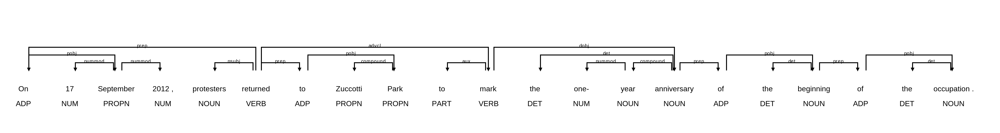

# Encontrando padrões linguísticos com o spaCy

Esta seção ensina você a encontrar padrões linguísticos usando o spaCy, uma biblioteca de processamento de linguagem natural para Python.

Se você não estiver familiarizado com as anotações linguísticas produzidas pelo spaCy, ou precisar refrescar a memória, revisite a Parte II antes de trabalhar nesta seção.

## Objetivos de Aprendizagem

Ao final deste módulo, você será capaz de:

* **Buscar por etiquetas e traços:** Saber como procurar padrões com base em etiquetas de classe gramatical (*part-of-speech tags*) e traços morfológicos.
* **Buscar por dependências:** Saber como procurar padrões com base em dependências sintáticas.
* **Examinar o contexto:** Saber como examinar os padrões encontrados em seu contexto de ocorrência.

## 1. Encontrando padrões usando os *Matchers* do spaCy

Anotações linguísticas, tais como etiquetas de classe gramatical, dependências sintáticas e traços morfológicos, ajudam a impor estrutura à linguagem escrita. De maneira crucial, as anotações linguísticas permitem buscar por **padrões estruturais** em vez de palavras ou expressões individuais. Isso permite definir padrões de busca de forma flexível.

Na biblioteca spaCy, a capacidade de busca por padrões é fornecida por diversos componentes chamados *Matchers* (algo como "casadores de padrões").

O spaCy oferece três tipos de *Matchers*:

1. O [*Matcher*](https://spacy.io/api/matcher), que permite definir regras que buscam por **palavras ou expressões** específicas examinando os atributos de objetos *Token*.
2. O [*DependencyMatcher*](https://spacy.io/api/dependencymatcher), que permite buscar **padrões sintáticos** nas árvores de análise.
3. O [*PhraseMatcher*](https://spacy.io/api/phrasematcher), um método rápido para casar objetos *Doc* do spaCy com outros objetos *Doc*.

As seções a seguir mostram como usar o *Matcher* para casar objetos *Token* e suas sequências com base em etiquetas de classe gramatical e traços morfológicos, e como usar o *DependencyMatcher* para casar dependências sintáticas.

### 1.1. Casando palavras ou expressões

Para começar a trabalhar com o *Matcher*, vamos importar a biblioteca spaCy e carregar um modelo de linguagem pequeno para o inglês.

```python
# Importa a biblioteca spaCy para o Python
import spacy

# Carrega um modelo de linguagem pequeno para o inglês; atribui o resultado a 'nlp'
nlp = spacy.load('en_core_web_sm')
```

Para termos algum dado com que trabalhar, vamos carregar um texto extraído de um artigo da Wikipédia.

Para isso, usamos a função `open()` do Python em combinação com a instrução `with` para abrir o arquivo em modo de leitura, fornecendo os argumentos `file`, `mode` e `encoding`, conforme instruído na Parte II.

Em seguida, chamamos o método `read()` para ler o conteúdo do arquivo e armazenamos o resultado na variável `text`.

```python
# Usa a função open() com a instrução 'with' para abrir o arquivo em modo de leitura
with open(file='data/occupy.txt', mode='r', encoding='utf-8') as file:

    # Usa o método read() para ler o conteúdo do arquivo; atribui o resultado à
    # variável 'text'
    text = file.read()
```

Isso devolve um objeto *string* do Python que contém o artigo em texto puro, agora disponível na variável `text`.

Em seguida, fornecemos esse objeto ao modelo de linguagem armazenado na variável `nlp`, conforme instruído na Parte II.

Também usamos a função `len()` do Python para contar o número de palavras no texto.

```python
# Fornece o objeto string ao modelo de linguagem
doc = nlp(text)

# Usa a função len() para verificar o tamanho do objeto Doc e contar
# quantos Tokens estão contidos nele.
len(doc)
```

```
14867
```

Agora que temos um objeto *Doc* do spaCy com quase 15 000 *Tokens*, podemos prosseguir e importar a classe *Matcher* do submódulo `matcher` do spaCy.

```python
# Importa a classe Matcher
from spacy.matcher import Matcher
```

Importar a classe *Matcher* do submódulo `matcher` do spaCy nos permite criar objetos *Matcher*.

Ao criar um objeto *Matcher*, você precisa fornecer a ele o vocabulário do modelo de linguagem usado para encontrar as correspondências.

A razão para isso é bastante simples: se você quer buscar padrões em algum idioma, primeiro precisa conhecer o vocabulário desse idioma.

O spaCy armazena o vocabulário de um modelo em um objeto [*Vocab*](https://spacy.io/api/vocab). O objeto *Vocab* pode ser encontrado no atributo `vocab` de um objeto *Language* do spaCy, apresentado na Parte II.

Neste caso, temos o objeto *Language* que contém um modelo de linguagem pequeno para o inglês armazenado na variável `nlp`, o que significa que podemos acessar seu objeto *Vocab* pelo atributo `nlp.vocab`.

Chamamos então a **classe** *Matcher* e fornecemos o vocabulário disponível em `nlp.vocab` ao argumento `vocab` para criar um objeto *Matcher*. Armazenamos o objeto resultante na variável `matcher`.

```python
# Cria um Matcher e fornece o vocabulário do modelo; atribui o resultado à variável 'matcher'
matcher = Matcher(vocab=nlp.vocab)

# Chama a variável para examinar o objeto
matcher
```

```
<spacy.matcher.matcher.Matcher at 0x295de8140>
```

O objeto *Matcher* está agora pronto para armazenar os padrões que queremos buscar.

Esses padrões – ou, mais especificamente, essas *regras de padrão* – são criados usando um [formato específico](https://spacy.io/api/matcher#patterns) definido pelo spaCy.

Cada padrão consiste em uma lista Python, que é preenchida por dicionários Python.

Cada dicionário nessa lista descreve o padrão para casar um único *Token* do spaCy.

Se você deseja casar uma sequência de *Tokens*, precisa definir múltiplos dicionários dentro de uma única lista, cuja ordem acompanha a do padrão a ser casado.

Vamos começar definindo um padrão simples para casar sequências de pronomes e verbos, e armazenar esse padrão na variável `pronoun_verb`.

Esse padrão consiste em uma lista, marcada pelos colchetes `[]`, que contém dois dicionários, marcados por chaves `{}` e separados por vírgula. Os pares de chave e valor em um dicionário são separados por dois-pontos.

* A **chave** do dicionário determina qual atributo do *Token* deve ser buscado. Os atributos suportados pelo *Matcher* podem ser encontrados [aqui](https://spacy.io/api/matcher#patterns).
* O **valor** associado à chave determina o valor específico daquele atributo.

Neste caso, definimos um padrão que busca uma sequência de duas etiquetas gerais de classe gramatical (`POS`), apresentadas na Parte II: pronomes (`PRON`) e verbos (`VERB`).

Observe que tanto as chaves quanto os valores devem ser fornecidos em letras maiúsculas.

```python
# Define uma lista com dicionários aninhados que contém o padrão a ser casado
pronoun_verb = [{'POS': 'PRON'}, {'POS': 'VERB'}]
```

Agora que definimos o padrão usando uma lista e dicionários, podemos adicioná-lo ao objeto *Matcher* armazenado na variável `matcher`.

Isso pode ser feito com o método `add()`, que exige duas entradas:

1. Um objeto *string* do Python que define um nome para o padrão. Isso é necessário para fins de identificação.
2. Uma lista contendo o(s) padrão(ões) a ser(em) buscado(s). Como uma única regra de casamento de padrões pode conter múltiplos padrões, a entrada deve ser uma *lista de listas*. Por isso envolvemos as listas de entrada em colchetes, por exemplo `[pattern_1]`.

```python
# Adiciona o padrão ao matcher sob o nome 'pronoun+verb'
matcher.add("pronoun+verb", patterns=[pronoun_verb])
```

Para buscar correspondências no objeto *Doc* armazenado na variável `doc`, fornecemos o objeto *Doc* ao *Matcher* e armazenamos o resultado na variável `result`.

Também definimos o argumento opcional `as_spans` como `True`, o que instrui o spaCy a devolver os resultados como objetos *Span*.

Como você deve lembrar da Parte II, objetos *Span* correspondem a "fatias" contínuas de objetos *Doc*.

```python
# Aplica o Matcher ao objeto Doc armazenado em 'doc'; fornece o argumento
# 'as_spans' com o valor True para obter Spans como saída
result = matcher(doc, as_spans=True)

# Chama a variável para examinar a saída
result
```

```
[that expressed,
 It aimed,
 It formed,
 this began,
 it organizes,
 that read,
 who designed,
 He wrote,
 there were,
 They promoted,
 It refers,
 which started,
 that indicate,
 that allowed,
 they saw,
 they argued,
 they called,
 it takes,
 ...
 that deals,
 that believe]
```

A saída é uma lista de objetos *Span* do spaCy que casam com o padrão solicitado. Vamos examinar o primeiro objeto da lista de correspondências em maior detalhe.

```python
result[0]
```

```
that expressed
```

O objeto *Span* possui vários [atributos](https://spacy.io/api/span) úteis, entre eles `start` e `end`. Esses atributos contêm os índices que indicam onde, no objeto *Doc*, o *Span* começa e termina.

```python
result[0].start, result[0].end
```

```
(14, 16)
```

Outro atributo útil é o `label`, que contém o nome que demos ao padrão. Vamos observá-lo mais de perto.

```python
result[0].label
```

```
12298179334642351811
```

O número armazenado no atributo `label` é, na verdade, um objeto [*Lexeme*](https://spacy.io/api/lexeme) do spaCy, que corresponde a uma entrada no vocabulário do modelo de linguagem.

Esse *Lexeme* contém o nome que demos ao padrão de busca acima, ou seja, `pronoun+verb`.

Podemos verificar isso facilmente usando o valor de `result[0].label` para buscar o *Lexeme* no objeto *Vocab* disponível em `nlp.vocab` e examinando seu atributo `text`.

```python
# Acessa o vocabulário do modelo usando colchetes; fornece o valor de 'result[0].label'
# como chave. Em seguida, obtém o atributo 'text' do objeto Lexeme, que contém o
# lexema em forma legível para humanos.
nlp.vocab[result[0].label].text
```

```
'pronoun+verb'
```

A informação disponível no atributo `label` é útil para desambiguar entre padrões, especialmente se o mesmo objeto *Matcher* contiver vários padrões diferentes, como veremos logo adiante.

Olhando para as correspondências acima, o padrão que definimos é bastante restritivo, pois o pronome e o verbo precisam vir imediatamente um após o outro.

Não conseguimos, por exemplo, casar padrões em que o verbo é precedido por verbos auxiliares.

O spaCy permite aumentar a flexibilidade das regras de padrão por meio de **operadores**.

Esses operadores são definidos adicionando a chave `OP` ao dicionário que define o padrão de um único *Token*. O spaCy suporta os seguintes operadores:

* `!`: Nega o padrão; o padrão pode ocorrer exatamente zero vezes.
* `?`: Torna o padrão opcional; o padrão pode ocorrer zero ou uma vez.
* `+`: Exige que o padrão ocorra uma ou mais vezes.
* `*`: Permite que o padrão ocorra zero ou mais vezes.

Vamos explorar o uso de operadores definindo outra regra de padrão, que amplia o alcance do nosso *Matcher*.

Para tanto, definimos um padrão adicional para um *Token* entre o pronome e o verbo. Esse *Token* deve ter a etiqueta geral de classe gramatical `AUX`, que indica um verbo auxiliar:

```python
{'POS': 'AUX', 'OP': '+'}
```

Além disso, acrescentamos outro par de chave e valor ao dicionário desse *Token*, contendo a chave `OP` com o valor `+`. Isso significa que o *Token* correspondente a um verbo auxiliar deve ocorrer *uma ou mais vezes*.

Armazenamos a lista resultante com dicionários aninhados na variável `pronoun_aux_verb` e adicionamos o padrão ao objeto *Matcher* já existente, armazenado na variável `matcher`.

```python
# Define uma lista com dicionários aninhados que contém o padrão a ser casado
pronoun_aux_verb = [{'POS': 'PRON'}, {'POS': 'AUX', 'OP': '+'}, {'POS': 'VERB'}]

# Adiciona o padrão ao matcher sob o nome 'pronoun+aux+verb'
matcher.add('pronoun+aux+verb', patterns=[pronoun_aux_verb])

# Aplica o Matcher ao objeto Doc armazenado em 'doc'; fornece o argumento 'as_spans'
# com o valor True para obter Spans como saída. Sobrescreve as correspondências
# anteriores armazenando o resultado na variável 'results'.
results = matcher(doc, as_spans=True)
```

Assim como antes, o *Matcher* devolve uma lista de objetos *Span* do spaCy.

Vamos percorrer cada item da lista `results`. Usamos a variável `result` para nos referirmos aos objetos *Span* individuais da lista, que contêm nossas correspondências.

Primeiro recuperamos o objeto *Lexeme* armazenado em `result.label`, que mapeamos para o *Vocabulário* do modelo de linguagem disponível em `nlp.vocab`.

Como aprendemos acima, esse *Lexeme* corresponde ao nome que demos à regra de padrão, cuja forma legível para humanos pode ser encontrada no atributo `text`.

Em seguida, imprimimos um caractere de tabulação para inserir algum espaço entre o nome do padrão e o objeto *Span* que contém a correspondência.

```python
# Percorre cada objeto Span na lista 'results'
for result in results:

    # Imprime o nome da regra de padrão, um caractere de tabulação e o Span correspondente
    print(nlp.vocab[result.label].text, '\t', result)
```

```
pronoun+verb 	 that expressed
pronoun+verb 	 It aimed
pronoun+verb 	 It formed
pronoun+verb 	 this began
pronoun+verb 	 it organizes
pronoun+aux+verb 	 that had resulted
pronoun+verb 	 that read
pronoun+verb 	 who designed
pronoun+verb 	 He wrote
pronoun+verb 	 there were
pronoun+aux+verb 	 they did have
pronoun+verb 	 they saw
pronoun+aux+verb 	 they were working
pronoun+aux+verb 	 which has been gathered
pronoun+aux+verb 	 who had lost
pronoun+aux+verb 	 that can be traced
...
pronoun+aux+verb 	 they have been protesting
pronoun+aux+verb 	 they will have made
pronoun+aux+verb 	 which would overturn
pronoun+verb 	 that believe
```

A saída mostra que o padrão que adicionamos ao *Matcher* casa com padrões que contêm um (por exemplo, "we *can* build") ou mais (por exemplo, "they *have been* protesting") auxiliares!

### 1.2. Casando traços morfológicos

Como apresentado na Parte II, o spaCy também pode realizar análise morfológica, cujos resultados são armazenados no atributo `morph` de um objeto *Token*.

O atributo `morph` contém um objeto *string*, no qual cada traço morfológico é separado por uma barra vertical `|`, como ilustrado abaixo.

```
We 	 Case=Nom|Number=Plur|Person=1|PronType=Prs
```

Como você pode ver, os tipos específicos de traços morfológicos – por exemplo, *Case* (caso) – e seu valor – por exemplo, *Nom* (para o caso nominativo) – são separados por sinais de igual `=`.

Vamos começar a explorar como podemos definir regras de padrão que casam traços morfológicos.

Para começar, criamos um novo objeto *Matcher* chamado `morph_matcher`.

```python
# Cria um Matcher e fornece o vocabulário do modelo; atribui o resultado à variável 'morph_matcher'
morph_matcher = Matcher(vocab=nlp.vocab)
```

Definimos então um novo padrão com regras para dois *Tokens*:

1. *Tokens* que possuem a etiqueta refinada de classe gramatical `NNP` (nome próprio), que pode ocorrer uma ou mais vezes (operador: `+`).

```python
{'TAG': 'NNP', 'OP': '+'}
```

2. *Tokens* que possuem a etiqueta geral de classe gramatical `VERB` e que apresentam *todos* os seguintes traços morfológicos (`MORPH`): `Number=Sing|Person=Three|Tense=Pres|VerbForm=Fin`.

```python
{'POS': 'VERB', 'MORPH': 'Number=Sing|Person=Three|Tense=Pres|VerbForm=Fin'}
```

Definimos o padrão usando dois dicionários em uma lista, que atribuímos à variável `propn_3rd_finite`.

```python
# Define uma lista com dicionários aninhados que contém o padrão a ser casado
propn_3rd_finite = [{'TAG': 'NNP', 'OP': '+'},
                    {'POS': 'VERB', 'MORPH': 'Number=Sing|Person=Three|Tense=Pres|VerbForm=Fin'}]
```

Em seguida, adicionamos o padrão ao *Matcher* recém-criado, armazenado na variável `morph_matcher`, usando o método `add()`.

Também fornecemos o valor `LONGEST` ao argumento opcional `greedy` do método `add()`.

O argumento `greedy` filtra as correspondências para *Tokens* que incluem operadores como o `+`, que buscam de forma *gulosa* mais de uma correspondência.

Ao definir o valor como `LONGEST`, o spaCy devolve a sequência mais longa de correspondências, em vez de devolver uma correspondência a cada vez que encontra uma. Em outras palavras, o spaCy coletará todos os *Tokens* correspondentes antes de devolvê-los.

```python
# Adiciona o padrão ao matcher sob o nome 'sing_3rd_pres_fin'
morph_matcher.add('sing_3rd_pres_fin', patterns=[propn_3rd_finite], greedy='LONGEST')
```

Aplicamos então o *Matcher* aos dados armazenados na variável `doc`.

```python
# Aplica o Matcher ao objeto Doc armazenado em 'doc'; fornece o argumento 'as_spans'
# com o valor True para obter Spans como saída. Sobrescreve as correspondências
# anteriores armazenando o resultado na variável 'morph_results'.
morph_results = morph_matcher(doc, as_spans=True)

# Percorre cada objeto Span na lista 'morph_results'
for result in morph_results:

    # Imprime o resultado
    print(result)
```

Como você pode ver, as correspondências são relativamente poucas, porque definimos que o verbo deveria ter traços morfológicos bastante específicos.

A questão, então, é: como podemos casar apenas *alguns* traços morfológicos?

Para afrouxar os critérios relativos aos traços morfológicos, concentrando-nos apenas no [tempo verbal](https://pt.wikipedia.org/wiki/Tempo_(gram%C3%A1tica)), precisamos usar um dicionário com a chave `MORPH`, mas, em vez de um objeto *string*, fornecemos um dicionário como valor.

Para esse dicionário, usamos a *string* `IS_SUPERSET` como chave. `IS_SUPERSET` é um dos atributos definidos no [formato de padrões](https://spacy.io/api/matcher#patterns) do spaCy, por exemplo:

```python
{'MORPH': {'IS_SUPERSET': [...]}}
```

Antes de prosseguirmos, vamos desempacotar um pouco a lógica por trás do `IS_SUPERSET`.

Podemos pensar nos traços morfológicos associados a um dado *Token* como um [conjunto](https://pt.wikipedia.org/wiki/Conjunto). Para exemplificar, um conjunto poderia consistir nos seguintes quatro itens:

```
Number=Sing, Person=Three, Tense=Pres, VerbForm=Fin
```

Se tivéssemos *outro conjunto* com apenas um item, `Tense=Pres`, poderíamos descrever a relação entre os dois conjuntos afirmando que o primeiro conjunto (com quatro itens) é um **superconjunto** do segundo (com um item).

Em outras palavras, o conjunto maior (superconjunto) contém o conjunto menor (subconjunto).

É assim também que funciona o casamento por meio de `IS_SUPERSET`: o spaCy recupera os traços morfológicos de cada *Token* e verifica se esses traços formam um superconjunto dos traços definidos no padrão de busca.

Os traços morfológicos a serem buscados são fornecidos como uma lista de *strings* do Python.

Essas *strings*, por sua vez, definem traços morfológicos específicos, como `Tense=Past`, conforme definido no esquema de [Dependências Universais](https://universaldependencies.org/u/overview/morphology.html) para a descrição da morfologia, apresentado na unidade anterior.

Essa lista é então usada como valor da chave `IS_SUPERSET`.

Vamos agora buscar verbos no passado e adicioná-los ao objeto *Matcher* armazenado em `morph_matcher`.

```python
# Define uma lista com dicionários aninhados que contém o padrão a ser casado
past_tense = [{'TAG': 'NNP', 'OP': '+'},
              {'POS': 'VERB', 'MORPH': {'IS_SUPERSET': ['Tense=Past']}}]

# Adiciona o padrão ao matcher sob o nome 'past_tense'
morph_matcher.add('past_tense', patterns=[past_tense], greedy='LONGEST')

# Aplica o Matcher ao objeto Doc armazenado em 'doc'; fornece o argumento 'as_spans'
# com o valor True para obter Spans como saída. Sobrescreve as correspondências
# anteriores armazenando o resultado na variável 'morph_results'.
morph_results = morph_matcher(doc, as_spans=True)
```

Vamos percorrer os resultados e imprimir o nome do padrão, o objeto *Span* que contém a correspondência e os traços morfológicos do último *Token* da correspondência, que corresponde ao verbo.

```python
# Percorre cada objeto Span na lista 'morph_results'
for result in morph_results:

    # Imprime o nome da regra de padrão, um caractere de tabulação e o Span
    # correspondente. Por fim, imprime outro caractere de tabulação, seguido dos
    # traços morfológicos do último Token da correspondência (um verbo).
    print(nlp.vocab[result.label].text, '\t', result, '\t', result[-1].morph)
```

```
past_tense 	 Community Environmental Legal Defense Fund released 	 Tense=Past|VerbForm=Fin
past_tense 	 Oakland Police Chief Howard Jordan expressed 	 Tense=Past|VerbForm=Fin
past_tense 	 U.S. Vice President Al Gore called 	 Tense=Past|VerbForm=Fin
past_tense 	 Los Angeles City Council became 	 Tense=Past|VerbForm=Fin
past_tense 	 Judge Jed S. Rakoff sided 	 Tense=Past|VerbForm=Fin
past_tense 	 Prime Minister Manmohan Singh described 	 Tense=Past|VerbForm=Fin
past_tense 	 New York Times reported 	 Tense=Past|VerbForm=Fin
...
past_tense 	 United Nations controlled 	 Aspect=Perf|Tense=Past|VerbForm=Part
past_tense 	 Occupy Glasgow set 	 Aspect=Perf|Tense=Past|VerbForm=Part
past_tense 	 Shapiro filed 	 Tense=Past|VerbForm=Fin
```

Como você pode ver, o padrão `past_tense` consegue casar objetos com base em um único traço morfológico, embora a maioria das correspondências compartilhe também outro traço morfológico, a saber, a forma finita.

### 1.3. Casando dependências sintáticas

Se você quiser casar padrões com base em dependências sintáticas, precisa usar a classe *DependencyMatcher* do spaCy.

Como aprendemos na Parte II, dependências sintáticas descrevem as relações que se mantêm entre objetos *Token*.

Para começar, vamos importar a classe *DependencyMatcher* do submódulo `matcher`.

Como você pode ver, o *DependencyMatcher* é inicializado exatamente como o *Matcher* acima.

```python
# Importa a classe DependencyMatcher
from spacy.matcher import DependencyMatcher

# Cria um DependencyMatcher e fornece o vocabulário do modelo;
# atribui o resultado à variável 'dep_matcher'
dep_matcher = DependencyMatcher(vocab=nlp.vocab)
```

Isso nos fornece um *DependencyMatcher* armazenado na variável `dep_matcher`, que está agora pronto para armazenar padrões de dependência.

Ao desenvolver regras de padrão para casar dependências sintáticas, o primeiro passo é determinar uma **"âncora"** em torno da qual o padrão é construído.

Visualizar as dependências sintáticas, como instruído na Parte II, pode ajudar a formular os padrões.

Vamos importar o submódulo `displacy` para desenhar as dependências sintáticas de uma sentença do objeto *Doc* armazenado na variável `doc`.

```python
# Importa o submódulo displacy do spaCy
from spacy import displacy

# Converte as sentenças contidas no objeto Doc em uma lista; toma a sentença
# no índice 420. Define o atributo 'style' como 'dep' para desenhar as
# dependências sintáticas.
displacy.render(list(doc.sents)[420], style='dep')
```



Como apresentado na unidade anterior, as dependências sintáticas são visualizadas por meio de arcos que partem do *Token* **cabeça** em direção ao *Token* **dependente**. O rótulo do arco indica a dependência sintática.

Vamos definir um padrão que busque verbos e seus sujeitos nominais (`nsubj`).

Assim como no caso da classe *Matcher*, as regras de padrão do *DependencyMatcher* são definidas usando uma lista de dicionários.

O primeiro dicionário da lista define o padrão "âncora" e seus atributos.

Você pode pensar na regra de padrão como uma corrente que avança da esquerda para a direita, na qual o primeiro padrão à esquerda funciona como âncora para os padrões subsequentes à sua direita.

Assim, definimos o seguinte padrão para a âncora:

```python
{'RIGHT_ID': 'verb', 'RIGHT_ATTRS': {'POS': 'VERB'}}
```

Usamos a chave obrigatória `RIGHT_ID` para fornecer um nome a esse padrão, que poderá então ser usado para referenciá-lo a partir de padrões posicionados à sua **direita**.

Em outras palavras, quando você vir a chave `RIGHT_ID`, pense em um nome para o *padrão atual*.

Criamos então um dicionário sob a chave `RIGHT_ATTRS` que guarda os traços linguísticos da âncora. Neste caso, determinamos que a âncora deve ter `VERB` como etiqueta de classe gramatical.

Em seguida, determinamos um padrão para o próximo "elo" da corrente, à direita da âncora:

```python
{'LEFT_ID': 'verb', 'REL_OP': '>', 'RIGHT_ID': 'subject', 'RIGHT_ATTRS': {'DEP': 'nsubj'}}
```

Começamos fornecendo a chave `LEFT_ID`, cujo valor é um objeto *string* que se refere ao nome de um padrão à **esquerda** do padrão atual. Esse é o nome que demos à âncora usando a chave `RIGHT_ID`.

Em seguida, usamos a chave `REL_OP` para definir um [operador relacional](https://spacy.io/api/dependencymatcher#patterns), que determina a relação entre este padrão e aquele referenciado por `LEFT_ID`.

O operador relacional `>` define que o padrão em `LEFT_ID` – a âncora – deve ser a cabeça do padrão atual.

Depois, nomeamos o padrão atual com a chave `RIGHT_ID`, o que permite referenciá-lo à direita, se necessário. Damos a esse padrão o nome `subject`.

Por fim, usamos `RIGHT_ATTRS` para determinar os atributos do padrão atual. Definimos que a relação sintática que se mantém entre este padrão e o padrão à sua esquerda deve ser `nsubj`, ou seja, sujeito nominal.

```python
# Define uma lista com dicionários aninhados que contém o padrão a ser casado
dep_pattern = [{'RIGHT_ID': 'verb', 'RIGHT_ATTRS': {'POS': 'VERB'}},
               {'LEFT_ID': 'verb', 'REL_OP': '>', 'RIGHT_ID': 'subject', 'RIGHT_ATTRS': {'DEP': 'nsubj'}}
              ]
```

Compilamos então esses dois dicionários em uma lista, adicionamos o padrão ao *DependencyMatcher* armazenado em `dep_matcher` e buscamos correspondências no objeto *Doc* `doc`.

Armazenamos as correspondências resultantes na variável `dep_matches` e chamamos essa variável para examinar a saída.

```python
# Adiciona o padrão ao matcher sob o nome 'nsubj_verb'
dep_matcher.add('nsubj_verb', patterns=[dep_pattern])

# Aplica o DependencyMatcher ao objeto Doc armazenado em 'doc'; armazena o
# resultado na variável 'dep_matches'.
dep_matches = dep_matcher(doc)

# Chama a variável para examinar a saída
dep_matches
```

```
[(5549296207297668001, [15, 14]),
 (5549296207297668001, [37, 36]),
 (5549296207297668001, [53, 52]),
 (5549296207297668001, [62, 60]),
 (5549296207297668001, [70, 69]),
 ...
 (5549296207297668001, [8004, 8002])]
```

Diferentemente do *Matcher*, o *DependencyMatcher* não consegue devolver as correspondências como objetos *Span*, porque as correspondências não formam necessariamente uma sequência contínua de *Tokens*, que é o que um objeto *Span* exige.

Assim, o *DependencyMatcher* devolve uma lista de tuplas.

Cada tupla contém dois itens:

1. Um objeto *Lexeme* que informa o nome do padrão.
2. Uma lista de índices dos *Tokens* que casam com o padrão de busca no objeto *Doc*.

```python
# Percorre cada tupla na lista 'dep_matches'
for match in dep_matches:

    # Toma o primeiro item da tupla, no índice [0], e o atribui à
    # variável 'pattern_name'. Esse item é um objeto Lexeme do spaCy.
    pattern_name = match[0]

    # Toma o segundo item da tupla, no índice [1], e o atribui à
    # variável 'matches'. Trata-se de uma lista de índices que se referem ao
    # objeto Doc armazenado em 'doc' que acabamos de casar.
    matches = match[1]

    # Vamos desempacotar a lista 'matches' em variáveis, por clareza
    verb, subject = matches[0], matches[1]

    # Imprime as correspondências buscando primeiro o nome do padrão no objeto
    # Vocabulary. Em seguida, usa as variáveis 'subject' e 'verb' para indexar o
    # objeto Doc. Isso nos dá os Tokens efetivamente casados. Usa um caractere de
    # tabulação ('\t') e reticências ('...') para separar a saída.
    print(nlp.vocab[pattern_name].text, '\t', doc[subject], '...', doc[verb])
```

```
nsubj_verb 	 that ... expressed
nsubj_verb 	 It ... aimed
nsubj_verb 	 movement ... had
nsubj_verb 	 groups ... had
nsubj_verb 	 concerns ... included
nsubj_verb 	 corporations ... control
nsubj_verb 	 that ... benefited
nsubj_verb 	 It ... formed
nsubj_verb 	 Steger ... called
nsubj_verb 	 Occupy ... began
...
nsubj_verb 	 protests ... began
nsubj_verb 	 protest ... started
nsubj_verb 	 they ... call
nsubj_verb 	 police ... moved
```

Isso nos devolve os verbos e seus sujeitos nominais.

Note que, ao definir regras de padrão para casamento de dependências, você também pode criar novas "correntes" que partem do padrão-âncora.

Por exemplo, para encontrar os objetos diretos (`dobj`) dos verbos casados acima, **não** devemos adicionar isso como um elo da corrente já existente, cujo item mais à direita se chama atualmente `subject`.

Em vez disso, precisamos iniciar uma nova corrente que começa a partir do padrão-âncora `verb`.

```python
{'LEFT_ID': 'verb', 'REL_OP': '>', 'RIGHT_ID': 'd_object', 'RIGHT_ATTRS': {'DEP': 'dobj'}}
```

Assim como acima, definimos que esse padrão deve estar à direita do padrão `verb`, iniciando essencialmente uma nova corrente.

Além disso, o padrão `verb` deve governar esse nó (`>`) e a relação deve ser `dobj`. Também nomeamos esse padrão como `d_object` usando o atributo `RIGHT_ID`.

Vamos definir um novo padrão e adicioná-lo ao objeto *DependencyMatcher*.

```python
# Define uma lista com dicionários aninhados que contém o padrão a ser casado
dep_pattern_2 = [{'RIGHT_ID': 'verb', 'RIGHT_ATTRS': {'POS': 'VERB'}},
                 {'LEFT_ID': 'verb', 'REL_OP': '>', 'RIGHT_ID': 'subject', 'RIGHT_ATTRS': {'DEP': 'nsubj'}},
                 {'LEFT_ID': 'verb', 'REL_OP': '>', 'RIGHT_ID': 'd_object', 'RIGHT_ATTRS': {'DEP': 'dobj'}}
                ]

# Adiciona o padrão ao matcher sob o nome 'nsubj_verb_dobj'
dep_matcher.add('nsubj_verb_dobj', patterns=[dep_pattern_2])

# Aplica o DependencyMatcher ao objeto Doc armazenado em 'doc'; armazena o
# resultado na variável 'dep_matches'.
dep_matches = dep_matcher(doc)

# Percorre cada tupla na lista 'dep_matches'
for match in dep_matches:

    # Toma o primeiro item da tupla, no índice [0], e o atribui à
    # variável 'pattern_name'. Esse item é um objeto Lexeme do spaCy.
    pattern_name = match[0]

    # Toma o segundo item da tupla, no índice [1], e o atribui à
    # variável 'matches'. Trata-se de uma lista de índices que se referem ao
    # objeto Doc armazenado em 'doc' que acabamos de casar.
    matches = match[1]

    # Como agora temos dois padrões de casamento que devolvem listas de
    # tamanhos diferentes – por exemplo, listas com dois índices para
    # 'nsubj_verb' e listas com três índices para 'nsubj_verb_dobj' –,
    # precisamos definir critérios condicionais para tratar essas listas.
    if len(matches) > 2:

        # Vamos desempacotar a lista 'matches' em variáveis, por clareza
        verb, subject, dobject = matches[0], matches[1], matches[2]

        # Imprime as correspondências buscando primeiro o nome do padrão no objeto
        # Vocabulary. Em seguida, usa as variáveis 'subject' e 'verb' para indexar
        # o objeto Doc. Isso nos dá os Tokens efetivamente casados. Usa um caractere
        # de tabulação ('\t') e reticências ('...') para separar a saída.
        print(nlp.vocab[pattern_name].text, '\t', doc[subject], '...', doc[verb], '...', doc[dobject])

    # Condição alternativa, com apenas dois itens na lista.
    else:

        # Vamos desempacotar a lista 'matches' em variáveis, por clareza
        verb, subject = matches[0], matches[1]

        # Imprime as correspondências buscando primeiro o nome do padrão no objeto
        # Vocabulary. Em seguida, usa as variáveis 'subject' e 'verb' para indexar
        # o objeto Doc. Isso nos dá os Tokens efetivamente casados.
        print(nlp.vocab[pattern_name].text, '\t', doc[subject], '...', doc[verb])
```

Como a saída mostra, o padrão `nsubj_verb_dobj` devolve tanto os sujeitos nominais quanto os objetos diretos dos verbos, que definimos usando diferentes "correntes" do padrão.

Poderíamos facilmente acrescentar outra corrente ao padrão-âncora – por exemplo, para buscar sintagmas preposicionais – ou adicionar mais elos a qualquer uma das correntes existentes para buscar traços mais refinados.

## 2. Examinando as correspondências em contexto com concordâncias

Podemos examinar as correspondências em seu contexto de ocorrência usando **concordâncias**. Na linguística de corpus, concordâncias são frequentemente entendidas como linhas de texto que exibem uma correspondência em seu contexto de ocorrência.

Essas linhas de concordância podem ajudar a compreender por que e como um determinado *token* ou estrutura é usado em um dado contexto.

Para criar linhas de concordância com o spaCy, vamos começar importando a classe *Printer* da wasabi, uma pequena [biblioteca Python](https://pypi.org/project/wasabi/) que o spaCy usa para colorir e formatar mensagens. Usaremos a wasabi para destacar as correspondências nas linhas de concordância.

Primeiro inicializamos um objeto *Printer*, que atribuímos à variável `match`. Em seguida, testamos o objeto *Printer* imprimindo algum texto na cor vermelha.

```python
# Importa a classe Printer da wasabi
from wasabi import Printer

# Inicializa um objeto Printer; atribui o objeto à variável 'match'
match = Printer()

# Usa o Printer para imprimir um texto na cor vermelha
match.text('Hello world!', color='red')
```

Prosseguimos então percorrendo os resultados devolvidos pelo objeto *Matcher* `morph_matcher`. Como aprendemos acima, os resultados consistem em objetos *Span* dentro de uma lista, armazenados na variável `morph_results`.

Percorremos os itens dessa lista e usamos a função `enumerate()` para manter a contagem. Também fornecemos o argumento `start` com o valor 1 à função `enumerate()`, para que a contagem comece no número 1.

Durante o laço, nos referimos a essa contagem pela variável `i` e ao objeto *Span* como `result`. O número em `i` é incrementado a cada objeto *Span*.

Imprimimos então a seguinte saída para cada objeto *Span* da lista `morph_results`:

1. `i`: o número do item na lista.
2. `doc[result.start - 7: result.start]`: uma fatia do objeto *Doc* armazenado na variável `doc`, no qual buscamos as correspondências. Como de costume, definimos uma fatia usando colchetes e separamos o início e o fim da fatia por dois-pontos. Tomamos uma fatia que começa 7 *Tokens* antes do início da correspondência (`result.start - 7`) e termina no início da correspondência (`result.start`).
3. `match.text(result, color="red", no_print=True)`: o objeto *Span* correspondente, renderizado em vermelho pelo objeto *Printer* da wasabi armazenado em `match`. Também definimos o argumento `no_print` como `True`, para impedir que a wasabi imprima a saída em uma nova linha.
4. `doc[result.end: result.end + 7]`: outra fatia do objeto *Doc* armazenado na variável `doc`. Aqui tomamos uma fatia que começa no fim da correspondência (`result.end`) e termina 7 *Tokens* após o fim da correspondência (`result.end + 7`).

Em essência, usamos os índices disponíveis nos atributos `start` e `end` de cada *Span* para recuperar o contexto linguístico em que o *Span* ocorre.

```python
# Percorre as correspondências em 'morph_results' e mantém a contagem dos itens
for i, result in enumerate(morph_results, start=1):

    # Imprime as seguintes informações para cada correspondência
    print(i,  # Número do item sendo percorrido
          doc[result.start - 7: result.start],  # A fatia do Doc que precede a correspondência
          match.text(result, color='red', no_print=True),  # A correspondência, em vermelho, via wasabi
          doc[result.end: result.end + 7]  # A fatia do Doc que sucede a correspondência
         )
```

Isso devolve um conjunto de linhas de concordância que destacam as correspondências em seu contexto de ocorrência.

Note que, em alguns casos, os *Tokens* precedentes ou seguintes consistem em quebras de linha que indicam mudança de parágrafo, o que faz a saída pular uma ou duas linhas.

Esta seção deve ter lhe dado uma ideia de como buscar estruturas correspondentes nas anotações linguísticas usando o spaCy.

Na próxima seção, você será apresentado aos *word embeddings*, uma técnica para aproximar o significado das palavras.
