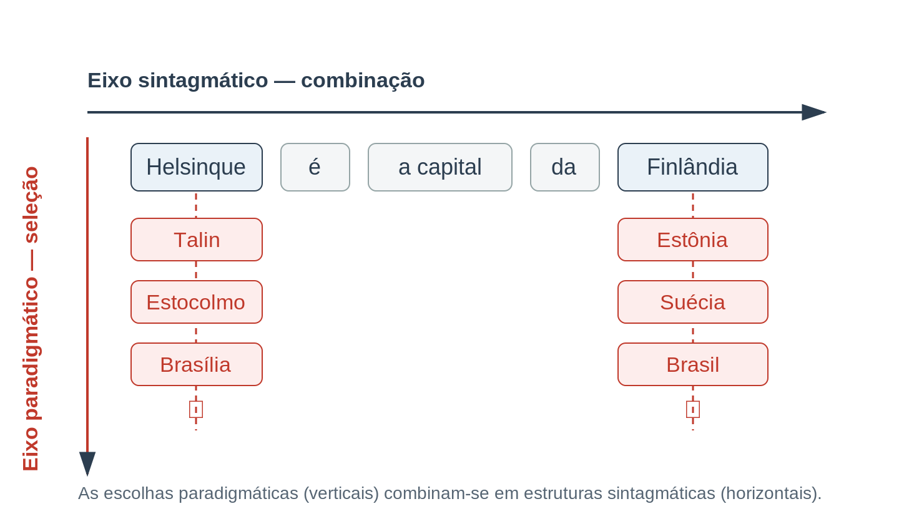
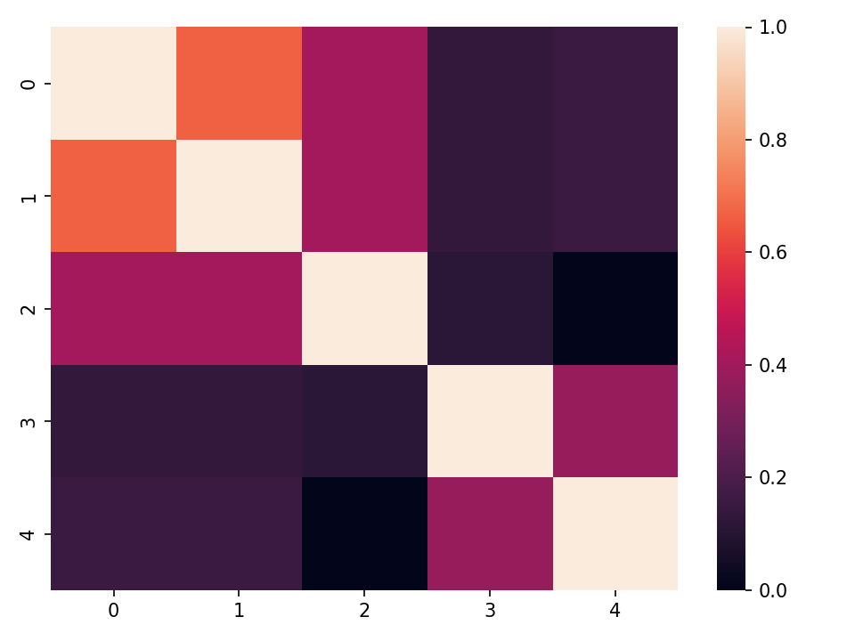
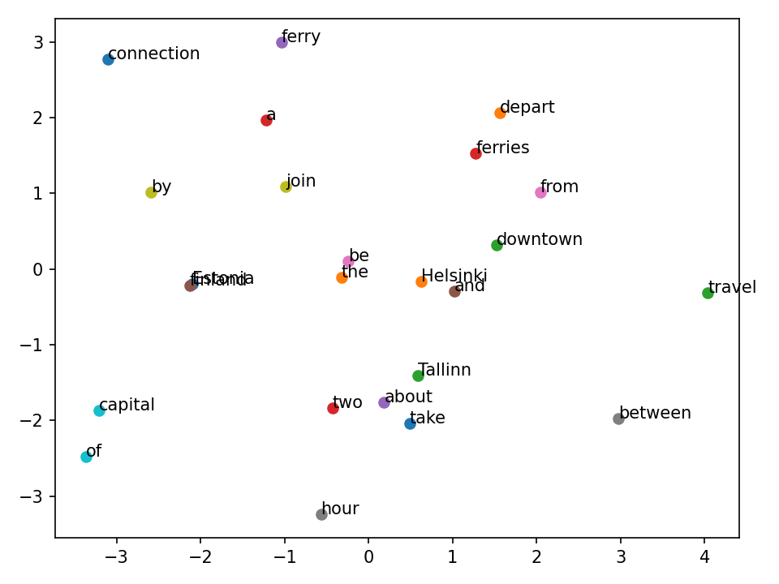

# Introdução aos *word embeddings*

Esta seção apresenta os *word embeddings* (vetores de palavras), uma técnica para aprender representações numéricas que aproximam o significado lexical das palavras, bem como a **hipótese distribucional** que lhes serve de fundamento.

## Objetivos de Aprendizagem

Ao final deste módulo, você será capaz de:

* **Compreender a hipótese distribucional:** Entender a ideia de que o significado de uma palavra pode ser inferido a partir de sua distribuição.
* **Representar estruturas numericamente:** Compreender como diferentes aspectos da estrutura linguística podem ser representados por números.
* **Entender o aprendizado de embeddings:** Compreender como os *word embeddings* são aprendidos diretamente a partir dos dados.

## 1. Fundamentos: a hipótese distribucional e os *word embeddings*

A inspiração para os *word embeddings* é frequentemente atribuída à seguinte observação do linguista inglês [J. R. Firth](https://en.wikipedia.org/wiki/John_Rupert_Firth):

> "Você conhecerá uma palavra pela companhia que ela mantém."

O que Firth quer dizer é que o significado de uma palavra pode ser inferido examinando-se a palavra em seu contexto de ocorrência.

Essa observação reflete o interesse mais amplo de Firth pelo estudo das palavras em seu contexto de ocorrência:

> "O significado completo de uma palavra é sempre contextual, e nenhum estudo do significado desvinculado do contexto pode ser levado a sério." (Firth [1935](https://doi.org/10.1111/j.1467-968X.1935.tb01254.x): 37)

> "O significado, isto é, deve ser encarado como um complexo de relações contextuais; e a fonética, a gramática, a lexicografia e a semântica lidam, cada uma, com os seus próprios componentes desse complexo, em seu contexto apropriado." (Firth [1935](https://doi.org/10.1111/j.1467-968X.1935.tb01254.x): 54)

A observação de Firth sobre o papel do contexto também pode ser relacionada à chamada **hipótese distribucional**, proposta por Harris ([1954](https://doi.org/10.1080/00437956.1954.11659520)), que assume que elementos linguísticos como as palavras podem ser caracterizados por sua distribuição no sistema linguístico.

> "A distribuição de um elemento será entendida como a soma de todos os seus ambientes. Um ambiente de um elemento A é um arranjo existente de seus coocorrentes, isto é, os demais elementos, cada um em uma posição particular, com os quais A ocorre para formar um enunciado. Os coocorrentes de A em uma dada posição são chamados de sua seleção para aquela posição." (Harris [1954](https://doi.org/10.1080/00437956.1954.11659520): 146)

O termo *distribuição* refere-se ao modo como as palavras coocorrem umas com as outras: a distribuição das palavras *não é aleatória*, mas pode ser caracterizada por meio de probabilidades, e algumas palavras têm maior chance de coocorrer do que outras.

Dito de outro modo, Boleda ([2020](https://doi.org/10.1146/annurev-linguistics-011619-030303): 214) resume a hipótese distribucional da seguinte forma:

> Semelhança de significado resulta em semelhança de distribuição linguística.

Para exemplificar: dado o verbo "gostar", você provavelmente conseguiria imaginar palavras que *poderiam* preceder ou seguir esse verbo com maior ou menor probabilidade. Dado algum contexto, você provavelmente também conseguiria substituir "gostar" sem alterar muito o sentido (por exemplo, por "apreciar"). Segundo a hipótese distribucional, esses verbos podem ser usados de forma intercambiável porque ocorrem em contextos linguísticos semelhantes.

Sahlgren ([2008](http://linguistica.sns.it/RdL/20.1/Sahlgren.pdf): 34) argumenta que a hipótese distribucional tem raízes em "solo estruturalista", isto é, nas ideias de [Ferdinand de Saussure](https://pt.wikipedia.org/wiki/Ferdinand_de_Saussure) sobre a estrutura da linguagem.

Saussure descreveu a estrutura da linguagem sob duas perspectivas: a *langue*, o sistema abstrato constituído pela língua, e a *parole*, as instâncias particulares de linguagem produzidas pelo sistema subjacente da *langue*.

Saussure caracterizou a *langue* como dotada de eixos de organização **paradigmático** e **sintagmático**, que permitem fazer escolhas entre alternativas e combinar essas seleções em estruturas maiores. As alternativas paradigmáticas emergem por oposição: as alternativas só podem ser identificadas pelo que são e pelo que não são.



As ideias de Saussure e de Firth foram levadas adiante por [M. A. K. Halliday](https://en.wikipedia.org/wiki/Michael_Halliday) ([1961](https://doi.org/10.1080/00437956.1961.11659756)), que as incorporou aos fundamentos de uma teoria da linguagem conhecida como [linguística sistêmico-funcional](https://pt.wikipedia.org/wiki/Lingu%C3%ADstica_sist%C3%AAmico-funcional) (para uma visão geral recente da área, veja Martin [2016](https://doi.org/10.1080/00437956.2016.1141939)).

Em contraste com a visão saussuriana da língua como um sistema estático de oposições, Halliday enfatiza o papel da **escolha** na linguagem.

Halliday argumenta que a língua é definida por um **potencial de significado**, realizado *dinamicamente* por meio de escolhas feitas dentro de sistemas linguísticos que se cruzam. Esses sistemas são fornecidos pela *lexicogramática*, que Halliday descreve como um contínuo: as escolhas feitas na língua tornam-se cada vez mais delicadas à medida que nos deslocamos da gramática para o léxico (veja, por exemplo, Fontaine [2017](https://doi.org/10.1186/s40554-017-0051-7)).

Nesse pano de fundo, as seções a seguir exploram a hipótese distribucional tanto da perspectiva sintagmática quanto da paradigmática, conforme proposto em Sahlgren ([2008](http://linguistica.sns.it/RdL/20.1/Sahlgren.pdf)).

## 2. Explorando a hipótese distribucional

### 2.1. Uma perspectiva sintagmática

Nesta seção, exploramos a hipótese distribucional de uma perspectiva sintagmática, isto é, buscamos descrever as estruturas sintagmáticas que resultam da combinação de escolhas paradigmáticas em unidades maiores.

Para tanto, precisamos primeiro determinar o escopo de uma unidade analítica para examinar estruturas sintagmáticas.

O escopo das unidades analíticas pode ser motivado linguisticamente – como ao observar palavras que coocorrem dentro de uma oração ou de uma sentença – ou pode simplesmente envolver a observação de palavras que ocorrem a uma distância arbitrária umas das outras.

Para encontrar palavras que coocorrem, precisamos recuperar as palavras únicas e contar suas ocorrências ao longo das unidades de análise.

Para começar, vamos importar a biblioteca spaCy e carregar um modelo de linguagem de porte médio para o inglês.

```python
# Importa a biblioteca spaCy
import spacy

# Carrega um modelo de linguagem de porte médio para o inglês; atribui à variável 'nlp'
nlp = spacy.load('en_core_web_md')
```

Definimos então um exemplo simplificado, formado por algumas orações em uma lista Python, que atribuímos à variável `examples`.

```python
# Cria a lista
examples = ["Helsinki is the capital of Finland",
            "Tallinn is the capital of Estonia",
            "The two capitals are joined by a ferry connection",
            "Travelling between Helsinki and Tallinn takes about two hours",
            "Ferries depart from downtown Helsinki and Tallinn"]

# Imprime o conteúdo da lista
print(examples)
```

```
['Helsinki is the capital of Finland', 'Tallinn is the capital of Estonia', 'The two capitals are joined by a ferry connection', 'Travelling between Helsinki and Tallinn takes about two hours', 'Ferries depart from downtown Helsinki and Tallinn']
```

Podemos então fornecer essa lista ao modelo de linguagem armazenado em `nlp` e guardar os objetos *Doc* resultantes em uma lista, na variável `docs`.

Para processar as orações de exemplo de forma eficiente, podemos usar o método `pipe()`, apresentado na Parte II, que recebe uma lista como entrada.

O método `pipe()` devolve um objeto gerador, que precisamos converter em lista usando a função `list()` do Python.

```python
# Fornece a lista de sentenças de exemplo 'examples' ao método pipe().
# Converte o resultado em lista e armazena na variável 'docs'.
docs = list(nlp.pipe(examples))

# Chama a variável para verificar a saída
docs
```

```
[Helsinki is the capital of Finland,
 Tallinn is the capital of Estonia,
 The two capitals are joined by a ferry connection,
 Travelling between Helsinki and Tallinn takes about two hours,
 Ferries depart from downtown Helsinki and Tallinn]
```

Por conveniência e simplicidade, examinamos as coocorrências de **lemas**, em vez das formas flexionadas das palavras.

Para contar os lemas em cada oração, precisamos importar o objeto `LEMMA` do módulo `attrs` do spaCy.

`LEMMA` é um objeto do spaCy que se refere a esse traço linguístico específico e que podemos passar ao método `count_by()` de um objeto *Doc* para instruir o spaCy a contar esses traços.

```python
# Importa o objeto LEMMA do módulo 'attrs' do spaCy
from spacy.attrs import LEMMA
```

Definimos então uma *compreensão de dicionário* (*dictionary comprehension*) em Python para contar os lemas em cada objeto *Doc* da lista `docs`.

Uma compreensão de dicionário é declarada com chaves `{ }`, que também são usadas para designar um dicionário em Python.

Como os dicionários do Python consistem em *chaves* e *valores*, precisamos de **dois** itens para preencher o novo dicionário `lemma_counts`:

1. `i` refere-se ao número devolvido pela função `enumerate`, que mantém a contagem dos itens da lista `docs`.
2. `doc` refere-se ao documento atual em `docs`, nossa *lista* de objetos *Doc*.

Observe que, do lado direito da instrução `for`, essas duas variáveis são separadas por vírgula.

O lado esquerdo da instrução `for` define o que é de fato armazenado no dicionário `lemma_counts`.

Neste caso, armazenamos a contagem `i` como *chave* e atribuímos a saída do método `count_by` como *valor*.

Do lado esquerdo, essas variáveis são separadas por dois-pontos.

```python
# Usa uma compreensão de dicionário para preencher o dicionário 'lemma_counts'
lemma_counts = {i: doc.count_by(LEMMA) for i, doc in enumerate(docs)}

# Chama a variável para verificar a saída
lemma_counts
```

```
{0: {332692160570289739: 1,
  10382539506755952630: 1,
  7425985699627899538: 1,
  15481038060779608540: 1,
  886050111519832510: 1,
  12176099360009088175: 1},
 1: {7392857733388117912: 1,
  10382539506755952630: 1,
  ...},
 ...}
```

As chaves do dicionário `lemma_counts` correspondem aos índices dos objetos *Doc* na lista `docs`, ao passo que os *valores* consistem em outros dicionários!

Esses dicionários claramente parecem reportar algumas contagens, mas as sequências de números usadas como chaves podem parecer estranhas.

Como você deve lembrar da unidade anterior, o spaCy usa sequências de números como identificadores de objetos *Lexeme* no *Vocabulário* do objeto *Language*.

Podemos verificar isso recuperando o objeto *Lexeme* com o identificador `332692160570289739` do *Vocabulário*, que pode ser acessado pelo atributo `vocab` do modelo de linguagem armazenado em `nlp`.

Usamos então o atributo `text` do objeto *Lexeme* para obter a forma legível para humanos.

```python
# Busca um Lexeme no Vocabulário do modelo, disponível em 'vocab'; obtém o atributo 'text'
nlp.vocab[332692160570289739].text
```

```
'Helsinki'
```

Como você pode ver, essa sequência de números identifica o *Lexeme* cujo texto é "Helsinki".

Podemos mapear os objetos *Lexeme* para suas formas legíveis realizando uma compreensão de dicionário um pouco mais complexa.

Abaixo, atualizamos o dicionário `lemma_counts` em duas etapas.

Primeiro, percorremos os pares de *chave* (`i`) e *valor* (`counter`), acessíveis pelo método `items()` do dicionário `lemma_counts` que acabamos de criar.

Isso é feito pela parte à **direita** da **segunda** instrução `for`:

```python
{... for i, counter in lemma_counts.items()}
```

Isso nos dá duas coisas a cada iteração: 1. um número em `i`, que pode ser usado para indexar a lista `docs` em busca de objetos *Doc*, e 2. um dicionário Python com identificadores de *Lexeme* como chaves e as contagens como valores.

Segundo, atualizamos as *chaves* e os *valores* do dicionário `lemma_counts`, preservando a chave original `i`, que permite identificar os objetos *Doc* na lista `docs`.

Como o *valor* do dicionário armazenado em `counter` é outro dicionário, precisamos definir mais uma compreensão de dicionário!

```python
{i: {docs[i].vocab[k].text: v for k, v in counter.items()} for ...}
```

Essa compreensão de dicionário é igual à anterior, mas desta vez atualizamos as *chaves* do dicionário `counter` para substituir os identificadores numéricos dos *Lexemes* por texto legível:

```python
{docs[i].vocab[k].text: v for ...}
```

Do lado esquerdo dos dois-pontos `:` que separam chaves e valores no dicionário que estamos criando, acessamos os objetos *Doc* da lista `docs` usando colchetes e referindo-nos ao número atual em `i`.

Fornecemos então o objeto *Lexeme* em `k` ao atributo `vocab` para buscar o conteúdo do atributo `text`.

Observe que não fazemos nada com as contagens armazenadas na variável `v` do lado direito dos dois-pontos `:`, mas simplesmente as transportamos para o dicionário recém-criado!

Isso ilustra o quanto uma única linha de Python pode realizar com compreensões de dicionário aninhadas umas nas outras.

```python
# Usa uma compreensão de dicionário para substituir as chaves do dicionário 'lemma_counts'
lemma_counts = {i: {docs[i].vocab[k].text: v for k, v in counter.items()} for i, counter in lemma_counts.items()}

# Chama a variável para verificar a saída
lemma_counts
```

```
{0: {'Helsinki': 1, 'be': 1, 'the': 1, 'capital': 1, 'of': 1, 'finland': 1},
 1: {'Tallinn': 1, 'be': 1, 'the': 1, 'capital': 1, 'of': 1, 'Estonia': 1},
 2: {'the': 1, 'two': 1, 'capital': 1, 'be': 1, 'join': 1, 'by': 1, 'a': 1,
     'ferry': 1, 'connection': 1},
 3: {'travel': 1, 'between': 1, 'Helsinki': 1, 'and': 1, 'Tallinn': 1,
     'take': 1, 'about': 1, 'two': 1, 'hour': 1},
 4: {'ferries': 1, 'depart': 1, 'from': 1, 'downtown': 1, 'Helsinki': 1,
     'and': 1, 'Tallinn': 1}}
```

Isso nos dá um dicionário com os números dos *Docs* como *chaves* e dicionários de contagem de lemas como *valores*.

Para compreender melhor essas contagens, podemos organizá-las em forma tabular usando a biblioteca pandas, apresentada na Parte II.

Para isso, criamos um novo objeto *DataFrame* chamando a classe `DataFrame` da biblioteca pandas (`pd`).

Podemos facilmente preencher o *DataFrame* fornecendo o dicionário `lemma_counts` ao método `from_dict()` de um *DataFrame*, que permite criar um *DataFrame* a partir de um dicionário Python.

```python
# Importa a biblioteca pandas
import pandas as pd

# Criamos então um DataFrame do pandas usando o método .from_dict(),
# ao qual passamos o dicionário armazenado em 'lemma_counts'. Em seguida,
# ordenamos o índice de forma ascendente com o método sort_index().
df = pd.DataFrame.from_dict(lemma_counts).sort_index(ascending=True)

# Substitui os valores NaN por zeros com o método fillna().
# Por fim, usamos o atributo .T para transpor o DataFrame.
# Isso troca colunas por linhas, melhorando a legibilidade.
df = df.fillna(0).T

# Imprime o DataFrame
df
```

|   | Estonia | Helsinki | Tallinn | a   | about | and | be  | between | by  | capital | ... | ferry | finland | from | hour | join | of  | take | the | travel | two |
|---|---------|----------|---------|-----|-------|-----|-----|---------|-----|---------|-----|-------|---------|------|------|------|-----|------|-----|--------|-----|
| 0 | 0.0     | 1.0      | 0.0     | 0.0 | 0.0   | 0.0 | 1.0 | 0.0     | 0.0 | 1.0     | ... | 0.0   | 1.0     | 0.0  | 0.0  | 0.0  | 1.0 | 0.0  | 1.0 | 0.0    | 0.0 |
| 1 | 1.0     | 0.0      | 1.0     | 0.0 | 0.0   | 0.0 | 1.0 | 0.0     | 0.0 | 1.0     | ... | 0.0   | 0.0     | 0.0  | 0.0  | 0.0  | 1.0 | 0.0  | 1.0 | 0.0    | 0.0 |
| 2 | 0.0     | 0.0      | 0.0     | 1.0 | 0.0   | 0.0 | 1.0 | 0.0     | 1.0 | 1.0     | ... | 1.0   | 0.0     | 0.0  | 0.0  | 1.0  | 0.0 | 0.0  | 1.0 | 0.0    | 1.0 |
| 3 | 0.0     | 1.0      | 1.0     | 0.0 | 1.0   | 1.0 | 0.0 | 1.0     | 0.0 | 0.0     | ... | 0.0   | 0.0     | 0.0  | 1.0  | 0.0  | 0.0 | 1.0  | 0.0 | 1.0    | 1.0 |
| 4 | 0.0     | 1.0      | 1.0     | 0.0 | 0.0   | 1.0 | 0.0 | 0.0     | 0.0 | 0.0     | ... | 0.0   | 0.0     | 1.0  | 0.0  | 0.0  | 0.0 | 0.0  | 0.0 | 0.0    | 0.0 |

5 linhas × 24 colunas

Isso nos dá um *DataFrame* do pandas com os *lemas únicos* de todos os *Docs*, distribuídos em 24 colunas, enquanto os *Docs* individuais ocupam cinco linhas, com índices de 0 a 4.

Cada célula do *DataFrame* informa quantas vezes um dado lema ocorre em um *Doc*.

Ao examinar as linhas individuais do *DataFrame*, podemos usar essas contagens para examinar a coocorrência de lemas dentro de cada *Doc*.

Podemos pensar em cada coluna como uma escolha paradigmática: ao examinar as linhas, descobrimos quais escolhas paradigmáticas ocorrem na mesma estrutura sintagmática.

Vamos examinar os valores da primeira sentença usando o acessador `iloc`, que permite acessar os índices (linhas) de um *DataFrame* do pandas.

Acessamos o primeiro *Doc*, no índice `0`, e recuperamos os valores pelo atributo `values`.

```python
df.iloc[0].values
```

```
array([0., 1., 0., 0., 0., 0., 1., 0., 0., 1., 0., 0., 0., 0., 0., 1., 0.,
       0., 0., 1., 0., 1., 0., 0.])
```

Isso devolve um *array*, ou seja, uma lista de números que correspondem às ocorrências de lemas únicos no objeto *Doc*.

Em matemática, tais listas de números são chamadas de **vetores**.

O comprimento desse vetor – 24 – é definido pelo número de lemas únicos em *todos* os objetos *Doc*.

O número correspondente ao comprimento define a **dimensionalidade** do vetor.

Podemos obter os vetores de cada objeto *Doc* pelo atributo `values` do *DataFrame* `df`.

```python
# Obtém os vetores de cada objeto Doc
df.values
```

```
array([[0., 1., 0., 0., 0., 0., 1., 0., 0., 1., 0., 0., 0., 0., 0., 1.,
        0., 0., 0., 1., 0., 1., 0., 0.],
       [1., 0., 1., 0., 0., 0., 1., 0., 0., 1., 0., 0., 0., 0., 0., 0.,
        0., 0., 0., 1., 0., 1., 0., 0.],
       [0., 0., 0., 1., 0., 0., 1., 0., 1., 1., 1., 0., 0., 0., 1., 0.,
        0., 0., 1., 0., 0., 1., 0., 1.],
       [0., 1., 1., 0., 1., 1., 0., 1., 0., 0., 0., 0., 0., 0., 0., 0.,
        0., 1., 0., 0., 1., 0., 1., 1.],
       [0., 1., 1., 0., 0., 1., 0., 0., 0., 0., 0., 1., 1., 1., 0., 0.,
        1., 0., 0., 0., 0., 0., 0., 0.]])
```

Como cada *Doc* está agora representado por um vetor, podemos facilmente realizar operações matemáticas, como calcular a distância entre os vetores para avaliar sua similaridade.

Para isso, importamos a função `cosine_similarity()` da biblioteca *scikit-learn*, que permite medir a [similaridade de cossenos](https://pt.wikipedia.org/wiki/Similaridade_por_cosseno) entre vetores.

```python
# Importa a função para medir a similaridade de cossenos
from sklearn.metrics.pairwise import cosine_similarity

# Avalia a similaridade de cossenos entre os vetores
sim = cosine_similarity(df.values)

# Chama a variável para examinar a saída
sim
```

```
array([[1.        , 0.66666667, 0.40824829, 0.13608276, 0.15430335],
       [0.66666667, 1.        , 0.40824829, 0.13608276, 0.15430335],
       [0.40824829, 0.40824829, 1.        , 0.11111111, 0.        ],
       [0.13608276, 0.13608276, 0.11111111, 1.        , 0.37796447],
       [0.15430335, 0.15430335, 0.        , 0.37796447, 1.        ]])
```

Isso devolve uma matriz 5 × 5 – uma "tabela" de cinco vetores, cada um com cinco dimensões – com as similaridades de cossenos entre cada par de objetos *Doc*.

Para nos ajudar a interpretar essa tabela, vamos importar a função `heatmap()` da biblioteca seaborn e visualizar a matriz de similaridade de cossenos.

```python
# Importa a função heatmap da biblioteca seaborn
from seaborn import heatmap

# Fornece a matriz de similaridade de cossenos armazenada em 'sim' à função heatmap()
heatmap(sim)
```



Cada linha e cada coluna do mapa de calor representam um único *Doc*, cujos números aparecem nos rótulos dos eixos vertical e horizontal. A barra do lado direito mapeia as cores aos valores de similaridade de cossenos.

O mapa de calor exibe uma linha diagonal com valores 1.0, porque cada *Doc* também é comparado consigo mesmo!

Esses *Docs* são naturalmente idênticos, o que resulta em um valor de 1.0.

Note também a alta similaridade de cossenos entre os *Docs* 0 e 1, que podemos recuperar da lista `docs`.

```python
# Obtém os Docs nos índices [0] e [1] da lista 'docs'
docs[0], docs[1]
```

```
(Helsinki is the capital of Finland, Tallinn is the capital of Estonia)
```

Sua similaridade de cossenos é alta, o que significa que os dois *Docs* estão próximos um do outro no espaço vetorial de 24 dimensões, porque apresentam uma combinação semelhante de escolhas paradigmáticas que formam uma estrutura sintagmática ("is the capital of").

Isso ilustra como podemos usar vetores para descrever *estruturas sintagmáticas*, capturando escolhas paradigmáticas que coocorrem dentro de alguma unidade fixa ou janela de tamanho determinado (no nosso caso, uma oração).

A desvantagem dessa abordagem, contudo, é que, à medida que o tamanho do vocabulário cresce, também cresce o comprimento do vetor. Para cada palavra nova, precisamos acrescentar mais uma dimensão para acompanhar suas ocorrências. À medida que o vocabulário se expande, aumenta também o número de dimensões com valor zero.

Além disso, o vetor não contém informação sobre a *ordem* em que as palavras aparecem. Por essa razão, tais representações são frequentemente caracterizadas pelo termo "[saco de palavras](https://en.wikipedia.org/wiki/Bag-of-words_model)" (*bag of words*).

### 2.2. Uma perspectiva paradigmática

Para explorar a hipótese distribucional de uma perspectiva paradigmática, precisamos deslocar o alvo da descrição das coocorrências de múltiplas palavras para as palavras individuais.

Assim como usamos vetores para representar estruturas sintagmáticas acima, podemos fazer o mesmo para palavras individuais.

Vamos começar tomando os lemas únicos do nosso corpus de *Docs*, armazenados na lista `docs`.

Eles podem ser facilmente recuperados do *DataFrame* `df` acessando o atributo `columns`, pois as colunas do *DataFrame* correspondem aos lemas únicos.

Usamos então o método `tolist()` para converter a saída em uma lista Python.

```python
# Recupera os lemas únicos do DataFrame e converte em lista
unique_lemmas = df.columns.tolist()

# Chama a variável para examinar a saída
unique_lemmas
```

```
['Estonia', 'Helsinki', 'Tallinn', 'a', 'about', 'and', 'be', 'between',
 'by', 'capital', 'connection', 'depart', 'downtown', 'ferries', 'ferry',
 'finland', 'from', 'hour', 'join', 'of', 'take', 'the', 'travel', 'two']
```

Isso nos dá uma lista dos lemas únicos presentes nos objetos *Doc*.

Para examinar quais palavras coocorrem a uma dada distância umas das outras, podemos criar um novo *DataFrame* do pandas que use os lemas de `unique_lemmas` para definir tanto as linhas quanto as colunas.

Para isso, criamos um novo *DataFrame* chamado `lemma_df` e fornecemos a lista `unique_lemmas` aos argumentos `index` e `columns`.

Por fim, usamos o método `fillna()` do *DataFrame* para substituir os valores NaN por zeros.

```python
# Cria um novo DataFrame com os lemas únicos como linhas e colunas, preenchido com zeros
lemma_df = pd.DataFrame(index=unique_lemmas, columns=unique_lemmas).fillna(0)

# Chama a variável para examinar o DataFrame
lemma_df
```

Isso nos dá um *DataFrame* vazio do pandas com 24 linhas e 24 colunas.

Esse *DataFrame* pode ser descrito como uma **matriz de coocorrência**, que registra quantas vezes um lema ocorre a uma dada distância de outro lema (Sahlgren [2008](http://linguistica.sns.it/RdL/20.1/Sahlgren.pdf): 46).

O primeiro passo para explorar as relações paradigmáticas entre palavras é preencher esse *DataFrame* com contagens de coocorrência, isto é, com que frequência os lemas ocorrem próximos uns dos outros nos objetos *Doc* armazenados em `docs`.

Para facilitar esse trabalho, vamos começar unindo todos os objetos *Doc* da lista `docs` em um único objeto *Doc*.

Para isso, podemos usar o método `from_docs()` de um objeto *Doc* do spaCy.

```python
# Importa a classe Doc de spacy.tokens
from spacy.tokens import Doc

# Cria um novo objeto Doc e usa o método 'from_docs()' para combinar os Docs
# da lista existente 'docs'. Atribui o resultado a 'combined_docs'.
combined_docs = Doc.from_docs(docs)
```

Para os fins atuais, vamos assumir que duas palavras de cada lado de uma palavra constituem seus vizinhos.

Podemos usar o método `nbor()` de um *Token* do spaCy para buscar seus vizinhos.

O método `nbor()` recebe um número inteiro como entrada, que determina a posição do vizinho em relação ao *Token* atual.

Números inteiros negativos referem-se aos índices dos *Tokens* que vêm antes do *Token* atual, enquanto os positivos referem-se aos que vêm depois.

Contudo, nem todas as palavras têm vizinhos dos dois lados: as palavras que iniciam ou encerram uma sentença ou alguma outra sequência não terão palavras precedentes ou seguintes.

Para lidar com esse problema, usamos as instruções `try` e `except` do Python para capturar os erros decorrentes de vizinhos inexistentes, cujos índices não estão disponíveis.

```python
# Percorre cada Token no objeto Doc
for token in combined_docs:

    # Percorre um intervalo de posições. Elas representam índices
    # relativos ao índice atual do objeto Token.
    for position in [-2, -1, 1, 2]:

        # Tenta executar o bloco de código a seguir
        try:

            # Usa o método nbor() para obter o vizinho do Token no índice
            # determinado por 'position'. Busca o lema do Token vizinho.
            nbor_lemma = token.nbor(position).lemma_

            # Usa o acessador 'at' para acessar linhas e colunas do
            # DataFrame 'lemma_df'. Incrementa (+=) o valor existente
            # em 1 para atualizar a contagem!
            lemma_df.at[token.lemma_, nbor_lemma] += 1

        # Se o bloco de código levantar um IndexError, executa
        # o código abaixo
        except IndexError:

            # Passa para o próximo Token
            continue
```

Isso reúne as contagens de coocorrência no *DataFrame*.

Vamos examinar o resultado chamando a variável `lemma_df`.

```python
# Chama a variável para examinar o DataFrame
lemma_df
```

|            | Estonia | Helsinki | Tallinn | a | about | and | be | between | by | capital | ... | of | take | the | travel | two |
|------------|---------|----------|---------|---|-------|-----|----|---------|----|---------|-----|----|------|-----|--------|-----|
| Estonia    | 0       | 0        | 0       | 0 | 0     | 0   | 0  | 0       | 0  | 1       | ... | 1  | 0    | 1   | 0      | 1   |
| Helsinki   | 0       | 0        | 2       | 0 | 0     | 2   | 1  | 1       | 0  | 0       | ... | 0  | 0    | 1   | 1      | 0   |
| Tallinn    | 0       | 2        | 0       | 0 | 1     | 2   | 1  | 0       | 0  | 0       | ... | 1  | 1    | 1   | 0      | 0   |
| a          | 0       | 0        | 0       | 0 | 0     | 0   | 0  | 0       | 1  | 0       | ... | 0  | 0    | 0   | 0      | 0   |
| about      | 0       | 0        | 1       | 0 | 0     | 0   | 0  | 0       | 0  | 0       | ... | 0  | 1    | 0   | 0      | 1   |
| and        | 0       | 2        | 2       | 0 | 0     | 0   | 0  | 1       | 0  | 0       | ... | 0  | 1    | 0   | 0      | 0   |
| be         | 0       | 1        | 1       | 0 | 0     | 0   | 0  | 0       | 1  | 3       | ... | 0  | 0    | 2   | 0      | 1   |
| capital    | 1       | 0        | 0       | 0 | 0     | 0   | 3  | 0       | 0  | 0       | ... | 2  | 0    | 3   | 0      | 1   |
| of         | 1       | 0        | 1       | 0 | 0     | 0   | 0  | 0       | 0  | 2       | ... | 0  | 0    | 3   | 0      | 0   |
| the        | 1       | 1        | 1       | 0 | 0     | 0   | 2  | 0       | 0  | 3       | ... | 3  | 0    | 0   | 0      | 1   |

24 linhas × 24 colunas

Como você pode ver, o *DataFrame* foi agora preenchido com as contagens de coocorrência de cada lema.

Note que os valores nas linhas e nas colunas são idênticos, porque as mesmas categorias (lemas) são usadas para ambas.

Os valores nas linhas/colunas fornecem um vetor para cada lema, que codifica informação sobre suas palavras colocadas (*collocates*).

Em outras palavras, cada lema é caracterizado por um vetor que descreve seus vizinhos!

De acordo com a hipótese distribucional, esperaríamos que alternativas paradigmáticas tivessem distribuições semelhantes.

Para explorar essa ideia, podemos medir a similaridade de cossenos entre esses vetores usando a função `cosine_similarity` que importamos do scikit-learn acima.

Vamos calcular a similaridade de cossenos entre os vetores de "Tallinn" e "Helsinki".

```python
# Obtém os vetores de 'Tallinn' e 'Helsinki' a partir do DataFrame.
# Usa o atributo 'values' para acessar os dados como um array NumPy.
tallinn_lemma_vector = lemma_df['Tallinn'].values
helsinki_lemma_vector = lemma_df['Helsinki'].values

# Mede a similaridade de cossenos entre os dois vetores. Note que os
# vetores precisam ser envolvidos em colchetes para serem fornecidos a
# esta função. Isso coloca o array no 'formato' correto.
cosine_similarity([tallinn_lemma_vector], [helsinki_lemma_vector])
```

```
array([[0.42857143]])
```

O resultado mostra que os vetores de "Helsinki" e "Tallinn" são de certa forma semelhantes.

Poderíamos refinar essas representações observando mais dados, para obter uma ideia melhor de como as palavras se distribuem, o que levaria a melhores representações vetoriais.

Contudo, assim como observamos no caso das estruturas sintagmáticas, a dimensionalidade do espaço vetorial cresce a cada nova palavra acrescentada ao vocabulário.

## 3. Aprendendo *word embeddings*

Até aqui, exploramos a hipótese distribucional tanto da perspectiva sintagmática quanto da paradigmática.

Usamos vetores para representar estruturas paradigmáticas e sintagmáticas e aplicamos abordagens diferentes para codificar, nesses vetores, informação sobre as palavras e sua distribuição.

Para descrever estruturas sintagmáticas, contamos quais palavras do vocabulário ocorriam dentro da mesma oração; para as estruturas paradigmáticas, contamos quais palavras ocorriam próximas umas das outras.

Podemos pensar em ambas as abordagens como **mecanismos de abstração** que quantificam informação linguística em representações vetoriais.

Continuamos agora essa jornada e nos concentramos nos **word embeddings**, uma técnica para aprender representações vetoriais de unidades linguísticas – como palavras ou sentenças – diretamente a partir do texto. Essas representações são estudadas no campo da **semântica distribucional**, que se desenvolveu a partir da hipótese distribucional.

Boleda ([2020](https://doi.org/10.1146/annurev-linguistics-011619-030303): 214) define a semântica distribucional de modo sucinto:

> A semântica distribucional representa o significado das palavras tomando grandes quantidades de texto como entrada e, por meio de um mecanismo de abstração, produzindo um modelo distribucional, semelhante a um léxico, com representações semânticas em forma de vetores – essencialmente, listas de números que determinam pontos em um espaço multidimensional.

Em comparação com nossos esforços anteriores, que envolviam contar coocorrências e codificar essa informação em vetores, as abordagens contemporâneas em semântica distribucional usam **algoritmos** como mecanismo de abstração (Baroni, Dinu & Kruszewski [2014](https://www.aclweb.org/anthology/P14-1023.pdf)).

Assim, nesta seção exploramos o uso de algoritmos como mecanismo de abstração para aprender representações vetoriais de unidades linguísticas.

### 3.1. Codificação one-hot

Para começar, continuamos trabalhando com os dados armazenados na lista `unique_lemmas` e usamos uma técnica chamada **codificação one-hot** (*one-hot encoding*) para representar cada lema por meio de um vetor.

A codificação one-hot mapeia cada lema para um vetor que consiste em zeros, exceto em uma dimensão, cujo valor é 1. Essa dimensão codifica a identidade de uma dada palavra no vocabulário.

Você pode pensar nisso como uma dimensão estando "quente" (*hot*) por ter valor 1, enquanto todas as demais estão "frias", pois seu valor é zero.

Vamos examinar isso na prática, mapeando cada lema da lista `unique_lemmas` para o vetor one-hot correspondente.

Para isso, importamos o *NumPy*, uma biblioteca Python para trabalhar com arrays (Harris et al. [2020](https://doi.org/10.1038/s41586-020-2649-2)).

```python
# Importa o NumPy, atribuindo-lhe o nome 'np'
import numpy as np

# Define um dicionário vazio, que servirá de contêiner para lemas e seus vetores
lemma_vectors = {}

# Percorre a lista de lemas únicos; conta os itens usando enumerate()
for i, lemma in enumerate(unique_lemmas):

    # Cria um vetor cujo comprimento corresponde ao da lista
    # 'unique_lemmas'. Isso corresponde ao tamanho do nosso vocabulário.
    # A função np.zeros() preenche esse vetor com zeros.
    vector = np.zeros(shape=len(unique_lemmas))

    # Usa os colchetes para acessar o vetor no índice atual 'i',
    # que recuperamos durante o laço sobre a lista 'unique_lemmas'.
    # Define o valor como um, em vez de zero, nessa posição do vetor.
    vector[i] = 1

    # Armazena o lema e o vetor no dicionário
    lemma_vectors[lemma] = vector

    # Imprime o vetor e o lema ao qual ele corresponde
    print(vector, lemma)
```

```
[1. 0. 0. 0. 0. 0. 0. 0. 0. 0. 0. 0. 0. 0. 0. 0. 0. 0. 0. 0. 0. 0. 0. 0.] Estonia
[0. 1. 0. 0. 0. 0. 0. 0. 0. 0. 0. 0. 0. 0. 0. 0. 0. 0. 0. 0. 0. 0. 0. 0.] Helsinki
[0. 0. 1. 0. 0. 0. 0. 0. 0. 0. 0. 0. 0. 0. 0. 0. 0. 0. 0. 0. 0. 0. 0. 0.] Tallinn
[0. 0. 0. 1. 0. 0. 0. 0. 0. 0. 0. 0. 0. 0. 0. 0. 0. 0. 0. 0. 0. 0. 0. 0.] a
...
[0. 0. 0. 0. 0. 0. 0. 0. 0. 0. 0. 0. 0. 0. 0. 0. 0. 0. 0. 0. 0. 0. 1. 0.] travel
[0. 0. 0. 0. 0. 0. 0. 0. 0. 0. 0. 0. 0. 0. 0. 0. 0. 0. 0. 0. 0. 0. 0. 1.] two
```

Como você pode ver, as dimensões com valor 1.0 formam uma linha diagonal ao longo dos vetores.

Essa linha diagonal emerge porque cada dimensão do vetor codifica a identidade de um lema único do vocabulário.

Para exemplificar: o vetor do lema "Estonia" deve ter valor 1.0 na primeira dimensão, porque essa dimensão codifica a identidade desse lema, ao passo que os valores de todas as demais dimensões devem ser zero, pois estão reservados aos lemas que vêm depois.

Dito de outro modo, se o lema é "Estonia", ele deve ter valor 1.0 na primeira dimensão. Se a palavra é "Helsinki", a primeira dimensão deve valer zero, mas a segunda deve valer 1.0, pois essa dimensão está reservada a "Helsinki".

Podemos usar vetores one-hot para codificar sequências de palavras em representações numéricas.

```python
# Percorre os Tokens do primeiro Doc da lista
for token in docs[0]:

    # Obtém o lema de cada token pelo atributo 'lemma_'
    # e o usa como chave no dicionário 'lemma_vectors'
    # para recuperar o vetor associado. Em seguida, imprime
    # o próprio lema.
    print(lemma_vectors[token.lemma_], token.lemma_)
```

```
[0. 1. 0. 0. 0. 0. 0. 0. 0. 0. 0. 0. 0. 0. 0. 0. 0. 0. 0. 0. 0. 0. 0. 0.] Helsinki
[0. 0. 0. 0. 0. 0. 1. 0. 0. 0. 0. 0. 0. 0. 0. 0. 0. 0. 0. 0. 0. 0. 0. 0.] be
[0. 0. 0. 0. 0. 0. 0. 0. 0. 0. 0. 0. 0. 0. 0. 0. 0. 0. 0. 0. 0. 1. 0. 0.] the
[0. 0. 0. 0. 0. 0. 0. 0. 0. 1. 0. 0. 0. 0. 0. 0. 0. 0. 0. 0. 0. 0. 0. 0.] capital
[0. 0. 0. 0. 0. 0. 0. 0. 0. 0. 0. 0. 0. 0. 0. 0. 0. 0. 0. 1. 0. 0. 0. 0.] of
[0. 0. 0. 0. 0. 0. 0. 0. 0. 0. 0. 0. 0. 0. 0. 1. 0. 0. 0. 0. 0. 0. 0. 0.] finland
```

Podemos juntar essas representações vetoriais de palavras individuais em uma **matriz**, que é como uma "tabela" de vetores.

Podemos usar o método `vstack()` do NumPy para empilhar os vetores verticalmente, isto é, colocá-los uns sobre os outros para formar uma matriz que representa o *Doc* inteiro.

```python
# Usa uma compreensão de lista para coletar os vetores de cada lema do primeiro Doc
sentence_matrix = np.vstack([lemma_vectors[token.lemma_] for token in docs[0]])

# Chama a variável para examinar a saída
sentence_matrix
```

```
array([[0., 1., 0., 0., 0., 0., 0., 0., 0., 0., 0., 0., 0., 0., 0., 0.,
        0., 0., 0., 0., 0., 0., 0., 0.],
       [0., 0., 0., 0., 0., 0., 1., 0., 0., 0., 0., 0., 0., 0., 0., 0.,
        0., 0., 0., 0., 0., 0., 0., 0.],
       [0., 0., 0., 0., 0., 0., 0., 0., 0., 0., 0., 0., 0., 0., 0., 0.,
        0., 0., 0., 0., 0., 1., 0., 0.],
       [0., 0., 0., 0., 0., 0., 0., 0., 0., 1., 0., 0., 0., 0., 0., 0.,
        0., 0., 0., 0., 0., 0., 0., 0.],
       [0., 0., 0., 0., 0., 0., 0., 0., 0., 0., 0., 0., 0., 0., 0., 0.,
        0., 0., 0., 1., 0., 0., 0., 0.],
       [0., 0., 0., 0., 0., 0., 0., 0., 0., 0., 0., 0., 0., 0., 0., 1.,
        0., 0., 0., 0., 0., 0., 0., 0.]])
```

Podemos examinar o formato da matriz resultante usando o atributo `shape`.

```python
# Obtém o atributo "shape" da matriz armazenada em 'sentence_matrix'
sentence_matrix.shape
```

```
(6, 24)
```

O atributo `shape` contém o formato da matriz: seis linhas, uma para cada lema, cada qual com 24 dimensões que codificam a identidade dos lemas individuais no vocabulário.

Uma matriz como essa permite representar numericamente qualquer sequência de *Tokens*.

Contudo, mais uma vez, à medida que o tamanho do vocabulário cresce, também cresce o número de dimensões necessárias para representar cada palavra única do vocabulário.

Esses vetores são também frequentemente caracterizados como **esparsos**, porque a maior parte de suas dimensões não codifica informação alguma, consistindo apenas em zeros.

Para tornar a representação vetorial mais eficiente, *cada dimensão* de um vetor deveria codificar alguma informação sobre a palavra e o contexto em que ela ocorre.

Isso pode ser alcançado aprendendo os *word embeddings* diretamente dos dados, usando um algoritmo como mecanismo de abstração.

Para treinar um algoritmo a prever palavras vizinhas, precisamos primeiro coletar os vizinhos. Para os fins atuais, continuemos tratando os dois lemas precedentes e os dois seguintes como vizinhos.

```python
# Define uma lista para guardar Tokens e seus Tokens vizinhos
pairs = []

# Percorre cada Doc na lista de Docs armazenada na variável 'docs'
for doc in docs:

    # Percorre cada Token em um Doc
    for token in doc:

        # Percorre os índices dos Tokens vizinhos que nos
        # interessam.
        for neighbour_i in [-2, -1, 1, 2]:

            # Tenta recuperar o vizinho na posição 'neighbour_i'
            try:

                # Atribui o Token vizinho à variável 'context'
                context = token.nbor(neighbour_i)

                # Acrescenta à lista 'pairs' uma tupla formada pelo
                # Token atual e pelo Token vizinho
                pairs.append((token.lemma_, context.lemma_))

            # Usa o comando except para capturar o erro que surge
            # caso não haja Token precedente ('IndexError')
            except IndexError:

                # Passa para o próximo Token da lista de vizinhos
                continue
```

Isso produz uma lista de tuplas contendo pares de palavras que ocorrem a até duas palavras de distância uma da outra.

Vamos imprimir os 10 primeiros pares para examinar o resultado.

```python
# Imprime as 10 primeiras tuplas da lista 'pairs'
pairs[:10]
```

```
[('Helsinki', 'be'),
 ('Helsinki', 'the'),
 ('be', 'Helsinki'),
 ('be', 'the'),
 ('be', 'capital'),
 ('the', 'Helsinki'),
 ('the', 'be'),
 ('the', 'capital'),
 ('the', 'of'),
 ('capital', 'be')]
```

A primeira palavra de cada tupla pode ser descrita como o lema **alvo** (*target*), enquanto a segunda constitui o lema de **contexto**.

Para preparar o terreno para as predições, precisamos coletar todas as palavras-alvo da lista e suas palavras de contexto correspondentes, e convertê-las em suas representações numéricas com codificação one-hot.

Isso pode ser feito com uma compreensão de lista que percorre as tuplas da lista `pairs`.

Podemos então buscar o vetor com codificação one-hot no dicionário `lemma_vectors`, usando o lema-alvo como chave.

```python
# Define uma compreensão de lista que coleta os lemas-alvo e armazena
# os vetores one-hot em uma lista chamada 'targets'
targets = [lemma_vectors[target] for target, context in pairs]

# Empilha todos os lemas-alvo em uma matriz
targets = np.vstack(targets)

# Chama a variável para verificar o tamanho da matriz
targets.shape
```

```
(118, 24)
```

Examinar o atributo `shape` do array NumPy armazenado em `targets` revela que nossos dados contêm um total de 118 lemas-alvo.

```python
# Obtém a primeira linha do array
targets[0]
```

```
array([0., 1., 0., 0., 0., 0., 0., 0., 0., 0., 0., 0., 0., 0., 0., 0., 0.,
       0., 0., 0., 0., 0., 0., 0.])
```

Como você pode ver, o array `targets` contém vetores one-hot que codificam a identidade dos lemas, recuperados do dicionário `lemma_vectors`.

Em seguida, repetimos a mesma operação para os lemas de contexto.

```python
# Define uma compreensão de lista que coleta os lemas de contexto e armazena
# os vetores one-hot em uma lista chamada 'context'
context = [lemma_vectors[context] for target, context in pairs]

# Empilha todos os lemas de contexto em uma matriz
context = np.vstack(context)

# Chama a variável para verificar o tamanho da matriz
context.shape
```

```
(118, 24)
```

Perfeito! Cada lema-alvo em `targets` agora tem um lema de contexto correspondente em `context`.

### 3.2. Criando uma rede neural

Em seguida, definiremos uma pequena rede neural, que tentará aprender um mapeamento entre os vetores dos lemas-alvo e os dos lemas de contexto.

Em outras palavras, dado o vetor da palavra-alvo, a rede neural tenta prever o vetor do lema de contexto correspondente.

Para isso, definimos uma pequena rede neural usando uma biblioteca chamada [Keras](https://keras.io/).

Mais especificamente, implementamos uma variante de um algoritmo para aprendizado de *word embeddings* chamado *Word2vec* (de *word to vector*), proposto por Tomas Mikolov et al. ([2013](https://arxiv.org/abs/1301.3781v3)).

O Keras faz parte da biblioteca de aprendizado profundo TensorFlow. Importamos dessa biblioteca tanto o Keras quanto *Dense*, um tipo específico de camada de rede neural.

```python
# Importa o módulo Keras e a classe Dense
from tensorflow import keras
from tensorflow.keras.layers import Dense
```

Começamos definindo uma camada de entrada (*Input*), que recebe os vetores one-hot armazenados na variável `targets`.

Buscamos o tamanho da segunda dimensão (no índice `[1]`) da matriz `targets`, disponível no atributo `shape`.

Fornecemos então essa informação ao *argumento* `shape` da camada *Input*, pois a rede neural precisa saber quantas dimensões têm as entradas. No nosso caso, o número é 24.

Também usamos o argumento `name` para nomear a camada como `input_layer`.

Armazenamos o objeto *Input* resultante na variável `network_input`.

```python
# Cria uma camada de entrada para a rede; armazena em 'network_input'
network_input = keras.Input(shape=targets.shape[1], name='input_layer')
```

Em seguida, definimos uma camada *Dense* com dois neurônios, conforme definido pelo argumento `units`.

Qualquer camada situada entre as camadas de entrada e de saída é chamada de **camada oculta**.

Conectamos a camada *Input* à camada oculta colocando a variável `network_input` entre parênteses após a camada *Dense*:

```python
Dense(...)(network_input)
```

Atribuímos a saída da camada *Dense* à variável `hidden_layer`.

```python
# Cria uma camada oculta para a rede; armazena em 'hidden_layer'
hidden_layer = Dense(units=2, activation=None, name='hidden_layer')(network_input)
```

Para fazer predições sobre quais lemas de contexto ocorrem próximos aos lemas-alvo, definimos outra camada *Dense*, cujo argumento `units` corresponde ao tamanho do nosso vocabulário.

Essa camada atua como a camada de saída da nossa rede.

Ao definir o argumento `activation` como `softmax`, a rede devolverá probabilidades para todos os lemas do vocabulário.

Dito de outro modo, quando fornecemos uma palavra de entrada, obtemos de volta uma distribuição de probabilidade sobre os 24 lemas do nosso vocabulário, cuja soma é aproximadamente 1.

```python
# Cria uma camada de saída para a rede; armazena em 'output_layer'
output_layer = Dense(units=context.shape[1], activation='softmax', name='output_layer')(hidden_layer)
```

Combinamos então as camadas definidas acima em uma rede e atribuímos o resultado à variável `embedding_model`.

Isso é feito usando o objeto *Model* do Keras e seus dois argumentos, `inputs` e `outputs`, aos quais devemos fornecer as camadas de entrada e de saída da nossa rede, isto é, `input_layer` e `output_layer`.

```python
# Cria um Model do Keras; armazena em 'embedding_model'
embedding_model = keras.Model(inputs=network_input, outputs=output_layer)
```

Por fim, usamos o método `compile()` para compilar o modelo e definir uma função de perda por meio do argumento `loss`.

A função de perda aproxima o erro entre os lemas de contexto previstos e os reais.

Esse erro é usado para ajustar os "pesos" da rede neural de modo a, potencialmente, melhorar as predições da próxima vez.

```python
# Compila o modelo para treinamento; define a função de perda
embedding_model.compile(loss='categorical_crossentropy')
```

Para examinar o modelo resultante, chamamos o método `summary()`.

```python
# Imprime um resumo do modelo
embedding_model.summary()
```

```
Model: "model"
_________________________________________________________________
 Layer (type)                Output Shape              Param #
=================================================================
 input_layer (InputLayer)    [(None, 24)]              0

 hidden_layer (Dense)        (None, 2)                 50

 output_layer (Dense)        (None, 24)                72

=================================================================
Total params: 122
Trainable params: 122
Non-trainable params: 0
_________________________________________________________________
```

### 3.3. Treinando uma rede neural

Compilamos agora uma rede neural simples. A rede tem uma única camada oculta com dois neurônios, que atua como um **gargalo** para a informação.

Em outras palavras, para aprender a prever os lemas de contexto a partir dos lemas-alvo, o modelo precisa aprender a condensar a informação contida nos vetores de entrada esparsos, de 24 dimensões.

O próximo passo é treinar o modelo. Isso é feito com a função `fit()` do modelo.

Essa função exige a definição de vários argumentos. Os argumentos `x` e `y` correspondem às entradas e às saídas. Eles consistem nos lemas-alvo e de contexto, armazenados nas matrizes `targets` e `context`, respectivamente.

Examinamos 64 pares de lemas-alvo e de contexto simultaneamente, conforme definido pela palavra-chave `batch_size`, e percorremos todos os pares de lemas 1500 vezes, conforme definido pela palavra-chave `epochs`.

Também fornecemos o argumento `verbose` com valor 0, para evitar inundar o *notebook* com mensagens de status sobre o procedimento de treinamento.

```python
# Ajusta um modelo aos dados
embedding_model.fit(x=targets,   # entradas
                    y=context,   # saídas
                    batch_size=64,  # quantos pares de palavras são processados simultaneamente
                    epochs=1500,   # quantas vezes percorremos todos os dados
                    verbose=0   # não imprimir o status do treinamento
                   )
```

```
<keras.callbacks.History at 0x2cb245b20>
```

Agora que a rede neural foi treinada, podemos usar o modelo para prever quais lemas de contexto têm maior probabilidade de ocorrer próximos ao lema-alvo.

Vamos examinar essas predições recuperando o vetor one-hot do lema "be" e fornecendo-o ao modelo.

Para isso, precisamos usar a função `expand_dims()` do NumPy para adicionar um eixo fictício à frente do vetor, pois nossa rede espera receber vetores em lotes. Isso informa à rede que a entrada consiste em um único vetor.

Armazenamos a entrada na variável `input_array`.

```python
# Adiciona um eixo fictício ao vetor de entrada
input_array = np.expand_dims(lemma_vectors['be'], axis=0)

# Verifica o formato do array de entrada
input_array.shape
```

```
(1, 24)
```

Fornecemos então o vetor ao modelo usando seu método `predict()`, que devolve um array de probabilidades.

Armazenamos essas probabilidades na variável `prediction`.

```python
# Fornece a entrada à rede neural; armazena as predições em 'prediction'
prediction = embedding_model.predict(input_array)

# Chama a variável para examinar a saída
prediction
```

```
array([[0.03111641, 0.03402824, 0.04240917, 0.01279583, 0.02988414,
        0.01735245, 0.17078072, 0.00548733, 0.02843637, 0.14491512,
        0.00424392, 0.00272338, 0.00635636, 0.00279296, 0.01021747,
        0.02801406, 0.00377476, 0.02527589, 0.03736946, 0.08433194,
        0.02223407, 0.17439087, 0.00555136, 0.07551773]], dtype=float32)
```

Essas probabilidades correspondem aos lemas únicos do nosso vocabulário.

Para examinar qual lema tem maior probabilidade de ocorrer na vizinhança do lema "be", podemos usar a função `argmax()` do NumPy para descobrir qual dimensão do vetor `prediction` tem o maior valor.

Isso nos dá um número inteiro, que podemos usar como índice da lista de lemas armazenada em `unique_lemmas`.

```python
# Indexa a lista de lemas únicos usando o inteiro devolvido por np.argmax()
unique_lemmas[np.argmax(prediction)]
```

```
'the'
```

> **Nota.** Como os pesos da rede são inicializados aleatoriamente, os valores numéricos exatos e o lema previsto podem variar de uma execução para outra. O que importa aqui é o comportamento qualitativo, não os números precisos.

E agora vem a parte interessante: prever o(s) vizinho(s) mais provável(is) de um dado lema **não é o objetivo real** do procedimento de treinamento; essa tarefa é **um substituto (*proxy*) do verdadeiro objetivo**: aprender representações numéricas para palavras individuais.

Para prever os lemas de contexto, a rede precisa aprender representações úteis para os lemas-alvo. Pode-se pensar nessas representações numéricas como a identidade da palavra, que inicialmente foi codificada por um vetor one-hot.

Essas representações podem ser obtidas da **camada oculta** da rede neural, que contém dois neurônios.

Os neurônios da camada oculta têm *parâmetros*, comumente chamados de *pesos*, que são ajustados à medida que a rede aprende a melhorar suas predições com base no erro estimado pela função de perda.

Os pesos de um modelo podem ser recuperados com o método `get_weights()` de um *Model* do Keras.

```python
# Recupera os pesos do modelo; atribui a lista resultante a 'model_weights'
model_weights = embedding_model.get_weights()

# Os pesos da camada oculta são o primeiro item da lista
hidden_layer_weights = model_weights[0]

# Chama a variável e usa o atributo 'shape' para examinar o tamanho
hidden_layer_weights.shape
```

```
(24, 2)
```

Os pesos da camada oculta consistem em 24 vetores bidimensionais, um vetor bidimensional para cada lema único do vocabulário.

Vamos imprimir os cinco primeiros vetores para examinar seus valores.

```python
# Examina os cinco primeiros itens da matriz de pesos
hidden_layer_weights[:5]
```

```
array([[ 2.6961532 , -1.5385563 ],
       [-0.9250037 , -0.37894028],
       [-0.5655858 , -0.98387873],
       [ 0.7383912 ,  2.1261196 ],
       [-0.24349385, -2.3168392 ]], dtype=float32)
```

Em contraste com os vetores esparsos da codificação one-hot, as representações aprendidas pela camada oculta podem ser caracterizadas como **densas**, pois cada dimensão do vetor codifica alguma informação.

Podemos pensar nesses valores bidimensionais como coordenadas e plotar as dimensões uma contra a outra para examinar a posição de cada lema no espaço bidimensional.

Isso representa o **espaço de embeddings** dos vetores.

Para visualizar o espaço de embeddings e os vetores dentro dele, usamos uma compreensão de dicionário para mapear cada lema único à sua representação bidimensional na camada oculta.

```python
# Coleta os pesos da camada oculta em um dicionário usando uma compreensão de dicionário
lemma_embeddings = {lemma: hidden_layer_weights[i] for i, lemma in enumerate(unique_lemmas)}
```

Importamos então a biblioteca *matplotlib* e criamos uma figura. O argumento `dpi` define a resolução da figura em 150 pontos por polegada.

Em seguida, percorremos os lemas e suas representações vetoriais no dicionário `lemma_embeddings`.

O método `items()` de um dicionário devolve tanto as chaves quanto os valores, que então adicionamos à figura do *matplotlib*.

```python
# Isso instrui o Jupyter a renderizar o gráfico do matplotlib no Notebook
%matplotlib inline

# Importa o componente pyplot do matplotlib
import matplotlib.pyplot as plt

# Cria uma figura com resolução de 150 DPI
plt.figure(dpi=150)

# Percorre os pares chave/valor do dicionário
for lemma, coordinates in lemma_embeddings.items():

    # Desempacota a variável coordinates em duas variáveis.
    # Elas correspondem às coordenadas horizontal e vertical.
    x, y = coordinates[0], coordinates[1]

    # Usa o método scatter() para adicionar as coordenadas x e y
    # à figura
    plt.scatter(x, y)

    # Usa o método annotate() para adicionar os lemas como rótulos
    # aos pares de coordenadas, que devem ser envolvidos em uma tupla
    plt.annotate(lemma, (x, y))
```



Podemos agora visualizar cada lema como um ponto no espaço de embeddings bidimensional, plotando as dimensões uma contra a outra.

Isso permite examinar o resultado sob a ótica da hipótese distribucional, que sugere que os vetores de lemas que ocorrem em contextos linguísticos semelhantes devem estar próximos uns dos outros no espaço de embeddings.

Ter acesso a mais dados (e a um vocabulário maior) permitiria ao modelo aprender mais sobre as coocorrências entre palavras, o que possibilitaria aprender melhores representações para os lemas no espaço de embeddings.

O espaço de embeddings também poderia ser ampliado aumentando-se o número de neurônios na camada oculta da rede neural. Esse tipo de "capacidade" adicional permitiria ao modelo aprender representações mais complexas para palavras individuais. É comum que os vetores de palavras tenham várias centenas de dimensões, todas capturando alguma informação sobre a palavra e sua distribuição.

Esta seção deve ter lhe dado uma compreensão básica da hipótese distribucional, que fundamenta a noção de *word embeddings* e a pesquisa em semântica distribucional.

Você também deve compreender como os *word embeddings* são aprendidos diretamente dos dados por meio de uma tarefa substituta (*proxy*), como a predição da palavra vizinha.

Note, contudo, que o exemplo simplificado apresentado acima apenas arranha a superfície do modo como os *word embeddings* são aprendidos.

As abordagens contemporâneas para o aprendizado de *word embeddings* usam redes neurais com arquiteturas complexas e bilhões de parâmetros, que também tentam codificar mais informação sobre as palavras vizinhas, a fim de distinguir formas homonímicas – como "banco" enquanto instituição financeira e "banco" enquanto assento.

Na próxima seção, aprofundaremos o estudo dos *word embeddings* e de como eles podem ser usados no spaCy.
