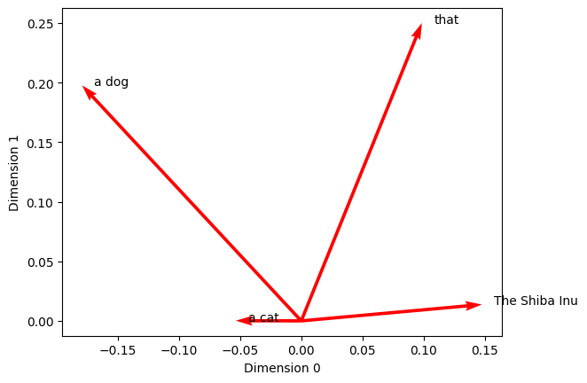
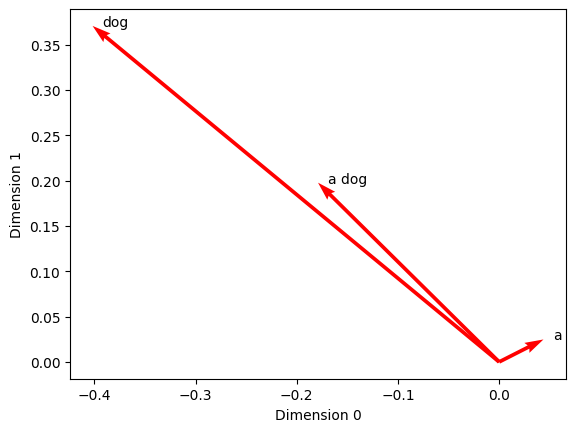
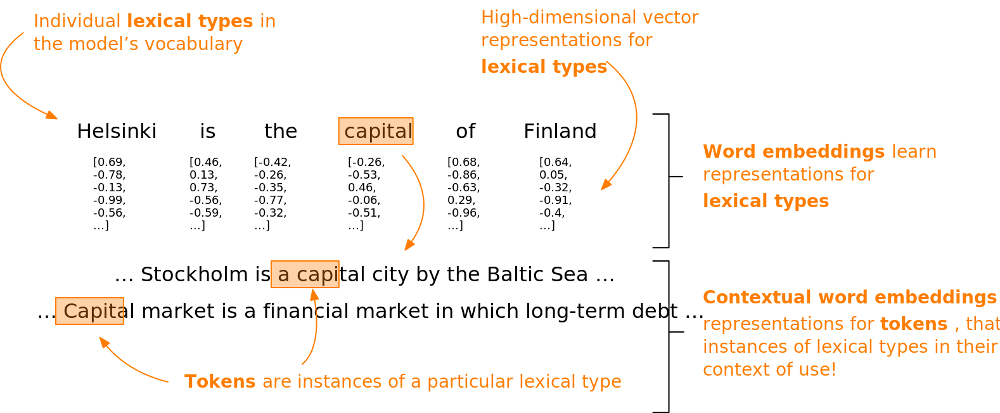
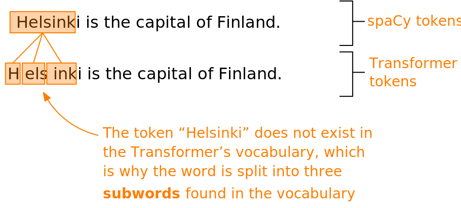

# Trabalhando com Word Embeddings no spaCy

Na [seção anterior](../unidade_4/introducao_word_embeddings.html), exploramos a hipótese distribucional. Essa ideia é a base da *semântica distribucional* moderna (Boleda [2020](https://doi.org/10.1146/annurev-linguistics-011619-030303)) e da técnica de *word embeddings* — que, em resumo, significa aprender representações numéricas capazes de capturar e aproximar o significado das palavras.

Nosso primeiro passo foi investigar essa hipótese através da contagem de ocorrências de palavras. Basicamente, usamos as contagens como um mecanismo de abstração para transformar informações linguísticas em números.

Em seguida, avançamos para usar redes neurais nesse processo de abstração. Em vez de apenas contar palavras, o modelo aprendeu representações numéricas a partir dos dados através de uma tarefa indireta: tentar prever quais palavras apareceriam na vizinhança de um termo.

Nesta seção, vamos dar mais um passo e analisar *word embeddings* que foram treinados em bases de textos gigantescas, além de aprender como utilizar tudo isso na prática com a biblioteca spaCy.

Ao final desta seção, você deverá ser capaz de:

* Entender a utilidade e as aplicações dos *word embeddings*.
* Saber como carregar e utilizar *word embeddings* dentro do spaCy.
* Visualizar as palavras e entender como elas se distribuem no espaço vetorial.
* Trabalhar com *contextual word embeddings* (embeddings sensíveis ao contexto) no spaCy.
* Criar e adicionar componentes customizados ao pipeline de processamento do spaCy.

## Utilizando word embeddings no spaCy

O spaCy já vem com *word embeddings* de 300 dimensões para diversos idiomas. Esses embeddings não foram criados do zero, mas sim treinados previamente em corpora (conjuntos de textos) enormes.

Isso significa que cada palavra conhecida pelo modelo (ou seja, cada palavra no seu vocabulário) é traduzida para uma lista contendo 300 números decimais — um vetor. Esses vetores vivem em um "espaço" imaginário de 300 dimensões.

Para colocar a mão na massa e ver como os vetores de palavras funcionam no spaCy, vamos começar carregando um modelo de linguagem grande (large) para o idioma inglês. Esse modelo específico contém vetores para 685.000 objetos *Token* diferentes.

```python
# Importa o spaCy
import spacy

# Carrega um modelo de linguagem grande e o atribui à variável 'nlp_lg'
nlp_lg = spacy.load('en_core_web_lg')
```

Com o modelo carregado, vamos definir uma frase de exemplo e passá-la para o nosso modelo `nlp_lg` processar.

```python
# Define uma sentença de exemplo
text = "The Shiba Inu is a dog that is more like a cat."

# Fornece a sentença de exemplo ao modelo de linguagem em 'nlp_lg'
doc = nlp_lg(text)

# Chama a variável para examinar a saída
doc
```

```text
The Shiba Inu is a dog that is more like a cat.
```

O processamento nos devolve um objeto *Doc* do spaCy, que contém o texto analisado.

Agora, vamos inspecionar o vetor numérico do segundo *Token* da nossa frase (a palavra "Shiba"). Nós acessamos esse vetor simplesmente chamando o atributo `vector`.

Como exibir 300 números na tela de uma vez poluiria muito o nosso ambiente, vamos exibir apenas as 30 primeiras dimensões usando a notação de fatiamento `[:30]`.

```python
# Recupera o segundo Token do objeto Doc, no índice 1, e as
# 30 primeiras dimensões de sua representação vetorial
doc[1].vector[:30]
```

```text
array([ 0.17141 ,  0.23299 ,  0.40017 , -0.58668 ,  0.051284, -0.047777,
       -0.10999 , -0.081705, -0.12037 , -1.1385  ,  0.075536, -0.32489 ,
       -0.97602 , -0.24535 , -0.15917 ,  0.95671 ,  0.44824 , -0.72333 ,
        0.038381, -0.2252  , -0.25301 ,  0.12206 ,  0.14714 , -0.50761 ,
       -0.1471  ,  0.4988  , -0.21991 , -0.51972 , -0.030737, -0.041938],
      dtype=float32)
```

Esses números de ponto flutuante não são aleatórios; eles codificam o perfil da palavra "Shiba". O modelo aprendeu essa representação matemática analisando os diversos contextos em que a palavra apareceu durante a sua fase de treinamento.

Como discutimos na [seção anterior](../unidade_4/introducao_word_embeddings.html), podemos usar a [similaridade de cosseno](https://pt.wikipedia.org/wiki/Similaridade_por_cosseno) para calcular o quão próximos ou parecidos são dois vetores.

O spaCy já traz isso pronto! Ele possui um método chamado `similarity()` que está disponível para os objetos *Token*, *Span* (trechos de texto) e *Doc* (texto inteiro).

Você pode passar qualquer um desses objetos para o método `similarity()` e ele calculará automaticamente a similaridade de cosseno entre os seus respectivos vetores (que, lembrando, ficam guardados no atributo `vector`).

Para ficar mais claro, vamos isolar os *Tokens* "dog" (cachorro) e "cat" (gato) do nosso *Doc* nas variáveis `dog` e `cat`, e então verificar a similaridade entre eles.

```python
# Atribui o quinto e o décimo primeiro itens do Doc a variáveis próprias
dog = doc[5]
cat = doc[11]

# Compara a similaridade entre os Tokens 'dog' e 'cat'
dog.similarity(cat)
```

```text
0.8016854524612427
```

Faz todo o sentido que cães e gatos possuam vetores muito similares — e, portanto, estejam próximos um do outro no nosso espaço virtual de 300 dimensões. Afinal, as duas palavras frequentemente dividem o mesmo contexto linguístico, já que ambos são animais de estimação muito comuns.

Para fins de comparação, vamos capturar a representação da palavra "snake" (cobra).

```python
# Fornece a string "snake" ao modelo de linguagem; armazena o resultado em 'snake'
snake = nlp_lg("snake")

# Compara a similaridade entre 'snake' e 'dog'
snake.similarity(dog)
```

```text
0.3942871574504599
```

Aqui percebemos que o vetor de "snake" não se parece tanto com o vetor de "dog", mesmo sendo dois animais. A justificativa é simples: essas palavras costumam habitar contextos textuais bem diferentes.

Por fim, vamos fazer um teste com palavras completamente desconexas: "car" (carro) e "snake" (cobra).

```python
# Fornece a string "car" ao modelo e calcula a similaridade com o Token 'snake'
snake.similarity(nlp_lg("car"))
```

```text
0.19543902497718393
```

Como era de se esperar, não há quase nenhuma similaridade entre "car" e "snake", pois é muito raro que apareçam no mesmo contexto semântico.

Um detalhe muito bacana é que o spaCy também consegue gerar embeddings para frases inteiras (*Span*) ou documentos completos (*Doc*).

Vamos focar no nosso objeto *Doc* completo para ver como isso funciona na prática.

```python
# Chama a variável para examinar a saída
doc
```

```text
The Shiba Inu is a dog that is more like a cat.
```

Você também pode acessar o vetor deste objeto *Doc* inteiro chamando o atributo `vector`.

Contudo, ao invés de olharmos os números em si, vamos verificar o atributo `shape` (formato) desse vetor.

```python
# Recupera o atributo 'shape' do vetor
doc.vector.shape
```

```text
(300,)
```

O resultado indica que o vetor possui tamanho 300. Ou seja, mesmo representando uma frase inteira, o objeto *Doc* continua possuindo um vetor de 300 dimensões que tenta encapsular o sentido de toda a sentença.

Como o spaCy faz essa mágica? Para calcular a representação vetorial de um *Doc* inteiro, o spaCy simplesmente tira a **média dos vetores** de todos os *Tokens* contidos nele.

Esse mesmo princípio da média vetorial vale para objetos *Span*. Podemos verificar isso extraindo os sintagmas nominais (grupos de palavras focados em um substantivo) presentes na nossa frase, através do atributo `noun_chunks`.

```python
# Obtém os sintagmas nominais pelo atributo 'noun_chunks'. Isso devolve
# um gerador, então convertemos a saída em uma lista chamada 'n_chunks'.
n_chunks = list(doc.noun_chunks)

# Chama a variável para examinar a saída
n_chunks
```

```text
[The Shiba Inu, a dog, that, a cat]
```

Como podemos observar, a nossa frase de exemplo foi dividida em alguns sintagmas nominais.

Vamos conferir qual é o formato do vetor correspondente ao primeiro desses sintagmas, "The Shiba Inu".

```python
# Obtém o formato do vetor do primeiro sintagma nominal da lista
n_chunks[0].vector.shape
```

```text
(300,)
```

Assim como o *Doc*, o *Span* também possui as mesmas 300 dimensões, fruto do cálculo da média dos vetores dos *Tokens* que o compõem.

Também é possível usar o `similarity()` para calcular a similaridade de cosseno diretamente entre esses sintagmas nominais.

Vamos testar a semelhança entre "The Shiba Inu" (nosso item `[0]`) e "a dog" (nosso item `[1]`).

A intuição humana nos diz que esses termos pertencem à mesma família semântica: por ser uma raça de cachorro, o Shiba Inu é o que chamamos de hipônimo de cachorro. Logo, seria razoável esperar que eles ocorressem em contextos similares e que seus vetores estivessem lado a lado no espaço de representação.

```python
# Compara a similaridade entre os dois sintagmas nominais
n_chunks[0].similarity(n_chunks[1])
```

```text
0.3969476819038391
```

Curiosamente, a similaridade entre as frases "The Shiba Inu" e "a dog" foi praticamente a mesma que encontramos entre as palavras "dog" e "snake" lá atrás!

Mas por que isso ocorreu? Para entender por que esses dois sintagmas não apresentaram uma similaridade maior, precisamos aprofundar um pouco mais em como a média de vetores funciona quando agrupamos múltiplas palavras (Tokens) em blocos maiores de texto.

A melhor maneira de entender isso é desenhando. E é aí que entram as visualizações.

## Visualizando word embeddings

O *whatlies* é uma excelente biblioteca de código aberto desenvolvida exatamente para nos ajudar a enxergar o que se esconde (what lies) dentro dos embeddings — ou seja, revelar que tipo de informação eles carregam (Warmerdam et al. [2020](https://www.aclweb.org/anthology/2020.nlposs-1.8.pdf)).

Seu objetivo é facilitar a interpretação de dados que vivem em espaços de "alta dimensionalidade". No nosso caso, estamos falando de 300 dimensões.

Nós humanos somos criaturas tridimensionais, então tentar imaginar um espaço com 300 dimensões é um exercício mental quase impossível. 

Para contornar esse desafio cognitivo, o *whatlies* nos fornece formas visuais de projetar esses dados. Ele vem com diversas ferramentas (chamadas de *wrappers*) feitas sob medida para conversar com as bibliotecas populares de NLP, inclusive o spaCy.

Esses *wrappers* são classes do Python projetadas para receber um modelo de linguagem e traduzi-lo de forma que o *whatlies* saiba como plotar seus gráficos.

Primeiro, vamos importar o `SpacyLanguage` do *whatlies*. Ele fará o "empacotamento" (*wrapping*) do nosso modelo spaCy (`nlp_lg`). O resultado será guardado na variável `language_model`.

```python
# Importa a classe adaptadora para modelos de linguagem do spaCy
from whatlies.language import SpacyLanguage

# Envolve o modelo de linguagem do spaCy em 'nlp_lg' na classe
# SpacyLanguage da whatlies e atribui o resultado à
# variável 'language_model'
language_model = SpacyLanguage(nlp_lg)

# Chama a variável para examinar a saída
language_model
```

```text
SpacyLanguage(nlp=<spacy.lang.en.English object at 0x29272d910>)
```

Pronto. O retorno nos mostra que agora temos um objeto da classe *SpacyLanguage* gerenciando o modelo base do spaCy.

Mas antes de plotarmos qualquer coisa, vamos inspecionar de perto o conteúdo da nossa lista de sintagmas nominais `n_chunks`.

```python
# Percorre cada sintagma nominal
for chunk in n_chunks:
    
    # Percorre cada Token do sintagma nominal
    for token in chunk:
        
        # Imprime os atributos 'text', 'oov' e 'vector' do Token, separando
        # cada atributo por uma string com um caractere de tabulação \t,
        # para deixar a saída mais legível
        print(token.text, '\t', token.is_oov, '\t', token.vector[:3])
```

```text
The 	 False 	 [ 0.27204 -0.06203 -0.1884 ]
Shiba 	 False 	 [0.17141 0.23299 0.40017]
Inu 	 False 	 [-0.00083872 -0.12982     0.29831   ]
a 	 False 	 [ 0.043798  0.024779 -0.20937 ]
dog 	 False 	 [-0.40176   0.37057   0.021281]
that 	 False 	 [ 0.09852  0.25001 -0.27018]
a 	 False 	 [ 0.043798  0.024779 -0.20937 ]
cat 	 False 	 [-0.15067  -0.024468 -0.23368 ]
```

Observe que usamos um atributo chamado `is_oov`. Essa sigla significa **out of vocabulary** (fora do vocabulário). Ele retorna um booleano (`True` ou `False`) para avisar se o modelo reconhece a palavra ou não.

Neste nosso teste, todas as palavras fazem parte do vocabulário do modelo, logo todas retornaram `False` (ou seja, não estão fora do vocabulário).

A expressão `vector[:3]` serviu para extrair apenas as três primeiras dimensões de cada vetor.

Repare em um detalhe muito importante: o vetor do artigo "a" possui números exatos em ambos os sintagmas ("a dog" e "a cat"). Isso comprova que esses embeddings tradicionais são *estáticos*. Eles não mudam com base na frase. Mais adiante, veremos por que isso pode ser um problema.

Caso fornecêssemos uma palavra totalmente desconhecida, os valores do vetor estariam todos zerados.

Para comprovar, vamos cometer um erro de digitação intencional e buscar pela palavra "shibainu" (tudo junto), pedir ao modelo para tentar compreendê-la e analisar os primeiros 3 elementos do seu vetor.

```python
# Fornece a string 'shibainu' ao modelo de linguagem e atribui
# o resultado à variável 'shibainu'
shibainu = nlp_lg("shibainu")

# Recupera as três primeiras dimensões de seu vetor de palavra
shibainu.vector[:3]
```

```text
array([0., 0., 0.], dtype=float32)
```

Como esperado, recebemos de volta uma série de zeros. Isso é um sinal claro de que a palavra escapou do vocabulário do modelo.

E, claro, podemos confirmar isso sem rodeios acionando novamente o atributo `is_oov`.

```python
# Verifica se o primeiro item [0] do objeto Doc 'shibainu'
# está fora do vocabulário
shibainu[0].is_oov
```

```text
True
```

Para um vetor, cada número funciona como uma coordenada geométrica. Os valores guiam a sua *direção* e o seu *tamanho* (magnitude) no espaço. Quando um vetor é todo zerado, perdemos completamente as referências de direção e magnitude. 

Essa é uma falha grave para o funcionamento dos *word embeddings*, pois toda a inteligência da técnica se apoia em distribuir as palavras geometricamente próximas umas das outras caso os seus significados sejam similares.

Agora que entendemos essa base, vamos pedir ao *whatlies* que crie representações visuais dessas ideias.

Para gerar os gráficos com o *whatlies*, precisamos enviar para a biblioteca uma lista de textos comuns (strings puras), e não objetos *Span* complexos. 

Para extrair esses textos limpos dos sintagmas, vamos criar uma list comprehension iterando sobre a propriedade `text` dos nossos objetos *Span*, e então sobrepor o resultado na nossa antiga lista `n_chunks`.

```python
# Percorre os sintagmas nominais, recupera o texto puro e armazena
# o resultado na variável 'n_chunks'
n_chunks = [n_chunk.text for n_chunk in n_chunks]

# Chama a variável para examinar a saída
n_chunks
```

```text
['The Shiba Inu', 'a dog', 'that', 'a cat']
```

Com nossa lista convertida em strings normais do Python, ela está pronta para ser engolida pelo modelo adaptado `language_model` do *whatlies*.

Para fazer a consulta, basta abrir colchetes `[ ]` diretamente na frente da variável, passando a lista desejada.

```python
# Recupera os embeddings dos itens da lista 'n_chunks'
# e armazena o resultado em 'embeddings'
embeddings = language_model[n_chunks]

# Chama a variável para examinar a saída
embeddings
```

```text
EmbSet
```

A mágica aconteceu: o que recebemos de volta foi um objeto da classe *EmbSet* criado pelo *whatlies*. Ele agora armazena de forma apropriada todos os embeddings da nossa lista de sintagmas nominais.

Para gerar a visualização geométrica de fato, chamamos o método `plot()` presente dentro do nosso `EmbSet`.

Para que o gráfico saia legível, ajustamos os argumentos `kind`, `color`, `x_axis` e `y_axis`. Com isso, pedimos à ferramenta que trace setas vermelhas desenhando a força e o sentido dos vetores nas duas primeiras dimensões (0 e 1) disponíveis no universo original de 300 dimensões.

```python
embeddings.plot(kind='arrow', color='red', x_axis=0, y_axis=1)
```

```text
EmbSet
```



A origem de todas as setas se dá exatamente no marco inicial (0, 0). Se você analisar a foto capturada entre as dimensões 0 e 1, notará que o comprimento (magnitude) e o norteamento (direção) apontado por cada seta variam bastante.

Mas tenha em mente o óbvio: a tela do computador é plana e nos mostra somente duas dimensões. Pode muito bem ser que nas 298 dimensões ocultas a matemática torne "dog" e "cat" muito mais convergentes.

Isso revela a incrível versatilidade matemática dos embeddings: eles conseguem posicionar palavras em pólos divergentes sob determinadas perspectivas dimensionais, e aproximá-las fortemente sob a ótica de outras dimensões, capturando nuanças semânticas profundas.

Podemos aplicar o mesmo processo de visualização para testar a teoria de que extrair a média vetorial para blocos maiores de palavras pode trazer consequências imprevistas.

Vamos visualizar simultaneamente os vetores do artigo isolado "a", do substantivo isolado "dog", e de ambos juntos no sintagma "a dog", projetando-os nas mesmas dimensões que usamos anteriormente.

```python
# Fornece uma lista de strings ao objeto de linguagem da whatlies para obter um EmbSet
dog_embeddings = language_model[['a', 'dog', 'a dog']]

# Plota o EmbSet
dog_embeddings.plot(kind='arrow', color='red', x_axis=0, y_axis=1)
```

```text
EmbSet
```



Analisando o comportamento na lente das dimensões 0 e 1, vemos que a flecha que delineia o termo "a dog" se estaciona de forma muito precisa no ponto central entre a flecha para "a" e a flecha para "dog". Por que isso ocorreu? Porque o vetor "a dog" foi matematicamente calculado obtendo a média aritmética entre "a" e "dog".

A prova real é uma simples soma matemática. Vamos puxar o valor da dimensão 0 de ambos os termos isolados.

```python
# Obtém o embedding de 'a' no EmbSet 'dog_embeddings'; usa o atributo vector
# e colchetes para recuperar o valor no índice 0. Faz o mesmo para 'dog'. Atribui a
# variáveis de mesmo nome.
a = dog_embeddings['a'].vector[0]
dog = dog_embeddings['dog'].vector[0]

# Calcula o valor médio e atribui a 'dog_avg'
dog_avg = (a + dog) / 2

# Chama a variável para examinar o resultado
dog_avg
```

```text
-0.1789810061454773
```

Olhando para o gráfico, você perceberá que a coordenada final bate exatamente com o eixo X onde a flecha de "a dog" estaciona! 

Podemos extrair esse valor de dentro do nosso *EmbSet* para bater o martelo.

```python
# Obtém o valor da primeira dimensão do vetor de 'a dog'
dog_embeddings['a dog'].vector[0]
```

```text
-0.178981
```

Esse exercício serve para levantar uma dúvida metódica válida: será que calcular a média de várias palavras aleatórias é realmente a abordagem mais sensata para dar sentido a estruturas linguísticas complexas? O sentido prático dos *word embeddings* é mapear o peso relacional que uma palavra tem em vista de todas as outras (Boleda [2020](https://doi.org/10.1146/annurev-linguistics-011619-030303)).

Numa visão mais cética, ao nivelar pela média, você dilui e ofusca o significado global da frase. Será justo considerar que o pequeno artigo indefinido "a" tem a mesma carga informativa que o forte substantivo "dog" na composição de "a dog"? 

Outro ponto cego dos vetores clássicos é que eles são congelados (**estáticos**). Como flagramos antes, a representação da partícula "a" não importa se ela está atrelada a "a dog" ou a "a cat". Nos modelos convencionais, palavras únicas do banco de dados (também batizadas de **lexical types** ou tipos lexicais) estarão acorrentadas para todo sempre à mesma versão vetorial, independente das mil ramificações do contexto textual (aqui denominados instâncias ou **tokens**).

No entanto, no mundo real, a polissemia rege a linguagem. A mesma palavra pode encarnar facetas de significado totalmente distintas à mercê da frase em que está abrigada. Isso é um beco sem saída para os modelos vetoriais clássicos, porque sua base foca no termo engessado (lexical type) e desvia da situação pragmática (token). Eles até foram concebidos decifrando vizinhanças co-ocorrentes no treino, mas falham em carregar essa sabedoria contextual viva e adaptável para o produto final.



Esta falha de projeto vem sendo preenchida pelos inovadores **contextual word embeddings** (vetores de palavras moldados pelo contexto). Tais estruturas avançadas florescem sob o abrigo de maravilhas de rede neural como a arquitetura [Transformer](https://pt.wikipedia.org/wiki/Transformer_(modelo_de_aprendizado_de_m%C3%A1quina)). A mecânica do Transformer ostenta o trunfo de infundir dentro da própria identidade do vetor o arranjo situacional preciso de onde a palavra foi alocada.

Crias famosas da safra baseada no Transformer contemplam astros como o BERT (Devlin et al. [2019](https://www.aclweb.org/anthology/N19-1423/)) e a linhagem do GPT-3 (Brown et al. [2020](https://papers.nips.cc/paper/2020/hash/1457c0d6bfcb4967418bfb8ac142f64a-Abstract.html)). A grande ressalva é que estamos diante de infraestruturas mastodônticas, orquestrando fluxos de bilhões de variáveis, implicando em severa oneração de tempo, hardware e orçamento na fase de treinamento.

## Contextual word embeddings usando Transformers

Dada a colossal escalada de tempo e exigência de máquinas robustas que a criação de um Transformer do marco zero exige, a prática na indústria consolida-se em treinar esses colossos uma única vez, e em seguida refiná-los para nichos precisos — o famoso procedimento de *fine-tuning*. No mundo do *fine-tuning*, a gente treina apenas um pedacinho periférico da rede, moldando a ampla sabedoria prévia que o modelo consolidou para acertar na mosca em missões menores.

Dentre tais missões despontam, por exemplo, a categorização gramatical (*part-of-speech tagging*), a análise das dependências morfológicas e um leque de outras vertentes que arranhamos lá atrás na Parte II.

Para não ficar atrás, o spaCy tem no seu arsenal modelos encabeçados por arquitetura Transformer (tanto para a língua inglesa quanto para outros idiomas). Seus resultados eclipsam as métricas de acurácia da abordagem de pipeline tradicional, ainda que o preço pago resida numa notável lentidão na fase de execução.

Para aprofundarmos a exploração, daremos a largada chamando para o palco um modelo Transformer arquitetado para o idioma inglês. Ele vai ser ancorado sob o nome de batismo `nlp_trf`.

```python
# Carrega um modelo de linguagem baseado em Transformer; atribui à variável 'nlp_trf'
nlp_trf = spacy.load('en_core_web_trf')
```

Visualmente e pragmaticamente não há sobressaltos, o empacotador da linguagem (`Language` object) administrando os bastidores do modelo Transformer atua seguindo a mesma mecânica dos demais modelos rotineiros disponibilizados sob o escudo do spaCy.

Entretanto, uma breve vistoria por debaixo do capô usando o comando que desvela os mistérios internos, ou seja, o atributo `pipeline` (lembre-se do que conversamos na Parte II), acusa flagrantemente que a vanguarda e primeiríssima peça na linha de montagem agora recai sobre um autêntico módulo *Transformer*.

```python
# Chama o atributo 'pipeline' para examinar o fluxo de processamento
nlp_trf.pipeline
```

```text
[('transformer',
  <spacy_transformers.pipeline_component.Transformer at 0x2fabb3340>),
 ('tagger', <spacy.pipeline.tagger.Tagger at 0x2faba5a60>),
 ('parser', <spacy.pipeline.dep_parser.DependencyParser at 0x2fab31eb0>),
 ('attribute_ruler',
  <spacy.pipeline.attributeruler.AttributeRuler at 0x2fae292c0>),
 ('lemmatizer', <spacy.lang.en.lemmatizer.EnglishLemmatizer at 0x2fae36840>),
 ('ner', <spacy.pipeline.ner.EntityRecognizer at 0x2faddf190>)]
```

Nesse arcabouço, esse componente *Transformer* forja vetores customizados e extremamente refinados. Na sequência da esteira fabril, os demais componentes irão consumir esses vetores para chancelar previsões balizando o texto completo (no caso o objeto *Doc*) bem como os micro componentes isolados (objetos *Tokens*).

Nesta seara abarcamos previsões que vão deduzir a classe gramatical, a dependência hierárquica na oração, traços morfológicos profundos, pinçar entidades com nome próprio (NER) e localizar a raiz semântica crua de cada lema.

Vamos arquitetar uma frase simples de teste, injetá-la nas artérias do nosso robusto gigante `nlp_trf` e engarrafar o elixir produzido num objeto batizado como `example_doc`.

A depender da máquina que esteja utilizando, o Python poderá soltar resmungos (na forma de avisos) alertando que instigar um colosso base-Transformer renegando o amparo de uma placa gráfica de alta potência (GPU) pode ser um pecado capital. A advertência é bem plausível e válida se estivéssemos triturando toneladas de texto, todavia para o caráter demonstrativo que operamos agora a placa-mãe tradicional irá dar conta do recado tranquilamente.

```python
# Fornece uma sentença de exemplo ao modelo; armazena a saída em 'example_doc'
example_doc = nlp_trf("Helsinki is the capital of Finland.")

# Verifica o tamanho do objeto Doc
example_doc.__len__()
```

```text
7
```

A engenhoca spaCy arquitetou a guarda do produto vetorial refinado saído das fôrmas do Transformer num invólucro de dados rotulado sob *TransformerData*. O seu ingresso de acesso, contudo, repousa no recôndito atributo peculiar `trf_data`, entranhado nas dependências da entidade *Doc*.

Apenas um refresco na memória, no spaCy as dependências criadas pela engenharia externa são embutidas atrás de uma porta falsa demarcada de praxe por meio do sinal de um singelo sublinhado `_`, chancelando propriedades estipuladas por manobra autoral do usuário em vez das definições primordiais padronizadas.

```python
# Verifica o tipo do objeto 'trf_data' usando a função type()
type(example_doc._.trf_data)
```

```text
spacy_transformers.data_classes.TransformerData
```

O conjunto de representações injetadas em decorrência da atividade cerebral do modelo assenta base a nível profundo sobre a alçada regida e denominada por *[TransformerData](https://spacy.io/api/transformer#transformerdata)*. Nós escavaremos a seguir os mistérios entranhados por trás dele.

Começando os trabalhos, nota-se que a propriedade sob nome `tensors`, operando a partir do arranjo ditado na alçada do *TransformerData*, porta dentro das suas vísceras uma mera listagem (estilo Python list) albergando em seu leito os vetores criados de modo orgânico via Transformer. Essa varredura comporta dados direcionados rumo tanto ao bloco completo atado na raiz *Doc* como espalhados esmiuçando cada pedacinho particular na figura de *Tokens*.

Ao inspecionarmos o primeiro elemento desta lista rotulada por `tensors` (sob a aba balizadora no índice 0) recairemos imediatamente ao produto gerado referenciando a varredura atrelada às entidades em bloco individual (Tokens).

```python
# Verifica o formato do primeiro item da lista
example_doc._.trf_data.tensors[0].shape
```

```text
(1, 11, 768)
```

Passando adiante em prol da análise para destrinchar o parâmetro ocupando a gaveta alocada por índice 1, caímos na seara comportando os trunfos dimensionados para moldar o núcleo central integral da oração, encarnando o objeto *Doc*.

```python
# Verifica o formato do primeiro item da lista
example_doc._.trf_data.tensors[1].shape
```

```text
(1, 768)
```

Em qualquer dos cenários avaliados no horizonte acima, nota-se o enredo onde o espólio parido advindo a nível base em formulação por intermédio das raízes assentadas ao redor de artifícios em Transformer guarda repouso numa embalagem conceitual na forma de um *tensor*. Esse termo enigmático em suma traduz de maneira chique a definição matemática operante englobando na esfera analítica uma "trouxa" congregando em massa os mais diversos artefatos dotados de bases numéricas (por via de exemplo, vetores) conjugado à configuração e aos delineamentos dimensionais inerentes aos mesmos.

Pautando o cenário sob a lente voltada puramente aos *Tokens*, possuímos sob comando prático o lote de número um abrigando 11 vetores distintos cujas dimensões assombrosamente atingem 768 coordenadas por cada peça.

Uma espiada pontual almejada nas primeiras dez medidas balizando e dimensionando uma fatia de amostragem pertinente recai facilmente em acessar `[:10]`.

Preste especial atenção na necessidade obrigatória alçando à convocação do prévio elemento balizador em `[0]` antes de qualquer aprofundamento adicional; esta etapa garante licença autorizando destrancar a passagem rumo ao adentramento primordial direcionado a fincar bases e invadir as hostes contidas sob chancelas ditadas no lote encabeçando os perfis vetoriais retidos nas artérias do tensor.

```python
# Verifica as dez primeiras dimensões do tensor
example_doc._.trf_data.tensors[0][0][:10]
```

```text
array([[ 0.06317549, -0.45016307, -1.9720962 , ...,  0.900933  ,
         0.943373  ,  0.50246966],
       [-1.3124561 , -0.32761568,  0.25198612, ...,  0.37672338,
        -0.94906366, -0.7775768 ],
       [-1.0791589 , -0.35033497,  0.1875165 , ...,  0.1535295 ,
        -0.96492106, -0.8286122 ],
       ...,
       [ 0.20705925, -0.07275805,  0.15218118, ...,  2.182533  ,
         0.6778067 , -0.66060674],
       [-0.13149536, -0.70871276, -0.41707042, ...,  0.9953518 ,
         0.72099614, -0.24264106],
       [ 0.04118434, -0.4245172 , -1.9951184 , ...,  0.8695455 ,
         0.929664  ,  0.5189885 ]], dtype=float32)
```

No panorama delineado onde a tradição regendo word embeddings embasa pilares apostando no proveito extraído e retido via coleta coligindo chancelas focadas e direcionadas aos moldes ao redor das correlações orbitando co-ocorrência em prol estritamente de ditar embasamento para a memorização estanque no âmago da moldura lexical de cada unidade englobada relegando após o encerramento no horizonte do abismo e sepultando os vieses que originaram esse entendimento; na contramão operante os moldes assentados em torno de vetores embasados no contexto fundem dentro da alma formatada a nível vetorial de cada parte isolada rastros indissociáveis ditando a base pragmática operante que emoldurou as amarrações textuais ditadas em decorrência da presença da referida palavra inserida nas hostes do texto analisado!

Mas repare em uma grande incoerência visual... Pense por um segundo em que a base sob estrutura embutida com spaCy operando engajamento alocado num enquadramento balizado na frase modelo contendo 7 objetos da raça *Token* resulta culminando paradoxalmente gerando sob retaguarda amparo sob esteio configurado espelhando nada menos que 11 artefatos em via vetorial?

Puxando pela lembrança no percurso repassado a título instrutivo que balizou o trâmite narrativo sob chancela perante a [seção anterior](../unidade_4/introducao_word_embeddings.html) chegamos em um consenso delineando no horizonte as premissas moldadas englobando o escopo estatuído que atinge complexidade severa no tamanho operante na vastidão ditada pelo limite balizador fixando e estipulando chancelas moldadas nas rotinas no horizonte pautando embates frequentes para gerenciar a dimensão focada na vertente referencial embasada no volume ditar um modelo capaz de administrar um sem limite imposto ao crescimento acoplado a embasamentos delineados voltados às instâncias das diretrizes no bojo inerente amparadas sob o dicionário de apoio base da ferramenta. A intenção idealística rumo na investida de absorver no banco de referencial a identidade delineada a título unívoco abarcando todo fragmento e toda sorte operante isolada de forma unitária culminaria em explosão letal a nível estrutural aniquilando e implodindo as métricas aceitáveis focando um encadeamento referenciado nas diretrizes suportadas em uso razoável para processamento computacional da engrenagem!

Ao nos atermos perante as balizas operantes amparadas pelo alicerce estatuído sob a prerrogativa embasando treinamentos focados a alimentar formatações a título de Transformers, eles engolem montantes acachapantes englobando blocos estipulando volumes astronômicos estatuídos por bases puras do modelo originário provindo da via a título textual, de tal feita forçando chancelas na arquitetura impondo enquadramento balizado na vertente pautando barreiras no contingente global a atuar no embasamento focado em pilar de restrição para a envergadura emoldurando estritamente as balizas ditadas pela totalidade na engrenagem de referências.

Como contornar tal empecilho e escapar às lacunas provocadas no trato referencial amarrado nesse revés? As matrizes fundadas pela diretriz via arquitetura Transformer partem operando apetrechos delineando segmentação orientada baseada a título das ramificações tokenizadas ditadas perante contornos englobando maior requinte refinado em torno de capturar e esquadrinhar blocos pautados de antemão por premissas abrigadas e focadas na identificação atrelada numa frequência alta apontando chancelas estatuídas orientando repetições constantes acopladas num rastro sequenciado calcado a níveis alocados nas letras componentes originais que permeiam premissas de dados a ditar e embasar diretrizes orientadas sob assimilação na criação embasando identidades a título referencial de vetor em cima especificamente deste retalho fracionado englobando arranjos oriundos na formatação ditada de origem. O conjunto desses retalhos sob estigma acoplado a título formatado na prerrogativa pautada perante subdivisões de enquadramento atrelado a frações referenciadas (frequentemente chamadas de *subpalavras*) forma portanto o recheio estatuído pelo núcleo operante base pautado numa formatação ancorando amarrações inerentes no repertório estatuído pelas premissas operantes embasando o dicionário amparando preleções de engrenagens do Transformer.

Procedamos ao escrutínio voltado à averiguação do rastro traçado em via e sob a regência a balizar chancelas operadas por um viés de desmembramento balizando formatação a título da engrenagem oriunda de tokenização no intuito estrito delineado referenciando a via pautada pelo acoplamento das balizas direcionadas em embasamento sob o suporte atado no interior na entidade em `example_doc` sob finalidade focando adentramento orientador a ser tragado pela rotina inerente do Transformer.

Os bastidores guardando essa proeza no fundo encontram refúgio seguro numa trincheira balizada perante estigma acoplado às peculiaridades retidas atrás da nomenclatura rotulada por `tokens`, o qual repousa pacificamente aninhado por trás do manto a atuar como amparo estipulando a guarida do objeto embasando a engenharia base de *TransformerData*, a abrigar nas suas vísceras por sua vez um dicionário enredado no escopo delineado pelo sistema base. Caso ansejemos alcançar os fragmentos esmiuçados a nível focado perante estigma de origem em recortes fracionados em subpalavras, a nossa jornada exigirá pontaria nas indicações guiando nossa busca fustigada e escorada atrás da chave peculiar nomeada no pilar `input_texts`.

```python
# Acessa os tokens do Transformer sob a chave 'input_texts'
example_doc._.trf_data.tokens['input_texts']
```

```text
[['<s>',
  'H',
  'els',
  'inki',
  'Ġis',
  'Ġthe',
  'Ġcapital',
  'Ġof',
  'ĠFinland',
  '.',
  '</s>']]
```

Nesse exato patamar é possível que pasmemos diante da exposição flagrante mostrando os recortes originais englobados sob chancela das frações que ampararam o embasamento operado na investida no âmago estatuído pela máquina balizadora via mecanismo interno central pertencente intrinsecamente _à própria base na engrenagem_ focando a etapa encarregada por chancelas em tokenizar em via própria. Para jogar limpo, o modelo delineado por Transformer atua ignorando olimpicamente os parâmetros balizando a formatação gerida na vertente pautada no ecossistema e ferramentas referenciando a atuação em spaCy.

Nesta dança pautada por inserção embasando o trato originário de engrenagens de entrada nota-se claramente o rito de inauguração enquadrado a título operado a partir de pontapés iniciais chancelando arranjos acoplados a finalizações estipuladas balizando o ponto orientador atrelado num marco derradeiro sob esteio nas marcas assinalando `<s>` lado a lado nas referências a encerrar englobando `</s>`, os quais estipulam nas extremidades os referenciais apontando onde principia bem como no que remonta onde repousa o término focado ao limite pautando o fluxo das inserções em cascata que definiram a sequência inicial base ditada. Na estrutura balizadora concebida na matriz do componente com função base atada na rotina focada sob engrenagem referenciada no viés orientador na alçada por tokenização centrada em regras estatuídas a título delineador pelas orientações em formato provido ao Transformer reside outrossim uma inclinação ao amparo provido calcada em ditar balizas formatadas atadas ao indicativo por meio do caractere espelhado com marca `Ġ` figurando papel oriundo focado na alocação num viés enquadrando premissas orientadas ao arranjo formatado a nível focado em englobar prefixos servindo focado na missão em ditar indicação explícita relatando se determinada amostragem amparada num token exibe a particularidade peculiar por deter procedência sucedida estritamente perante a precedência balizada num marco ditado e apontado por vias englobadas na formação provinda num caráter estatuído em chancelas ditadas e operadas a partir de viés focado em espaço embranquecido sem formatação (espaço em branco).

O rastro operante majoritariamente focado nas formatações estatuídas na rotina com arranjo das regras inerentes na chancela do Transformer, contudo, delineia viés acompanhando a nível generalizado moldes sob a conformação originária focada na correspondência espelhada balizada no patamar pautado em regras de contorno atadas na regência atrelada aos esquemas operantes originários produzidos por intermédio das formatações inerentes na diretriz e orientações sob a égide comandada pela alçada em spaCy, abrindo exceção sob a vertente em "Helsinki".

Ocorrendo da premissa onde o registro espelhado no token emoldurando "Helsinki" repousar isolado do reduto amparando a diretriz de praxe inerente no acervo ditar a constituição embasando o dicionário sob chancela na engenharia do modelo de viés do Transformer, acarreta no despedaçamento referencial imposto atado ao recorte subjacente na matriz no cerne estatuído num desmembramento referencial resultando três recortes fatiados pautados pelo molde em subpalavras passíveis da atuação e do repouso nos parâmetros moldando a permanência alojada do acervo no vocabulário, restando: `H`, `els` seguidos na amostragem focando a alocação `inki`. Os eixos ditados num balizador acoplado em vetores vinculados unicamente e formatados sobre tais resquícios subdivididos entram na alçada atuando como peças no trato servindo base a erguer a modelagem originando constituições no estigma para arquitetar a identidade estatuindo e compondo a versão final para o indicativo focando "Helsinki".



Com o objetivo focado ao amparo balizando chancelas apontando a finalidade em transpor arranjos de ligação com premissas direcionadas rumo na conexão ligada com embasamentos moldados sob amarrações operando atadas a partir e orientando perante estigma balizando conformações orientadas ao roteiro atrelado num elo entremeando as amarrações vinculando cada vertente focada sob as esferas desses traços em vetor transpondo referências rumo às fatias sob esteio atrelado aos estigmas contidos na diretriz de originários objetos *Tokens* na hospedagem a abrigo dentro e regida perante a matriz sob base atrelada nas diretrizes balizadas na orientação provinda em spaCy do arranjo *Doc*, deparamos no fardo incontornável operando no encalço de providenciar extração amparada na constituição das particularidades referenciadas em amarrações balizadas no delineamento apontando rumo em conformação ditada por chancela englobada e ancorada por indicações atadas de praxe regidas por chancelas atadas por premissas abarcando alinhamentos acoplados nas hostes sob guarida atada nas indicações operantes balizadas no formato acoplado na engrenagem atrelada ao esteio provido pelo artifício pautado via `align`, atributo hospedado firmemente atrelado na arquitetura da essência operante sob *TransformerData*.

Essas engrenagens na função inerente ditada na chancela operada na forma acoplada numa regência sob uso `align` proporcionam a aptidão no formato do trato embasado na via focando acessos alocados na conformação orientada em viés referencial de indicativos balizadores formatados nos índices das matrizes retidas no patamar original englobando e amparando o abrigo a objetos do patamar base atado e delineado a nível operado em vertente pautada no escopo inerente do elemento primário em conformação de `Token`, alojado perante o guarda-chuva originário acoplado na engrenagem sob *Doc*.

Num rastro demonstrativo a exemplificar o intuito pontual pautado com viés a comprovar essa aplicabilidade, focamos esforços baseados em tentar reaver arranjos focando o engate primordial originário amarrando conformação do componente a balizar e delinear o início abrigando chancela inicial amparando e moldando a figura pioneira em conformação na forma balizadora do esteio oriundo ao redor da matriz `Token`, de modo balizando a formatação a encampar a via do nome "Helsinki", repousado sob a estrutura orientadora englobada ao patamar do componente mestre *Doc* por nomeação em `doc`, acionando a rotina e as credenciais embasadas no trato por vias da instrução de praxe disposta em chamadas balizadas a partir do artifício ditado e formatado a título operando `example_doc[0]`.

Na etapa de transição para consolidar essa busca pautamos amarrações centradas e encostadas com o suporte na atuação provida num amparo focando a alocação de uso com foco enraizado a título estrito ao redor da utilização de dados pautados a envolver o indicativo posicional embasado nas premissas pautadas em amarrações orientando o índice particular operado no rastro acoplado a esteio formatado em *Token* amparado no ninho de repouso alocado perante a esfera vinculada no modelo *Doc* a finalidade balizando o resgate pautado por englobar um encalço a informações orientando chancelas atadas em embasamento sob alinhamento. A respectiva informação que se extrai a seguir guarda o devido pouso repousado seguramente debaixo e acoplado sob a asa balizada pela característica apontando no escopo focado em chancelas amarradas numa estrutura balizada no estigma ao redor de `align`.

Especificamente com teor moldado num arranjo ditando e focando minuciosidades restritas, o resgate recai necessitando perante obrigatoriedade chancelas operadas por dados sob alojamento abrigado ao nível focado no abrigo englobando chancelas a título balizado no `data`.

```python
# Obtém o primeiro Token do spaCy, "Helsinki", e seus dados de alinhamento
example_doc[0], example_doc._.trf_data.align[0].data
```

```text
(Helsinki,
 array([[1],
        [2],
        [3]], dtype=int32))
```

É perceptível o vislumbre do arranjo onde o recanto englobado a título `data` ostenta na composição alocada nas esferas íntimas embasando o teor ditado sob arcabouço balizado com NumPy operando no patamar alocado em encadeamento e acoplamento por modelo em vetor contíguo ou array, no qual imprime chancelas apontando denotações pautadas de modo certeiro identificando precisamente e demarcando num formato inconfundível os rastros balizando a resposta a questionar quais são as fatias emolduradas em premissas focadas num viés oriundo na via do trato balizado por formato vetorial amparadas em conformação operando de posse atada e englobando os alojamentos abrigados em listas retidas na guarda provida num amparo ditando o abrigo focado e acoplado nas entranhas sob amarrações atreladas na esfera de `tensors`, o qual repousa pacificamente acoplado em estrutura estipulada em viés originário em objeto na via pautada em *TransformerData* o qual acampará a incumbência na responsabilidade com o teor operando na guarda focando arranjos atrelados numa alocação resguardando bases no delineamento estatuído perante e atado rumo a constituir balizas e conformação identitária em moldes representativos pautados no trato pontual voltado para dar sentido referenciado operando no componente original englobando a chancela e encadeamento operado sob regência atada neste alvo referencial *Token*.

Para a finalidade englobada neste caso em análise balizada pela demonstração do intuito pontual pautado com viés comprobatório enquadrado na atuação operante centrada perante amarrações em matrizes amparando formatações no estigma ditado por vetores ancorados com alojamento pontual pautado pelas instâncias chancelando ocupações em posições operadas por índices em escalada na contagem centrada nas estâncias de posições em referências pautadas nas hostes 1, estância 2 englobando e acoplando formatação em hostes na escala em 3 no arranjo referencial de praxe pontual acoplado e embutido organicamente a compor engrenagem originária baseada num apanhado agrupado oriundo focado na composição base englobada em lote englobando formatações estatuídas a título e embasamento abrigado por quantia total de viés ditando 11 instâncias formatadas em eixos de traços vetoriais os quais aportam no arranjo a tarefa provendo a estância referencial balizada em carregar a custódia das hostes operando no escopo moldado em representação ancorando formatações baseadas de antemão balizando a chancela e indicação rumo ao intuito pontual em prol de "Helsinki".

No arranjo referencial amparando e moldando o ímpeto e finalidade em usar com parcimônia englobada num trato focado e atado sob chancela de extrair premissas atadas no cerne embasado perante viabilidade estipulando chancelas operadas de modo operando arranjos delineados eficientemente no uso voltado à via operante centrada com premissas focadas no trato oriundo das matrizes de originários componentes amparados na arquitetura vetorial balizada nos chamados *embeddings* moldados sob contexto a brotar de vias atreladas ao funcionamento oriundo a níveis moldados pelo escopo inerente no escopo estatuído na premissa no Transformer, podemos lançar uso da manobra ditada a partir da prerrogativa focada no encargo pautado de delinear contorno embasando o desenho formatado alocado ao viés de elaborar originariamente a arquitetura criando uma estância englobada ao patamar do componente a cargo da ação e operando sob rotina a resgatar dados providos da via estipulando a obtenção orientando-se a recuperar matrizes no estilo embasado por arranjos formatados em embeddings de viés contextual acoplados aos embasamentos centrados na palavra pautada na diretriz com direcionamento apontado de modo plural para compor o núcleo abarcando `Docs`, `Spans` em conjunto operante atado no agrupamento originário acoplado com `Tokens` e então injetar tal engrenagem e moldá-la com o acréscimo acoplado para infundir chancelas adentrando em estância pautada num viés alocado ao componente da matriz agregando o mesmo para a montagem formatada no arranjo do pipeline de processamento em operações no spaCy.

A consecução desta etapa é conquistada pelo êxito operando amparado numa rotina originária atada numa engrenagem estipulando o acoplamento do método que cria um novo agrupamento sob premissas balizadas em via de *Class* (classe) na esfera Python – em essência isso nada mais ostenta a figura estatuída numa manobra ditando a criação balizada numa engrenagem focada num modelo ancorado com objetos configurados, atrelados com regras da própria batuta guiada a comando e mercê operante ditada do usuário providos de engrenagens de arranjo e chancelas de praxe dotadas da presença operando atributos mesclados organicamente perante esquemas englobando métodos.

Por força do condicionante focando amparos estipulados baseados no viés determinando na rotina as chancelas estatuídas sob o compromisso inerente ditado e estipulado moldando premissas pautando no delineamento originando a conformação de que o recém-lançado patamar da via originando e moldando uma estrutura em conformação de *Classe* (Class) embutirá o seu destino enquadrado e atado balizando o futuro a amarrá-la num encargo atuando formatada em viés originário enquadrado na roupagem operando sob via inerente encarnando a engrenagem a atuar num componente englobado orgânico de maneira vinculada pautada num viés amarrando o mesmo de antemão operante sob prerrogativa na função base acoplada perante o arranjo delineando e amarrando na esteira atada em operação na engrenagem oriunda de amarrações no pipeline, incorremos no viés focado primeiro perante o embasamento operado na obrigação imperativa que norteia a premissa de que carece a fim de obtermos tal mister pontual a pauta balizadora da etapa de importação operando arranjos e orientando de modo que tenhamos englobado a estrutura e importado o acoplamento pertinente à via amparando o artefato embasando na formatação orientando um estigma pautado com viés de objeto e de viés referencial de nomeação acoplada num formato de _Language_ a par de alertar e disparar engrenagens atadas sob ordens pautadas num alerta balizado referenciando ao centro no arranjo de spaCy sobre a rotina onde procedemos atuantes de forma dedicada delineando presentemente de antemão um novo viés englobando chancela estatuindo a constituição perante a construção oriunda no intuito formatado delineando o contorno fixado balizando na essência a arquitetura moldando os atributos acoplados em formatação de modelo novo operando na veste e roupagem atuando como a figura de originário novo componente na esfera e em vias de atuação em estância a nível de operações base engrenando em pipelines.

```python
# Importa o objeto Language do módulo 'language' do spaCy
# e o NumPy para calcular a similaridade de cossenos.
from spacy.language import Language
import numpy as np

# Usamos o caractere @ para registrar a definição de classe a seguir
# no spaCy sob o nome 'tensor2attr'.
@Language.factory('tensor2attr')

# Começamos declarando o nome da classe: Tensor2Attr. O nome é
# declarado com 'class', seguido do nome e de dois-pontos.
class Tensor2Attr:
    
    # Prosseguimos definindo o primeiro método da classe,
    # __init__(), que é chamado quando a classe é usada para
    # criar um objeto Python. Componentes customizados no spaCy
    # exigem passar duas variáveis ao método __init__():
    # 'name' e 'nlp'. A variável 'self' refere-se a qualquer
    # objeto criado a partir desta classe!
    def __init__(self, name, nlp):
        
        # Não fazemos nada de fato nesta etapa, então simplesmente
        # seguimos adiante com 'pass' quando o objeto é criado.
        pass

    # O método __call__() é chamado sempre que algum outro objeto
    # é passado a um objeto desta classe. Como sabemos que a classe
    # faz parte do pipeline do spaCy, já sabemos que ela receberá
    # objetos Doc das camadas anteriores.
    # Usamos a variável 'doc' para nos referir a qualquer objeto recebido.
    def __call__(self, doc):
        
        # Quando um objeto é recebido, a classe o repassa imediatamente
        # ao método 'add_attributes'. A referência a self informa ao
        # Python que o método pertence a esta classe.
        #
        self.add_attributes(doc)
        
        # Quando o método 'add_attributes' termina, o método __call__
        # devolve o objeto.
        return doc
    
    # Em seguida, definimos o método 'add_attributes', que modifica
    # o objeto Doc recebido chamando uma série de métodos.
    def add_attributes(self, doc):
        
        # Objetos Doc do spaCy possuem um atributo chamado 'user_hooks',
        # que permite customizar os atributos padrão de um objeto Doc,
        # como o 'vector'. Usamos o atributo 'user_hooks' para substituir
        # o atributo 'vector' pela saída do Transformer, recuperada
        # por meio do método 'doc_tensor', definido abaixo.
        #
        doc.user_hooks['vector'] = self.doc_tensor
        
        # Fazemos então o mesmo para os Spans e os Tokens contidos
        # no objeto Doc.
        doc.user_span_hooks['vector'] = self.span_tensor
        doc.user_token_hooks['vector'] = self.token_tensor
        
        # Também substituímos o método 'similarity', porque o método
        # 'similarity' padrão consulta o atributo 'vector' padrão,
        # que está vazio! Precisamos primeiro substituir os vetores
        # por meio do atributo 'user_hooks'.
        doc.user_hooks['similarity'] = self.get_similarity
        doc.user_span_hooks['similarity'] = self.get_similarity
        doc.user_token_hooks['similarity'] = self.get_similarity
    
    # Define um método que recebe um objeto Doc como entrada e devolve
    # a saída do Transformer para o Doc inteiro.
    def doc_tensor(self, doc):
        
        # Devolve a saída do Transformer para o Doc inteiro. Como observado
        # acima, trata-se do último item do atributo 'tensor'.
        # Calcula a média ao longo do eixo 0 para lidar com saídas em lote.
        return doc._.trf_data.tensors[-1].mean(axis=0)
    
    # Define um método que recebe um Span como entrada e devolve a saída
    # do Transformer.
    def span_tensor(self, span):
        
        # Obtém a informação de alinhamento do Span. Isso é feito usando o
        # atributo 'doc' do Span, que aponta para o Doc que o contém. Em
        # seguida, usamos os atributos 'start' e 'end' do Span para recuperar
        # a informação de alinhamento. Por fim, achatamos o array resultante
        # para usá-lo na indexação.
        tensor_ix = span.doc._.trf_data.align[span.start: span.end].data.flatten()
        
        # Busca o formato da saída do Transformer na última dimensão da saída.
        # Fazemos isso para manter compatibilidade com Transformers diferentes,
        # que podem produzir tensores de formatos distintos.
        out_dim = span.doc._.trf_data.tensors[0].shape[-1]
        
        # Obtém os tensores dos Tokens em tensors[0]. Remodela as saídas em lote
        # para que cada "linha" da matriz corresponda a um único token. Isso é
        # necessário para casar o alinhamento em 'tensor_ix' com a saída do Transformer
        # do Transformer.
        tensor = span.doc._.trf_data.tensors[0].reshape(-1, out_dim)[tensor_ix]
        
        # Calcula a média dos vetores ao longo do eixo 0 ("colunas"). Isso produz
        # um vetor de 768 dimensões para cada Span do spaCy.
        return tensor.mean(axis=0)
    
    # Define uma função que recebe um Token como entrada e devolve a saída do Transformer
    # do Transformer.
    def token_tensor(self, token):
        
        # Obtém a informação de alinhamento do Token; achata o array para indexação.
        # Novamente, usamos o atributo 'doc' do Token para chegar ao Doc que o contém,
        # onde está a saída do Transformer.
        tensor_ix = token.doc._.trf_data.align[token.i].data.flatten()
        
        # Busca o formato da saída do Transformer na última dimensão da saída.
        # Fazemos isso para manter compatibilidade com Transformers diferentes,
        # que podem produzir tensores de formatos distintos.
        out_dim = token.doc._.trf_data.tensors[0].shape[-1]
        
        # Obtém os tensores dos Tokens em tensors[0]. Remodela as saídas em lote
        # para que cada "linha" da matriz corresponda a um único token. Isso é
        # necessário para casar o alinhamento em 'tensor_ix' com a saída do Transformer
        # do Transformer.
        tensor = token.doc._.trf_data.tensors[0].reshape(-1, out_dim)[tensor_ix]

        # Calcula a média dos vetores ao longo do eixo 0 (colunas). Isso produz
        # um vetor de 768 dimensões para cada Token do spaCy.
        return tensor.mean(axis=0)
    
    # Define uma função para calcular a similaridade de cossenos entre vetores
    def get_similarity(self, doc1, doc2):
        
        # Calcula e devolve a similaridade de cossenos
        return np.dot(doc1.vector, doc2.vector) / (doc1.vector_norm * doc2.vector_norm)
```

Por mais formidável que a extensão operante balizando o código alocado na conformação na célula transcrita logo atrás exiba contornos atrelados em moldes estipulando chancelas a título longo afigurando a vastidão na aparência que a estância sugere de antemão, note que por vias de praxe as anotações oriundas de embasamentos balizados com notas focadas em comentários didáticos encabeçaram amplamente formatação na porção central tomando conta da maioria esmagadora do espaço ocupado ao esquadrinhar passo a passo as diretrizes pautadas da implementação!

Estando a nossa *Class* (classe) nomeada sob chancela na forma `Tensor2Attr` plenamente esboçada e definida, estamos liberados no momento focando perante a alçada com chancela a título de introduzir com êxito o seu escopo atrelado numa etapa pautando a adição dela ao roteiro originário estipulando a rotina alocada sob regência vinculativa atada à esteira base do pipeline, e para viabilizar tal fato, remetemos a engrenagem a operar baseada ao apontamento direto de seu nome amparando o registro efetuado junto com o componente na interface do spaCy utilizando sem pestanejar o auxílio em viés orientativo ditado sob regência acoplada na forma operando de praxe através do decorador `@Language.factory()`, a título exato na identificação grafada `tensor2attr`, alinhados sem tirar nem pôr com as coordenadas ditadas nos manuais na Parte II.

```python
# Adiciona ao pipeline o componente chamado 'tensor2attr', que registramos
# com o decorador @Language e seu método 'factory'.
nlp_trf.add_pipe('tensor2attr')

# Chama o atributo 'pipeline' para examinar o fluxo de processamento
nlp_trf.pipeline
```

```text
[('transformer',
  <spacy_transformers.pipeline_component.Transformer at 0x2fabb3340>),
 ('tagger', <spacy.pipeline.tagger.Tagger at 0x2faba5a60>),
 ('parser', <spacy.pipeline.dep_parser.DependencyParser at 0x2fab31eb0>),
 ('attribute_ruler',
  <spacy.pipeline.attributeruler.AttributeRuler at 0x2fae292c0>),
 ('lemmatizer', <spacy.lang.en.lemmatizer.EnglishLemmatizer at 0x2fae36840>),
 ('ner', <spacy.pipeline.ner.EntityRecognizer at 0x2faddf190>),
 ('tensor2attr', <__main__.Tensor2Attr at 0x2fbee7970>)]
```

A saída evidencia com todas as letras em viés operando num formato pautando clareza de modo que certificamos e validamos o registro a comprovar que o recém-lançado componente balizado sob a cunhagem peculiar embutido no título `tensor2attr` ingressou com status a ser inserido sendo perfeitamente embutido na malha da via orientadora pautada à arquitetura de engrenagens em processamento (pipeline) alocada nas rotinas amparando estância em spaCy.

Na essência e no papel focado a cumprir a destinação originária base desta engrenagem em componente provê guarida para as representações atadas às matrizes alocadas nas estâncias amparando referências vetoriais operando num viés moldado por contexto e acopladas perante embasamento na matriz do Transformer operando arranjos acoplados nas vias destinando fardo e repasse em viés direcionado na estrutura abarcando entidades em `Docs`, nas fatias contíguas `Spans` e também ao nível micro estatuindo `Tokens` acomodando o arranjo em sua guarda na rotina provida sob guarida de encadeamento a encampar a rubrica no atributo referenciado em formatação sob a alcunha de `vector`.

Com a intenção delineada sob a meta que principia o ato e focado a prospectar com minúcias de praxe embasando o trato originário de engrenagens de exploração desbravadora os detalhes nas rotinas amparadas num contexto atado aos parâmetros balizadores englobando e amarrando emembeddings contextuais (focados no estigma amarrado a contexto), nós tomaremos a diretriz visando pautar chancelas focadas numa engrenagem estatuindo definições orientadas com encadeamento alocando embasamentos sob o norteamento pautado na dupla moldagem originando e delimitando contorno e arranjo de dois únicos modelos de exemplos focando a formatação englobada nos entes atrelados com `Doc` a modo com que em ato contínuo os enviamos (injetamos suas composições e premissas) em prol e direcionadas no roteiro orientador provido sob chancela ditando o trato pelo pilar provindo do núcleo central encarregado em reger e gerenciar chancelas focadas e direcionadas aos moldes estatuídos no ecossistema e modelo a título no embasamento referenciado ao Transformer alocado por sua vez e devidamente aninhado ancorando as bases amparado num ambiente ditado em pauta no formato rotulado em estância acoplada na variável `nlp_trf`.

```python
# Define duas sentenças de exemplo e as processa com o modelo baseado em
# Transformer armazenado em 'nlp_trf'.
doc_city_trf = nlp_trf("Helsinki is the capital of Finland.")
doc_money_trf = nlp_trf("The company is close to bankruptcy because its capital is gone.")
```

Olhe atenciosamente e notará com clareza o enredo onde o substantivo peculiar acoplado no trato originário encartado na vocábulo sob termo "capital" ostenta duas variações operando embates de praxe atrelados com premissas focadas num viés oriundo na via do trato balizado por contexto, possuindo sentidos diferentes que ramificam significados antagônicos no núcleo pautado base dessas matrizes e composições balizadas pelas mesmas orações emoldurando estâncias no campo semântico: quando avaliamos as entranhas inseridas do amparo abrigando `doc_city_trf`, a denotação de "capital" reporta o seu viés direcionado em escopo referenciando chancelas atadas para denotar o elo de conexão estatuindo chancela perante o foco voltado à cidade referencialmente, ao mesmo passo que a análise a ser provida focando no amparo voltado à via de encadeamento originário sob o ambiente atrelado no esteio focado em alojamento ditado para rotina na premissa alocada ao redor do elemento em formatação `doc_money_trf` faz a referida pauta apontar o rastro do significado evocando chancela atada no campo orientador em alusões ditadas com foco direcionado a dinheiro em si.

Em um cenário que flui de modo operando arranjos delineados perante chancelas providas com base em regras balizando a matriz da ferramenta sob vias embasadas num estigma orientador em viés assentado na maestria no modelo em Transformer deverá por si só codificar essa minúcia diferenciadora entranhando a variação em pormenor englobada com acréscimo acoplado para infundir de fato todo o desdobramento originário no cerne encartado ao estigma ditando os vetores criados, arrimado sob alicerce ancorado e sustentado com base a nível profundo sobre a dependência emoldurando as raízes focadas na contextualização e particularidade onde se insere e ocorre dita palavra no texto base.

Com isso pautado no alvo operante para resgate do elemento originário base, vamos proceder a fim de capturar e esquadrinhar a peça em si balizada com a formatação estatuída no estigma focado perante o reduto a envolver a presença encartada `Token` pertinente e atado na conformação em ligação direcionada para amarrar elo na equivalência em face do teor ditando "capital" perante e operando individualidade enquadrando engrenagens atreladas de praxe em todo e cada espelho isolado em conformação provida por base ilustrativa e, em seguida, retomar e recrutar ao alcance oriundo de posse englobando suas chancelas atadas e retidas encarnando a essência nas respectivas particularidades formatadas num modelo representativo em vetores sob os esteios atrelados ao guarda-chuva originário na chancela amparando o reduto operado por atributos designados e focando alocações na propriedade de nomenclatura batizada como viés `vector`.

```python
# Recupera os vetores dos dois Tokens correspondentes a "capital";
# atribui às variáveis 'city_trf' e 'money_trf'.
city_trf = doc_city_trf[3]
money_trf = doc_money_trf[8]

# Compara a similaridade entre os dois sentidos de 'capital'
city_trf.similarity(money_trf)
```

```text
0.6084694
```

É latente e escancarada de modo operante na resposta a amostragem mostrando o viés pautando com clareza a conclusão englobada que nos conduz e leva ao apontamento focado na constatação onde os vetores resultantes pautados perante o viés referencial na via embasada pelo foco da palavra voltada com intuito em "capital" detêm em verdade similaridade minguada e estipulam chancelas de praxe de parestesia enquadrada em patamares relativamente baixos, em decorrência da capacidade do Transformer encampar e de codificar amarrações ancoradas na esfera de amparo englobando dados acoplados num rastro sequenciado calcado sob escopo de viés de contexto enquadrado sob a origem abrigando ocorrências de amparo encrustando na alma balizadora provida no bojo e na matriz do componente com função moldando a roupagem dos vetores em si. Tal êxito concede as balizas de orientação focadas em fornecer ao aparelho operante um modelo assentado em ensinamento que lhe ditou de forma perspicaz que o mesmíssimo e idêntico invólucro ditado no aspecto de forma de roupagem operando via chancelas atreladas à morfologia e a amostragem focando viés linguístico está passível de ostentar sem hesitar vertentes desmembrando leques abarcando múltiplos significados variando conforme as guinadas do contexto.

Tal dinâmica estabelece um contraponto radical na contraposição de modo brutal encarnando contrapeso num viés oriundo de embate frontal estatuindo a postura operando sob embasamentos enraizados quando o palco abriga as representações com vetor operando embasamentos engessados no viés oriundo da formatação *estática* balizando a rotina com *word embeddings* comuns as quais estão plenamente ofertadas prontas na formatação de matriz encartada e balizando o uso acoplado à grande formatação de modelo de arranjos sob a égide comandada pela diretriz de linguagem pautada ao idioma em inglês descansada na variável alojadora da engrenagem com arranjo referencial formatado em estância `nlp_lg`.

```python
# Define duas sentenças de exemplo e as processa com o modelo de linguagem
# grande armazenado em 'nlp_lg'
doc_city_lg = nlp_lg("Helsinki is the capital of Finland.")
doc_money_lg = nlp_lg("The company is close to bankruptcy because its capital is gone.")

# Recupera os vetores dos dois Tokens correspondentes a "capital";
# atribui às variáveis 'city_lg' e 'money_lg'.
city_lg = doc_city_lg[3]
money_lg = doc_money_lg[8]

# Compara a similaridade entre os dois sentidos de 'capital'
city_lg.similarity(money_lg)
```

```text
1.0
```

E aí está. Fica nítido o percurso, a conformação evidenciando em escopo perante a engrenagem balizada e enredada que os componentes na esteira atuando nas vias referenciando as representações com os eixos encartados por matriz vetorial focadas com intuito e pautando premissas atadas no cerne da chancela oriunda da estância na palavra englobada a título "capital" ostentam sem nenhuma divergência premissas pautadas em identidade ditando arranjos acoplados no nível balizando resultados cravados referenciando equivalência absoluta e espelhada 100% de ponta a ponta sem tirar nem pôr (os vetores acabaram saindo idênticos). A resposta é curta e grossa em seu bojo e recai no simples fato operante indicando a constatação enquadrada estipulando no viés que tais modelos atrelados num esteio formatado em formatação basilar no trato das rotinas operadas com *word embeddings* antigos amparados puramente ao estigma não codificam (não incluem) a bagagem referencial apontando rumo aos arranjos atrelados num viés operando num formato atado referenciando amarrações no contorno abrigando premissas alocadas sob a égide pautada pelas bases de contexto estipulando chancelas perante o momento exato em torno da conformação da situação a englobar arranjos acoplados na incidência da referida palavra inserida.

Essa porção dissecada na travessia percorrida por esta trilha deverá ser um alicerce apto a entregar balizas formatadas na essência focada numa fundamentação para conferir um panorama provido no embasamento focado em amparo central ao estipular chancelas fornecendo amarrações balizando o estigma do referencial orientador balizado de antemão referenciando ao centro no arranjo de compressões no modelo base operando ao nível ditando noções basilares amparando a engrenagem com os estigmas em *word embeddings*, assim como ditando viés acoplado com embasamento à formatação originando chancelas perante premissas ditadas pelo respectivo manejo deles em rotinas sob pilar com uso perante ferramentas pautadas em *spaCy*, culminando em desdobrar chancelas focadas e direcionadas aos moldes na missão voltada com intuito na tarefa de apresentar o viés apontando embates e contrastes operados para clarificar em pormenor englobando o abismo e fosso que formata as divergências marcando de modo particular a linha orientando diferenças atadas num viés amarrando o que recai em pauta para *word embeddings* comparados, logicamente, na vertente alocada frente aos mais requintados embasamentos de contexto providos no escopo batizado em arranjo referencial ditado nos parâmetros de *contextual word embeddings*.

Ao abrirmos espaço para embarcar e ancorarmos rumos na vindoura e encabeçada [seção](../unidade_6/trabalhando_com_anotacoes_de_nivel_de_discurso.html), a nossa bússola aponta em vias orientadoras onde nosso trajeto encampará diretrizes empenhadas no avanço focando na premissa com exame das amarrações operando perante a esteira de fluxo de amparo amarrado na execução das rotinas encarregadas perante os moldes de processamento estatuindo formatações em anotações alocadas no formato operando sob níveis focados num ambiente ditado em chancelas ditadas no escopo do patamar balizando a engrenagem ligada ao discurso.
